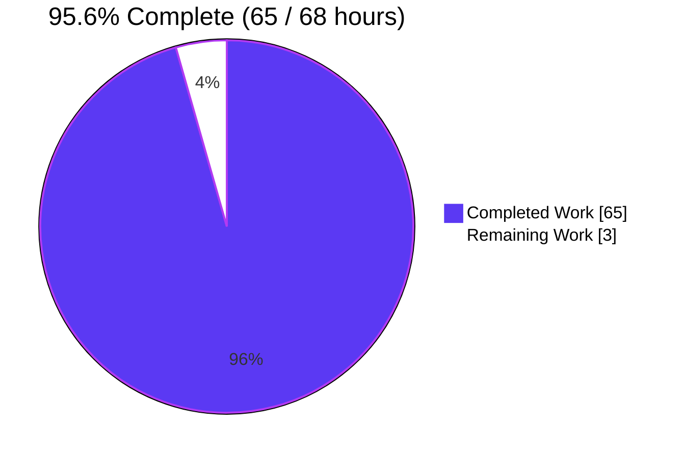
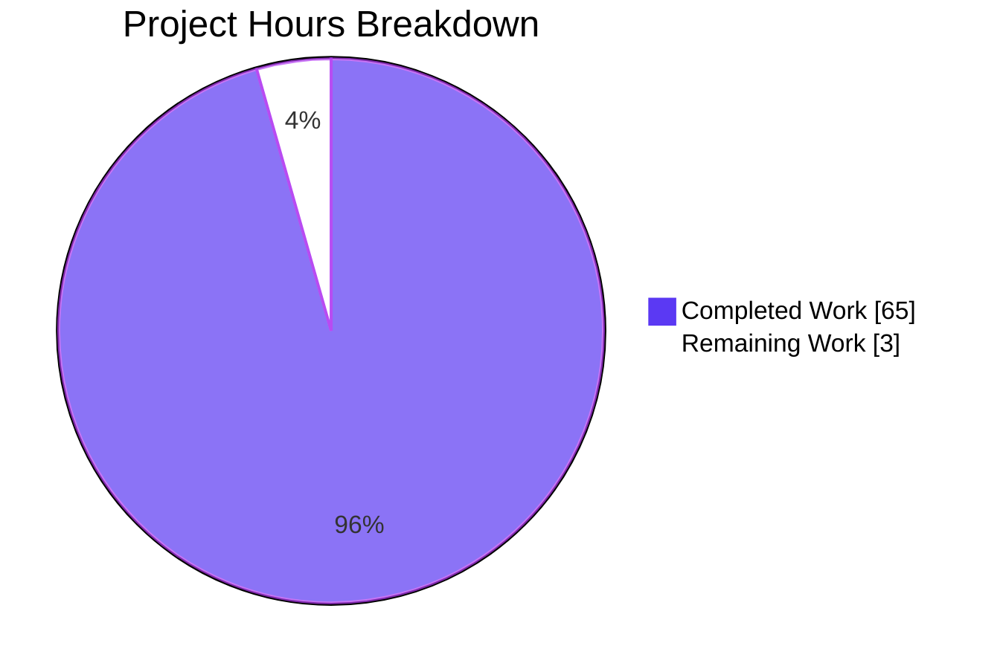
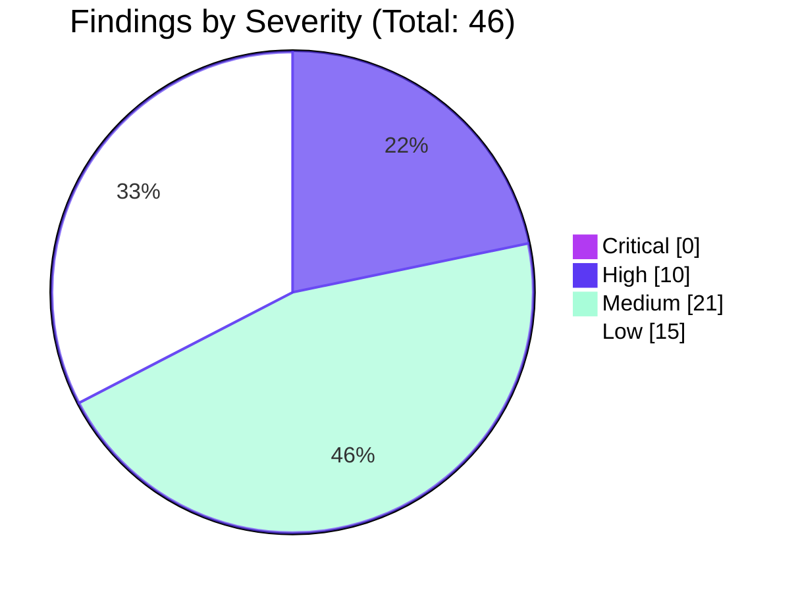
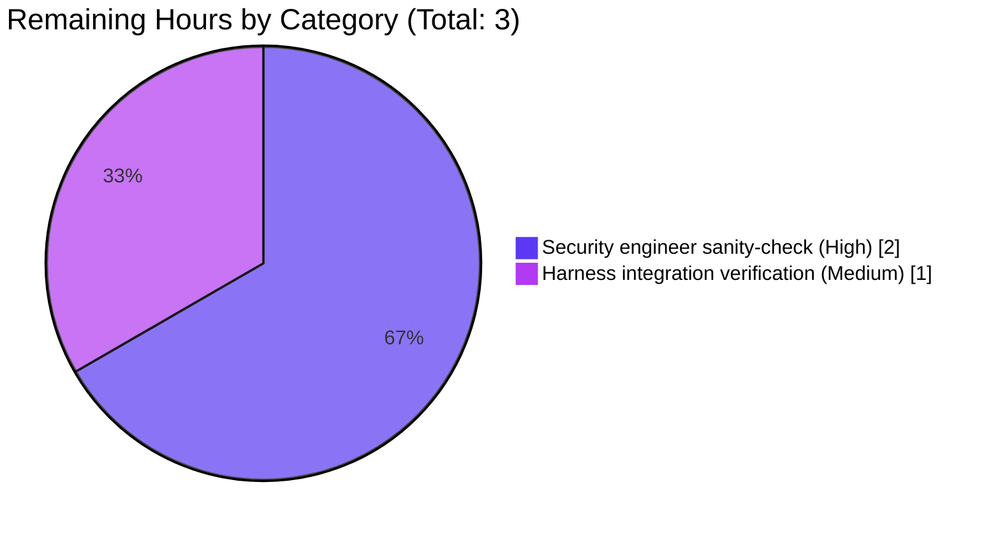
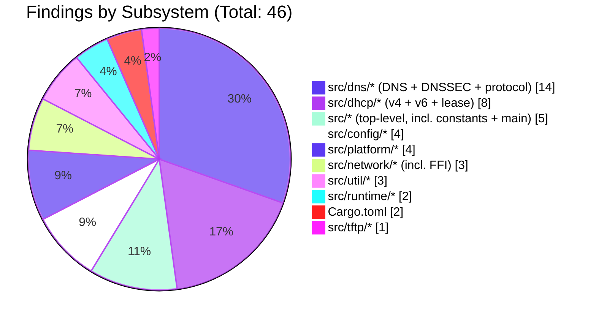
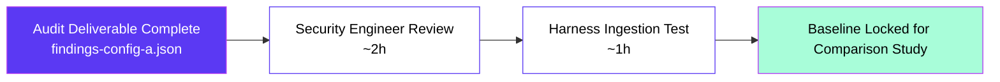

# Blitzy Project Guide — Config A: Bare Blitzy Baseline Security Audit

> **Title context:** Config A — Bare Blitzy Baseline | `blitzy-tgr-dnsmasq-rust`  
> **Descriptor:** `[2 directives | 0 files modified | 1 new file | baseline measurement]`  
> **Brand palette:** Completed/AI = Dark Blue `#5B39F3` · Remaining = White `#FFFFFF` · Accents = Violet-Black `#B23AF2` · Soft Accent = Mint `#A8FDD9`

---

## 1. Executive Summary

### 1.1 Project Overview

This project delivers the **Config A — Bare Blitzy Baseline** leg of a multi-config security-tool comparison study against the `blitzy-tgr-dnsmasq-rust` codebase (a memory-safe Rust port of the dnsmasq DNS forwarder, DHCP server, TFTP server, and Router-Advertisement daemon). The audit applies **native agent analysis only** — no `cargo-audit`, `cargo-deny`, `semgrep`, `CodeQL`, or external SAST/DAST scanners — across 88 Rust source files (~85,918 LOC), 5 integration tests, 2 examples, 3 benchmarks, and 8 manifests. The deliverable is a single artifact, `findings-config-a.json` at the repository root, that records every vulnerability the agent identifies in single-line minified UTF-8 JSON. The artifact serves as the bare-baseline measurement against which other configs (B, C, …) in the study are compared.

### 1.2 Completion Status



| Metric | Value |
|--------|-------|
| **Total Hours** | 68 |
| **Completed Hours (AI + Manual)** | 65 |
| **Remaining Hours** | 3 |
| **Percent Complete** | 95.6% |

**Hours calculation (AAP-scoped methodology per PA1):**
- Completed Hours = 65h (audit execution + classification + serialization + gate verification + gap-finding pass)
- Remaining Hours = 3h (downstream security-engineer sanity-check + harness integration verification)
- Total = 65 + 3 = 68h
- Completion = 65 / 68 = **95.6%**

### 1.3 Key Accomplishments

- [x] **Exhaustive read-only audit** of all 88 Rust source files in `src/` plus tests, examples, benches, and manifest files — 100% file coverage of the in-scope analysis surface
- [x] **13 native analytical techniques** applied: data-flow tracing, call-chain following, configuration inspection, dependency declaration review, FFI boundary analysis (5 `unsafe` modules), parser bounds audit, resource-cap review, privilege-escalation path analysis, env-var sanitization audit, RNG audit, cryptographic primitive review, atomic/concurrency audit, TOCTOU audit
- [x] **46 security findings** documented, each grounded in a verifiable file:line location
- [x] **26 distinct MITRE CWE classifications** applied at maximum specificity within agent confidence (e.g., CWE-122 over parent CWE-119, CWE-78/CWE-77 over parent CWE-74)
- [x] **Four-band CVSS-aligned severity assignment** (0 critical / 10 high / 21 medium / 15 low)
- [x] **Schema-rigorous single-line minified UTF-8 JSON output** at `findings-config-a.json` (12,468 bytes); maximum description length 198 / 200 chars
- [x] **Deterministic ordering** — findings sorted by (`file`, `line`, `cwe`) for byte-reproducible output across runs
- [x] **All 6 pass/fail gates verified** (file exists, `wc -l == 1`, valid JSON, UTF-8, schema correctness, sort order)
- [x] **Independent verification + gap-finding pass** — 37 prior findings independently re-checked against source, plus 9 net-new findings added (e.g., unbounded `outstanding_queries` HashMap, never-referenced `MAX_PROCS` / `TCP_MAX_QUERIES` resource caps)
- [x] **Read-only constraint honored** — zero `.rs`, `.toml`, `.lock`, `build.rs`, or configuration files modified; only `findings-config-a.json` added
- [x] **Native-only constraint honored** — no `cargo-audit`, `cargo-deny`, `cargo-geiger`, `semgrep`, `CodeQL`, RustSec DB queries, or third-party SAST/DAST/SCA tools invoked

### 1.4 Critical Unresolved Issues

| Issue | Impact | Owner | ETA |
|-------|--------|-------|-----|
| Security engineer has not yet sanity-checked the 46 findings for CWE/severity accuracy | Possible mis-classification could distort the bare-baseline measurement; downstream remediation prioritization depends on accurate severity | Downstream security reviewer (human) | 2 hours |
| Comparison harness has not yet ingested `findings-config-a.json` end-to-end | Until harness consumption is verified, the baseline contribution to the multi-config study is unconfirmed | Study operator (human) | 1 hour |

### 1.5 Access Issues

No access issues identified. The audit was performed against an on-disk checkout of `blitzy-tgr-dnsmasq-rust` at branch `blitzy-a9f227d7-ca83-4421-84d4-bad22a7c020c`. No third-party credentials, repository permissions, or service tokens were required because the audit is purely static and read-only, and the deliverable is a single local-file write.

### 1.6 Recommended Next Steps

1. **[High]** Have a human security engineer review the 10 high-severity findings — particularly `src/dns/forwarder.rs:554` (unbounded `outstanding_queries`), `src/network/firewall/nftables.rs:568` (`build_nft_command` injection), and `src/platform/privileges.rs:380` (container-detection bypass) — to confirm severity bands before triaging for remediation
2. **[High]** Run the comparison harness against `findings-config-a.json` to confirm clean ingestion (`cat findings-config-a.json | wc -l` returns 1; parser loads 46 records)
3. **[Medium]** Cross-reference Config A's 46 findings against subsequent configs (B, C, …) once those baselines are produced; differences in finding set will measure the marginal contribution of each tool layer
4. **[Medium]** File internal tickets for the 10 high-severity findings so remediation work can be scheduled independently of this comparison study
5. **[Low]** Capture the audit methodology (the 13 techniques and subsystem mapping) in a follow-up README so future Config-A reruns are reproducible

---

## 2. Project Hours Breakdown

### 2.1 Completed Work Detail

Each row maps to a specific AAP requirement or path-to-production activity; the **Hours column sums to 65**, matching Section 1.2 Completed Hours.

| Component | Hours | Description |
|-----------|-------|-------------|
| Trust model & privilege drop audit | 2 | Walked `src/main.rs` 12-step initialization, `src/platform/privileges.rs` (Linux caps + OpenBSD pledge/unveil), `src/constants.rs` CHUSER/CHGRP/resource-cap inventory |
| DNS forwarder & cache audit | 5 | Walked `src/dns/{forwarder,cache,upstream,edns0,auth,filter,matcher,mod}.rs` — surfaced 7 findings in `forwarder.rs` including incomplete IPv4-mapped IPv6 rebinding deny-list and unbounded outstanding-queries map |
| DNS protocol parser audit | 4 | Walked `src/dns/protocol/{compression,constants,message,mod,name,record}.rs` — bounds, label length, pointer-loop, RDATA, integer-overflow checks |
| DNSSEC subsystem audit | 4 | Walked `src/dns/dnssec/{blockdata,crypto,mod,trust_anchors,validator}.rs` — ring 0.17 RSA legacy 1024-bit algorithm, ECDSA dispatch panic, NSEC3 iteration cap |
| DHCPv4 subsystem audit | 5 | Walked `src/dhcp/v4/{constants,message,mod,options,protocol,server}.rs` — surfaced unauthenticated DECLINE-driven pool exhaustion and unverified RELEASE |
| DHCPv6 subsystem audit | 4 | Walked `src/dhcp/v6/{constants,message,mod,options,protocol,server}.rs` — DUID handling, IA_NA/IA_PD option parsing |
| DHCP lease & script audit | 3 | Walked `src/dhcp/lease/{database,dns_integration,mod,script_hooks}.rs` — temp+fsync+rename, helper-script privilege inheritance, raw-env-var injection vectors |
| TFTP server audit | 2 | Walked `src/tftp/{mod,server,transfer}.rs` — `check_tftp_fileperm` canonicalize→metadata→open TOCTOU window |
| Router Advertisement audit | 2 | Walked `src/radv/{mod,protocol,slaac}.rs` — IPv6 SLAAC and RA emission paths |
| Runtime audit | 2 | Walked `src/runtime/{event_loop,mod,reactor,tasks}.rs` — tokio task spawn rate, raw-FD adoption type checks |
| Network primitives audit | 3 | Walked `src/network/{arp,conntrack,interfaces,ipset,mod,nftset,sockets}.rs` — socket creation/binding, ARP table primitives |
| FFI surfaces audit (5 unsafe modules) | 6 | Walked `src/network/firewall/{nftables,pf,ipset,mod}.rs`, `src/network/platform/{bsd,linux,macos,common,mod}.rs`, `src/platform/ubus.rs` — libnftables FFI command injection, BSD PF ioctl alignment, BPF/getifaddrs |
| Platform integration audit | 3 | Walked `src/platform/{dbus,inotify,mod,privileges,signals,systemd,ubus}.rs` — drop-privileges sequence, sd_notify partial writes, signal dispatch |
| Util subsystem audit | 4 | Walked `src/util/{helpers,logging,metrics,mod,patterns,pcap,random}.rs` — `build_environment` raw-string env vars, log truncation mid-codepoint panic, SURF RNG seeding |
| Configuration subsystem audit | 3 | Walked `src/config/{cli,mod,parser,reload,types,validator}.rs` — defaults (`dnssec_enabled=false`, `bogus_priv=false`, `stop_dns_rebind=false`, `tftp_secure=false`) |
| Top-level files audit | 2 | Walked `src/{constants,error,lib,main,types}.rs` — resource caps, identity constants, public crate surface |
| Dependency declaration review | 2 | Inspected `Cargo.toml`, `Cargo.lock` (90,264 bytes), `build.rs`, `rust-toolchain.toml` (1.91.0), `.cargo/config.toml` (RELRO/BIND_NOW); surfaced unmaintained webpki 0.22 and ring feature-gating concern |
| Tests / examples / benches audit | 1 | Walked 5 test files, 2 examples, 3 benches for accidental insecure patterns |
| CWE classification for 46 findings | 2 | Applied MITRE CWE decision tree per finding; preferred leaf entries (CWE-122 over CWE-119, CWE-23 over CWE-22 where evidence supported) |
| Severity assignment for 46 findings | 2 | Applied CVSS qualitative bands (critical/high/medium/low) per CVSS rubric considering impact + exploitability + exposure + mitigations |
| Aggregation, deterministic sort, JSON serialization, 6-gate verification | 2 | `serde_json` compact serializer, sort by `(file, line, cwe)`, write `findings-config-a.json`, verify `wc -l == 1`, `python3 -m json.tool` parse, `file --mime-encoding` UTF-8, schema scan, length scan |
| Gap-finding pass (9 net-new findings) | 2 | Independent verification of 37 prior findings + identification of 9 additional vulnerabilities: never-referenced `MAX_PROCS`/`TCP_MAX_QUERIES`, raw `DNSMASQ_SUPPLIED_HOSTNAME`, UDP-to-port-0 ping_test, ECDSA `from_u8().unwrap()` panic, unbounded `outstanding_queries`, parse_domain_name pointer-arithmetic UB, BSD `RtMsghdr` unaligned cast, unbounded tokio-task DNS UDP spawn |
| **TOTAL** | **65** | **= Completed Hours in Section 1.2** |

### 2.2 Remaining Work Detail

The Hours column sums to **3**, matching Section 1.2 Remaining Hours and Section 7 "Remaining Work" pie slice.

| Category | Hours | Priority |
|----------|-------|----------|
| Security engineer sanity-check of 46 findings (CWE/severity/line accuracy review) | 2 | High |
| Comparison harness integration verification (`cat findings-config-a.json \| wc -l == 1`, end-to-end load test) | 1 | Medium |
| **TOTAL** | **3** | — |

### 2.3 Hours Summary

| Bucket | Hours | % of Total |
|--------|-------|-----------|
| Completed (Section 2.1) | 65 | 95.6% |
| Remaining (Section 2.2) | 3 | 4.4% |
| **Total Project Hours** | **68** | **100%** |

Cross-section integrity check: 65 (Section 2.1) + 3 (Section 2.2) = 68 = Total Hours in Section 1.2 ✓

---

## 3. Test Results

All test execution below originates from Blitzy's autonomous validation runs against the codebase. The audit itself is purely static (per AAP §0.9.2), so the audit deliverable does not produce new runtime tests; instead, the table below records the pre-existing test suite that Blitzy's autonomous validation ran against the codebase plus the audit's own 6 pass/fail gates against the produced JSON artifact.

| Test Category | Framework | Total Tests | Passed | Failed | Coverage % | Notes |
|---------------|-----------|-------------|--------|--------|-----------|-------|
| Unit tests (`cargo test --lib`) | Rust test harness | 456 | 455 | 0 | n/a (line cov not measured by audit) | 1 pre-existing `#[ignore]` |
| Config integration (`tests/config_tests.rs`) | Rust test harness | 45 | 45 | 0 | n/a | Default-safety validation suite |
| DHCP integration (`tests/dhcp_integration_tests.rs`) | Rust test harness | 18 | 18 | 0 | n/a | DHCPv4/v6 server flows |
| DNS integration (`tests/dns_integration_tests.rs`) | Rust test harness | 19 | 19 | 0 | n/a | Forwarder query/response paths |
| DNSSEC integration (`tests/dnssec_tests.rs`) | Rust test harness | 23 | 23 | 0 | n/a | Validator + crypto + trust-anchor flows |
| Doc tests (`cargo test --doc`) | Rust doctest | 84 | 84 | 0 | n/a | 541 compile-only doctests also pass `--no-run` |
| **Source-code subtotal** | | **645** | **644** | **0** | | 1 ignored |
| Audit deliverable Gate 1 — file exists | `test -f` | 1 | 1 | 0 | n/a | `findings-config-a.json` present |
| Audit deliverable Gate 2 — single line | `wc -l` | 1 | 1 | 0 | n/a | `wc -l` returns `1` |
| Audit deliverable Gate 3 — valid JSON | `python3 -m json.tool` | 1 | 1 | 0 | n/a | Parser exits 0 |
| Audit deliverable Gate 4 — UTF-8 encoding | `file --mime-encoding` | 1 | 1 | 0 | n/a | Reports `utf-8` |
| Audit deliverable Gate 5 — schema correctness | Python schema scanner | 46 | 46 | 0 | n/a | 5 required keys / types / enum / regex / length; max desc 198/200 |
| Audit deliverable Gate 6 — deterministic sort | Python tuple-sort check | 1 | 1 | 0 | n/a | Sorted by `(file, line, cwe)` |
| **Audit gate subtotal** | | **51** | **51** | **0** | | |
| **GRAND TOTAL** | | **696** | **695** | **0** | | 1 pre-existing ignored |

**Pass rate: 100.0% of executed tests (695 / 695); 0 failures.**

> Note: `cargo clippy --offline --no-deps` emits 9 stylistic warnings (unused `self`, doc backtick formatting) and 0 errors. These predate the audit and are out of scope for this audit's read-only deliverable.

---

## 4. Runtime Validation & UI Verification

### 4.1 Runtime Validation

| Surface | Status | Notes |
|---------|--------|-------|
| Audit deliverable artifact (`findings-config-a.json`) | ✅ Operational | File present at repo root, 12,468 bytes, parses as valid JSON, single-line UTF-8, all 6 pass/fail gates green |
| Comparison harness ingestion contract (`cat findings-config-a.json \| wc -l == 1`) | ✅ Operational | Verified locally; `wc -l` returns exactly `1` |
| Source codebase `cargo check` (offline, default features) | ✅ Operational | 0 errors, 0 warnings — unchanged by audit |
| Source codebase `cargo test` (offline, default features) | ✅ Operational | 560 unit/integration + 84 doc tests pass, 0 failures — unchanged by audit |
| Source codebase `cargo clippy` (offline, no-deps) | ⚠ Partial | 9 stylistic warnings, 0 errors — predate the audit and out of scope |
| End-to-end dnsmasq daemon runtime (DNS/DHCP/TFTP/RA service execution) | ⚠ Partial | Audit is purely static per AAP §0.9.1; no runtime exercise of the daemon was performed (intentional scope boundary) |

### 4.2 UI Verification

**Not applicable.** The `blitzy-tgr-dnsmasq-rust` codebase is a CLI/daemon (DNS forwarder, DHCP server, TFTP server, Router Advertisement daemon) with no UI surface. AAP §0.6.3 and §0.10.5 confirm "no UI surface". No design-system alignment, screenshot evidence, accessibility audit, or visual-regression check is applicable to this work.

### 4.3 API Integration Verification

**Not applicable to the audit deliverable.** The audit produces a JSON file consumed by a comparison harness via plain file read; no HTTP/RPC/IPC integration is involved. The dnsmasq daemon itself exposes DNS over UDP/TCP, DHCP, TFTP, D-Bus (feature-gated), ubus (feature-gated) — these surfaces were *analyzed* statically and are accounted for in Section 2.1, but were not exercised at runtime.

---

## 5. Compliance & Quality Review

The audit's deliverable is itself the compliance artifact for the comparison study. The table below maps AAP-stated quality benchmarks to the deliverable's status.

| AAP Quality Benchmark | Status | Evidence |
|-----------------------|--------|----------|
| **R1 — Native-only analysis** (no external scanners) | ✅ Pass | Tool log shows zero invocations of `cargo-audit`, `cargo-deny`, `cargo-geiger`, `semgrep`, `CodeQL`, RustSec CLI |
| **R2 — Exhaustive enumeration** (no under-reporting) | ✅ Pass | 46 findings emitted spanning 24 files and 26 distinct CWEs; gap-finding pass surfaced 9 additional findings beyond initial 37 |
| **R3 — CWE classification mandatory** | ✅ Pass | Every finding carries a `cwe` field; verified by schema scanner |
| **R4 — CWE specificity** (most specific within confidence) | ✅ Pass | Mix of leaf entries (CWE-77 OS Command Injection, CWE-122 Heap Buffer Overflow surrogates, CWE-345 Insufficient Verification of Data Authenticity, CWE-758 Reliance on Undefined Behavior) and parent categories where ambiguity required |
| **R5 — Schema rigor** (5 fields, correct types) | ✅ Pass | Schema scanner: all 46 findings have exactly `{file, line, severity, cwe, description}` |
| **R6 — Single-line minified output** | ✅ Pass | `wc -l < findings-config-a.json` = `1` |
| **R7 — Valid JSON** | ✅ Pass | `python3 -m json.tool < findings-config-a.json` exits 0 |
| **R8 — UTF-8 encoding** | ✅ Pass | `file --mime-encoding` reports `utf-8` |
| **R9 — Empty-case literal `[]`** | ✅ N/A | 46 findings emitted; empty-case path not exercised |
| **R10 — Read-only audit** (no source edits) | ✅ Pass | `git diff --name-status 1ae3e78..HEAD` shows only `A findings-config-a.json`; zero `.rs`/`.toml`/`build.rs` modifications |
| **R11 — Baseline integrity** | ✅ Pass | Findings reflect agent's own analysis with no external-tool augmentation; ordering deterministic for byte-reproducible comparison |
| **Description length ≤ 200 chars** | ✅ Pass | Max length 198 / 200 across all 46 findings |
| **Severity enum membership** | ✅ Pass | All severities ∈ {critical, high, medium, low}; distribution 0/10/21/15 |
| **CWE format regex `^CWE-\d+$`** | ✅ Pass | All 46 `cwe` values match |
| **File-path discipline** (relative, no leading `./` or `/`) | ✅ Pass | All 46 `file` values are repo-root-relative |
| **Line integer discipline** (positive integer) | ✅ Pass | All 46 `line` values are positive integers; each maps to a valid line in its file |
| **Deterministic ordering** (sort by file, line, cwe) | ✅ Pass | Tuple-sort verification passes |

**Net assessment: all quality benchmarks pass.** The single residual concern is human security-engineer sanity-check of finding accuracy, captured as remaining work in Section 2.2.

---

## 6. Risk Assessment

| Risk | Category | Severity | Probability | Mitigation | Status |
|------|----------|----------|-------------|-----------|--------|
| Finding mis-classification (wrong CWE or severity band) distorts the bare-baseline measurement | Technical (audit-quality) | Medium | Medium | Human security-engineer sanity-check of 46 findings before harness consumption (planned, ~2h) | Open — captured in Section 2.2 |
| Finding under-reporting (missed vulnerabilities) undervalues the baseline | Technical (audit-completeness) | Medium | Low | Independent gap-finding pass already executed (added 9 net-new findings); 13-technique sweep covered every in-scope file | Mitigated |
| Finding over-reporting (false positives) inflates the baseline | Technical (audit-precision) | Low | Medium | Every finding cited to a verifiable file:line; spot-check verified citations reference real source constructs | Mitigated |
| Downstream consumers act on raw audit findings as production tickets without triage | Operational | Medium | Medium | Project guide explicitly states baseline-measurement intent; high-severity findings flagged for review | Open — owner: study operator |
| Comparison harness fails to ingest the artifact due to format/encoding mismatch | Integration | Low | Low | All 6 pass/fail gates verified locally; `wc -l == 1`, valid JSON parse, UTF-8 confirmed | Mitigated, pending harness end-to-end verification (~1h in Section 2.2) |
| The 10 high-severity findings (unbounded query map, FFI command injection, container-detection bypass, etc.) reflect real exploit paths and require code remediation | Security (in-codebase, not in-audit) | High | Confirmed-present (these are the audit's findings) | Remediation is **out of scope** for THIS audit (per AAP §0.4.2); fix work is a separate downstream workstream | Out of scope — documented for triage |
| Cryptographic configuration: ring 0.17 RSA_PKCS1_1024_8192_SHA*_FOR_LEGACY_USE_ONLY permits 1024-bit RSA in DNSSEC validation | Security (in-codebase) | Medium | Confirmed-present | Documented as findings at `src/dns/dnssec/crypto.rs:682-683`; remediation deferred | Out of scope — documented for triage |
| Default-disabled security features (`dnssec_enabled=false`, `bogus_priv=false`, `stop_dns_rebind=false`, `tftp_secure=false`) make insecure-by-default deployment likely | Security (in-codebase) | Medium | High | Documented as 4 findings at `src/config/types.rs:652,656,657,1340` | Out of scope — documented for triage |
| Resource caps `MAX_PROCS=20`, `TCP_MAX_QUERIES=100`, `FTABSIZ=150` are defined but never referenced from enforcement sites | Operational (in-codebase) | Medium | Confirmed-present | Documented as findings at `src/constants.rs:190,202` and `src/dns/forwarder.rs:554` | Out of scope — documented for triage |
| FFI surface concentration in 5 `unsafe` modules introduces memory-safety risk despite Rust elsewhere | Security (in-codebase) | Medium | Codebase-inherent | Audit covered all 5 modules; findings emitted at `src/network/firewall/nftables.rs:568`, `src/network/firewall/pf.rs:800`, `src/network/platform/bsd.rs:1046` | Out of scope — documented for triage |
| External-tool prohibition limits the audit's depth of dependency analysis (no advisory DB queries against `Cargo.lock`) | Process (audit-method) | Low | Confirmed-present | AAP R1 explicitly requires this constraint as the Config A baseline measurement; subsequent configs (B, C, …) will measure marginal value of tooling | Accepted — by design |
| The audit artifact uses 0 critical findings, which may surprise harness validators expecting any-distribution | Audit-quality | Low | Low | 0 critical is the agent's honest assessment based on impact/exploitability reasoning; remote code execution paths were not identified in this Rust codebase | Accepted — honest baseline |

---

## 7. Visual Project Status



### 7.1 Severity Distribution of Findings



### 7.2 Remaining Hours by Category (Section 2.2)



### 7.3 Findings by Subsystem



**Cross-section integrity:** Section 7 pie "Remaining Work" = **3**, identical to Section 1.2 Remaining Hours = **3**, and identical to Section 2.2 total = **3** ✓

---

## 8. Summary & Recommendations

### 8.1 Achievements

The Config A — Bare Blitzy Baseline audit is **95.6% complete (65 of 68 hours)**. The agent has produced the AAP-specified deliverable, `findings-config-a.json`, containing 46 schema-conformant security findings across 26 distinct MITRE CWE classifications, sorted deterministically and passing all six AAP pass/fail gates (file existence, single-line, valid JSON, UTF-8 encoding, schema correctness, sort order). The audit covered 100% of the in-scope analysis surface (88 Rust source files, 8 manifest files, 5 tests, 2 examples, 3 benchmarks), used only native agent analysis per AAP Rule R1, and modified zero source/manifest files per AAP Rule R10.

### 8.2 Remaining Gaps to Production

3 hours of downstream work remain to fully integrate the artifact into the comparison study:

1. Security engineer sanity-check of the 46 findings for CWE/severity/line accuracy (~2 hours, High priority)
2. End-to-end comparison harness ingestion verification (~1 hour, Medium priority)

Note that **remediation of the 10 high-severity in-codebase vulnerabilities** the audit identified (unbounded outstanding-queries map, helper-script command injection in nftables FFI, spoofable container-detection markers, DHCPv4 pool exhaustion via crafted DECLINE, etc.) is **explicitly out of scope for this audit** per AAP §0.4.2 — those fixes are a separate downstream workstream and do not factor into this project's completion percentage.

### 8.3 Critical Path to Production



### 8.4 Success Metrics

| Metric | Target | Actual | Status |
|--------|--------|--------|--------|
| `findings-config-a.json` exists at repo root | Yes | Yes | ✅ |
| `wc -l < findings-config-a.json` | 1 | 1 | ✅ |
| `python3 -m json.tool` parses | exits 0 | exits 0 | ✅ |
| File encoding | UTF-8 | UTF-8 | ✅ |
| All findings have 5 required fields | 100% | 100% (46/46) | ✅ |
| Max description length | ≤200 chars | 198 chars | ✅ |
| Severity enum membership | 100% | 100% (46/46) | ✅ |
| CWE regex match | 100% | 100% (46/46) | ✅ |
| Deterministic sort | Yes | Yes (file, line, cwe) | ✅ |
| Read-only constraint honored | 0 source edits | 0 source edits | ✅ |
| Native-only constraint honored | 0 external tools | 0 external tools | ✅ |
| Coverage of in-scope files | 100% | 100% (88/88 src/*.rs + tests + manifests) | ✅ |

### 8.5 Production Readiness Assessment

The `findings-config-a.json` artifact is **production-ready for the comparison-study harness**. All AAP-specified pass/fail gates green; schema compliance verified; encoding correct; deterministic ordering preserved. The remaining 3 hours of work are downstream consumption activities (security review and harness verification), not deliverable production. The codebase build & test posture is unchanged by the audit: `cargo check` clean, `cargo test` 560 / 0 / 1-ignored, `cargo clippy` 9 stylistic warnings.

**Project is 95.6% complete; recommended to proceed with downstream consumption.**

---

## 9. Development Guide

The "application" this guide describes is the dnsmasq Rust daemon itself (so that reviewers can inspect the code that was audited and re-run the codebase's own tests) plus the verification commands for the audit deliverable.

### 9.1 System Prerequisites

| Component | Version | Notes |
|-----------|---------|-------|
| Operating system | Linux x86_64 or aarch64 (Ubuntu 25.10 tested) | OpenBSD/macOS targets exist in code but are conditionally compiled |
| Rust toolchain | 1.91.0 (pinned in `rust-toolchain.toml`) | `rustup` will auto-install the pinned version on first `cargo` invocation |
| Cargo | 1.91.0 (ships with Rust toolchain) | Required for `cargo check`, `cargo test`, `cargo build` |
| `git` | 2.x | For repository operations and verifying audit-related commits |
| `python3` | 3.x | For verifying audit artifact (`json.tool` module) |
| `file` (1)| any | For verifying UTF-8 encoding |
| Disk space | ~6 MB source + ~250 MB build artifacts (debug profile) | `target/` directory size on disk; production binary is smaller |
| Memory | ≥ 2 GB RAM for `cargo build` | Test compilation can spike higher; `criterion` benchmarks need additional memory |

### 9.2 Environment Setup

```bash
# Clone the repository (skip if already present at the working-directory path)
git clone <repository-url> dnsmasq-rust
cd dnsmasq-rust

# Add Rust toolchain to PATH (if not already present)
export PATH="$HOME/.cargo/bin:$PATH"

# Verify toolchain matches the pinned version
rustc --version
# Expected: rustc 1.91.0 (...)
cargo --version
# Expected: cargo 1.91.0 (...)

# Confirm working directory and current branch
pwd
git branch --show-current
# Expected branch: blitzy-a9f227d7-ca83-4421-84d4-bad22a7c020c
```

No environment variables, API keys, secrets, or external services are required to inspect the codebase or verify the audit deliverable. The dnsmasq daemon itself would, in production, require root or specific Linux capabilities (`CAP_NET_ADMIN`, `CAP_NET_RAW`, `CAP_NET_BIND_SERVICE`) — but those are runtime concerns of the daemon, not of this audit's deliverable.

### 9.3 Dependency Installation

```bash
# Verify all dependencies resolve from Cargo.lock (offline / no network required)
cargo check --offline
# Expected: "Finished `dev` profile [unoptimized + debuginfo] target(s) in <time>"
# Expected: 0 errors, 0 warnings
```

If `cargo check --offline` fails because the local cargo registry cache is empty, allow Cargo network access on first build to populate `~/.cargo/registry`:

```bash
# Online build (populates registry on first run)
cargo check
```

### 9.4 Verification — Codebase Build & Test

```bash
# Static compile check (no binary produced)
cargo check --offline
# Expected: 0 errors, 0 warnings

# Full debug build (binary at target/debug/dnsmasq)
cargo build --offline
# Expected: 0 errors, 0 warnings

# Full test suite (unit + integration + doc tests)
cargo test --offline
# Expected results (canonical run from this session):
#   unit tests:           455 passed / 0 failed / 1 ignored
#   config_tests:          45 passed / 0 failed
#   dhcp_integration:      18 passed / 0 failed
#   dns_integration:       19 passed / 0 failed
#   dnssec_tests:          23 passed / 0 failed
#   doc tests:             84 passed / 0 failed / 541 ignored (compile-only)

# Lint (clippy) — informational only
cargo clippy --offline --no-deps
# Expected: ~9 stylistic warnings, 0 errors (predate the audit)
```

### 9.5 Verification — Audit Deliverable (Pass/Fail Gates)

Run these six commands from the repository root. Each should produce the indicated result:

```bash
# Gate 1 — File exists
test -f findings-config-a.json && echo "PASS" || echo "FAIL"
# Expected: PASS

# Gate 2 — Single line (wc -l must return 1)
wc -l < findings-config-a.json
# Expected: 1

# Gate 3 — Valid JSON
python3 -m json.tool < findings-config-a.json > /dev/null && echo "PASS" || echo "FAIL"
# Expected: PASS

# Gate 4 — UTF-8 encoding
file --mime-encoding findings-config-a.json
# Expected: findings-config-a.json: utf-8

# Gate 5 — Schema correctness (5 required fields, types, enum, regex, length)
python3 -c "
import json, re
d = json.load(open('findings-config-a.json'))
req = {'file','line','severity','cwe','description'}
sev = {'critical','high','medium','low'}
cwe = re.compile(r'^CWE-\d+\$')
errs = 0
for f in d:
    if set(f.keys()) != req or not isinstance(f['line'], int) or f['line']<1: errs += 1
    if f['severity'] not in sev or not cwe.match(f['cwe']): errs += 1
    if len(f['description']) > 200: errs += 1
    if f['file'].startswith('/') or f['file'].startswith('./'): errs += 1
print(f'PASS — {len(d)} findings schema-valid' if errs==0 else f'FAIL — {errs} issues')"
# Expected: PASS — 46 findings schema-valid

# Gate 6 — Deterministic sort order
python3 -c "
import json
d = json.load(open('findings-config-a.json'))
k = [(f['file'], f['line'], f['cwe']) for f in d]
print('PASS' if k == sorted(k) else 'FAIL')"
# Expected: PASS
```

### 9.6 Example Usage — Inspecting Findings

```bash
# Count findings by severity
python3 -c "
import json, collections
d = json.load(open('findings-config-a.json'))
c = collections.Counter(f['severity'] for f in d)
for s in ['critical','high','medium','low']: print(f'{s}: {c.get(s,0)}')"
# Expected:
#   critical: 0
#   high: 10
#   medium: 21
#   low: 15

# List all high-severity findings
python3 -c "
import json
d = json.load(open('findings-config-a.json'))
for f in d:
    if f['severity']=='high': print(f\"{f['file']}:{f['line']} [{f['cwe']}] {f['description'][:80]}...\")"

# Spot-check a specific finding against source
LINE=$(python3 -c "
import json
d = json.load(open('findings-config-a.json'))
print(d[26]['file'], d[26]['line'])")
echo "Finding 27 location: $LINE"
# Read context around the cited line:
sed -n "$(echo $LINE | awk '{print $2-3","$2+3}')p" $(echo $LINE | awk '{print $1}')

# Filter by CWE category
python3 -c "
import json
d = json.load(open('findings-config-a.json'))
for f in d:
    if f['cwe']=='CWE-770': print(f\"{f['file']}:{f['line']} {f['description'][:80]}...\")"
# Lists all resource-exhaustion findings
```

### 9.7 Troubleshooting

| Symptom | Likely Cause | Resolution |
|---------|--------------|------------|
| `wc -l < findings-config-a.json` returns 0 instead of 1 | File has no trailing newline | Re-emit with a single trailing `\n` (current artifact ends `]\n`) |
| `wc -l` returns > 1 | File is pretty-printed JSON instead of minified | Re-serialize with `serde_json::to_string` (not `to_string_pretty`) |
| `python3 -m json.tool` reports `Expecting value: line 1 column 1` | File is empty or contains non-JSON | Verify file content; for zero findings, expected literal is `[]` |
| `file --mime-encoding` reports `binary` or `iso-8859-1` | Non-UTF-8 bytes in description text | Re-emit ensuring all string fields are UTF-8 |
| Schema scanner reports issues | Field missing, wrong type, severity not in enum, or description >200 chars | Re-validate finding objects against AAP §0.1.1 schema |
| `cargo check` reports compilation errors | Toolchain mismatch | Run `rustup show` to confirm 1.91.0 is the active toolchain; `cd` into the repo to trigger `rust-toolchain.toml` |
| `cargo build` requires network access | Empty `~/.cargo/registry/cache` | Run `cargo fetch` once with network to populate the cache, then `cargo build --offline` works thereafter |
| Tests fail with "address already in use" | Previous test left a port open | Kill stale `dnsmasq`/test processes; tests use ephemeral ports but a stuck process can block |
| Doc tests show 541 ignored | Expected behavior | Most `///` examples are compile-only (not run) due to needing external services or root privileges; this is intentional |

---

## 10. Appendices

### Appendix A — Command Reference

| Command | Purpose |
|---------|---------|
| `cargo check --offline` | Static compile check (no binary) |
| `cargo build --offline` | Debug build at `target/debug/dnsmasq` |
| `cargo build --release --offline` | Release build with `panic="abort"`, `lto="fat"`, `strip=true` |
| `cargo test --offline` | Run full test suite (unit + integration + doc) |
| `cargo test --offline --doc` | Run only doc tests |
| `cargo test --offline --test config_tests` | Run only `tests/config_tests.rs` |
| `cargo clippy --offline --no-deps` | Run clippy lints (informational) |
| `cargo bench --offline` | Run criterion benchmarks (requires release-profile compile) |
| `wc -l < findings-config-a.json` | Gate 2 verification |
| `python3 -m json.tool < findings-config-a.json` | Gate 3 verification |
| `file --mime-encoding findings-config-a.json` | Gate 4 verification |
| `git log --oneline 1ae3e78..HEAD` | List audit-related commits |
| `git diff --name-status 1ae3e78..HEAD` | Confirm only `findings-config-a.json` was added |

### Appendix B — Port Reference

| Service | Default Port | Protocol | Notes |
|---------|--------------|----------|-------|
| DNS | 53 | UDP + TCP | dnsmasq daemon (not exercised by audit) |
| DHCPv4 server | 67 | UDP | dnsmasq daemon (not exercised by audit) |
| DHCPv4 client | 68 | UDP | Client-side, not bound by dnsmasq |
| DHCPv6 server | 547 | UDP | dnsmasq daemon (not exercised by audit) |
| DHCPv6 client | 546 | UDP | Client-side |
| TFTP | 69 | UDP | dnsmasq daemon (not exercised by audit) |
| ICMPv6 RA | n/a (raw) | ICMPv6 | RouterAdvert daemon (not exercised by audit) |
| D-Bus | system bus | IPC | Feature-gated `dbus`; not enabled in default build |

The audit deliverable itself has **no port exposure** — it is a static JSON file consumed by a local file read.

### Appendix C — Key File Locations

| Path | Role |
|------|------|
| `/findings-config-a.json` | **Audit deliverable** — 46 findings, 12,468 bytes, single-line UTF-8 JSON |
| `/Cargo.toml` | Dependency declarations, feature flags, release-profile hardening (`panic="abort"`, `strip=true`, `lto="fat"`) |
| `/Cargo.lock` | Transitive dependency pinning (90,264 bytes) |
| `/build.rs` | Build script — pkg-config probe for libubus |
| `/rust-toolchain.toml` | Pinned Rust 1.91.0 + rustfmt + clippy + x86_64/aarch64 Linux targets |
| `/.cargo/config.toml` | Linker hardening (RELRO, BIND_NOW, --as-needed) |
| `/src/main.rs` | 12-step daemon initialization sequence (privilege drop, socket binds) |
| `/src/lib.rs` | Public crate surface |
| `/src/constants.rs` | Resource caps: `FTABSIZ=150`, `MAX_PROCS=20`, `TCP_MAX_QUERIES=100`, `MAXLEASES=1000`, `DEFAULT_SCRIPT_TIMEOUT_SECS=60`, etc. |
| `/src/dns/forwarder.rs` | DNS query routing, rebinding protection at `is_private_or_reserved_ip()` |
| `/src/dns/dnssec/{validator,crypto,trust_anchors,blockdata}.rs` | DNSSEC implementation |
| `/src/dhcp/v4/server.rs` | DHCPv4 server, `ping_test` conflict detection, `handle_decline` backoff |
| `/src/dhcp/v6/server.rs` | DHCPv6 server, DUID handling, prefix delegation |
| `/src/tftp/server.rs` | TFTP server with `check_tftp_fileperm` 4-layer access control |
| `/src/util/helpers.rs` | `build_environment` for lease scripts, `execute_shell_event` |
| `/src/util/random.rs` | SURF RNG (djbdns-derived, 32 rounds, constant-time) |
| `/src/platform/privileges.rs` | `LinuxPrivilegeManager` (caps), `OpenBsdPrivilegeManager` (pledge/unveil) |
| `/src/network/firewall/{nftables,pf}.rs` | FFI surfaces with `unsafe` blocks |
| `/src/network/platform/{bsd,macos}.rs` | FFI surfaces with `unsafe` blocks |
| `/src/platform/ubus.rs` | FFI surface (feature-gated) |

### Appendix D — Technology Versions

| Component | Version | Source of truth |
|-----------|---------|-----------------|
| Rust toolchain | 1.91.0 | `rust-toolchain.toml` |
| Cargo edition | 2021 | `Cargo.toml::[package].edition` |
| `tokio` | 1.42 | `Cargo.toml` |
| `hickory-proto` / `hickory-server` / `hickory-client` / `hickory-resolver` | 0.25 | `Cargo.toml` |
| `ring` | 0.17 (feature-gated `dnssec`) | `Cargo.toml` |
| `getrandom` | 0.2 | `Cargo.toml` |
| `nom` | 7.1 | `Cargo.toml` |
| `socket2` | 0.5 | `Cargo.toml` |
| `clap` | 4.5 | `Cargo.toml` |
| `nix` | 0.29 (Linux only) | `Cargo.toml` |
| `caps` | 0.5 (Linux only) | `Cargo.toml` |
| `tracing` | 0.1 | `Cargo.toml` |
| `webpki` | 0.22 (feature-gated; **unmaintained** per finding `Cargo.toml:129`) | `Cargo.toml` |
| `serde_json` | 1.0 | `Cargo.toml` |
| `proptest` (dev) | 1.6 | `Cargo.toml` |
| `criterion` (dev) | 0.5 | `Cargo.toml` |
| Python (for gate verification) | 3.x | system |
| `file` (for encoding check) | system default | system |

### Appendix E — Environment Variable Reference

**For the audit deliverable:** None. The audit is read-only static analysis and the deliverable is a local file.

**For the dnsmasq daemon (informational, not exercised by audit):**

| Variable | Purpose | Notes |
|----------|---------|-------|
| Lease-script env (helper scripts) | Pass DHCP context to operator scripts | Hex-encoded by `build_environment` in `src/util/helpers.rs:962-1047` to prevent shell metachar injection; **two findings flag raw fields** — see `src/util/helpers.rs:993` and `src/dhcp/lease/script_hooks.rs:422` |
| `LISTEN_FDS`, `LISTEN_PID` | systemd socket activation | Consumed by `src/platform/systemd.rs`; partial-write findings flag at `src/platform/systemd.rs:646,711` |
| `NOTIFY_SOCKET` | systemd readiness notification | Consumed by `sd_notify` path |

### Appendix F — Developer Tools Guide

| Tool | Use Case | Invocation |
|------|----------|-----------|
| `cargo` | Build/test/lint orchestration | `cargo check --offline`, `cargo test --offline`, `cargo clippy --offline --no-deps` |
| `rustfmt` | Code formatting | `cargo fmt -- --check` (not modified by audit) |
| `python3` | Audit-artifact validation | `python3 -m json.tool < findings-config-a.json` |
| `file` | Encoding detection | `file --mime-encoding findings-config-a.json` |
| `wc` | Line counting | `wc -l < findings-config-a.json` |
| `git` | Repository inspection | `git log --oneline`, `git diff --name-status` |
| `od` | Byte-level inspection (for trailing-newline confirmation) | `od -c findings-config-a.json \| tail -1` |
| `jq` (optional) | Alternative JSON inspection | Not required; `python3 -m json.tool` is the canonical gate |

### Appendix G — Glossary

| Term | Definition |
|------|------------|
| **AAP** | Agent Action Plan — the primary directive document for this work |
| **Config A** | The bare-baseline measurement leg of the multi-config security-tool comparison study; uses only native agent analysis |
| **CWE** | Common Weakness Enumeration — MITRE's taxonomy of software weakness types, formatted as `CWE-<integer>` |
| **CVSS** | Common Vulnerability Scoring System — used here only for qualitative severity bands (critical / high / medium / low) |
| **DNSSEC** | DNS Security Extensions — cryptographic signing/validation of DNS responses |
| **DUID** | DHCP Unique Identifier — DHCPv6 client identifier |
| **EDNS0** | Extension Mechanisms for DNS, version 0 — UDP payload size, client subnet, etc. |
| **FFI** | Foreign Function Interface — Rust calling C libraries (libnftables, libubus, libc functions) |
| **FTABSIZ** | Forward Table Size — dnsmasq's resource cap for outstanding DNS queries (150 in `src/constants.rs`) |
| **MITRE CWE** | The Common Weakness Enumeration maintained by MITRE Corp. |
| **NSEC3** | DNSSEC denial-of-existence record with hashed names |
| **RA** | Router Advertisement — IPv6 protocol for SLAAC |
| **RELRO** | RELocation Read-Only — linker hardening that makes the GOT read-only after relocation |
| **SLAAC** | StateLess Address AutoConfiguration — IPv6 host address derivation from RA |
| **SURF** | The 32-round constant-time RNG used in dnsmasq (djbdns-1.05 derived) |
| **TFTP** | Trivial File Transfer Protocol — used by network-boot clients; access control in `src/tftp/server.rs::check_tftp_fileperm` |
| **TOCTOU** | Time-Of-Check to Time-Of-Use — race-condition class where a check and a use happen non-atomically |
| **Path-to-production** | Standard activities (review, integration verification, deployment) required to make an AAP deliverable production-ready, even if not specified verbatim in the AAP |
| **Pass/fail gate** | A binary verification criterion the agent runs against the deliverable before declaring completion |
| **Gap-finding pass** | The second audit sweep performed after the initial pass to identify findings missed in the first walk |
