# Technical Specification

# 0. Agent Action Plan

## 0.1 Intent Clarification

### 0.1.1 Core Objective

Based on the provided requirements, the Blitzy platform understands that the objective is to perform a one-shot SonarQube static-analysis sweep of the `blitzy-tgr-dnsmasq-rust` repository — a memory-safe Rust reimplementation of dnsmasq at version 2.92.0 [Cargo.toml:L1-L8] — using an ephemeral SonarQube Community server provisioned via Docker, and to emit a single minified JSON file named `findings-config-i.json` that captures every vulnerability and bug finding in a normalized 5-field record format. The `-i` suffix in the artifact name signals that this run is one entry in a multi-config security-tool comparison; sibling runs (Config II, Config III, …) will produce parallel artifacts under their own AAPs and the comparison harness will diff them.

The codebase under analysis is the Rust reimplementation described in the system overview as a single-binary daemon that combines DNS forwarding, DHCPv4/DHCPv6, TFTP, and IPv6 Router Advertisement subsystems on a Tokio async runtime, with the dnsmasq 2.92.0 wire-compatible feature set [docs/architecture.md:§2.2, blitzy/documentation/Technical Specifications.md:§1.2]. Total scope: 99 Rust source files and approximately 97,075 lines of code across `src/`, `tests/`, `benches/`, and `examples/` [inferred — repository inspection].

The five user directives map to the implementation as follows:

| Directive | Goal | Implementation Locus |
|-----------|------|----------------------|
| D1: Install SonarQube server and scanner | Provision host tooling | `apt install sonar-scanner` + `docker pull sonarqube:community` |
| D2: Start ephemeral SonarQube server | Bring the analysis backend online | `docker run -d --name sonarqube-test -p 9000:9000 sonarqube:community` with poll on `/api/system/status` |
| D3: Execute sonar-scanner scan | Submit the Rust tree for analysis and await the quality gate | `sonar-scanner` with the five user-specified properties; record wall-clock |
| D4: Export findings from SonarQube API | Retrieve raw issues from the server | `curl` against `/api/issues/search?componentKeys=blitzy-tgr-dnsmasq-rust&types=VULNERABILITY,BUG&ps=500` |
| D5: Normalize findings and tear down | Produce the final artifact and reclaim resources | Transform issues → 5-field records → minified JSON; `docker stop && docker rm` |

### 0.1.2 Task Categorization

- Primary task type: **Tooling + Security Scanning** (introduces a security-analysis workflow that did not previously exist in the repository)
- Secondary aspects: **Build/Deploy infrastructure** (Docker orchestration of an analysis backend) and **Documentation deliverable** (decision log and executive summary mandated by rules)
- Scope classification: **Isolated change at the artifact layer** — the workflow produces new sibling artifacts at the repository root and does not modify any application source, test, benchmark, example, or Cargo metadata file

### 0.1.3 Special Instructions and Constraints

The following directives are preserved verbatim from the user prompt and govern downstream code generation. Deviations from any of these are treated as defects per the Explainability rule.

User Example — D1 invocation:
```bash
apt install sonar-scanner
docker pull sonarqube:community
```

User Example — D2 invocation:
```bash
docker run -d --name sonarqube-test -p 9000:9000 sonarqube:community
```

User Example — D3 invocation:
```bash
sonar-scanner \
  -Dsonar.projectKey=blitzy-tgr-dnsmasq-rust \
  -Dsonar.sources=/path/to/blitzy-tgr-dnsmasq-rust \
  -Dsonar.host.url=http://localhost:9000 \
  -Dsonar.login=admin \
  -Dsonar.password=admin \
  -Dsonar.qualitygate.wait=true
```

User Example — D4 invocation:
```bash
curl "http://localhost:9000/api/issues/search?componentKeys=blitzy-tgr-dnsmasq-rust&types=VULNERABILITY,BUG&ps=500"
```

User Example — D5 normalization shape:
```plaintext
[{"file":"<relative path>","line":<integer>,"severity":"<critical|high|medium|low>","cwe":"<CWE-ID>","description":"<max 200 chars>"},...]
```

User Example — D5 teardown:
```bash
docker stop sonarqube-test && docker rm sonarqube-test
```

User Example — Severity normalization table (preserved exactly):

| Field | Source |
| --- | --- |
| file | Issue component (relative path) |
| line | Issue line number |
| severity | blocker/critical→critical, major→high, minor→medium, info→low |
| cwe | Rule tags CWE ID. If absent, infer from rule description |
| description | Issue message, truncated to 200 characters |

User-stated pass/fail criteria, preserved verbatim:

- D1: `sonar-scanner --version` returns a version string; `docker pull sonarqube:community` succeeds
- D2: Server responds with status `UP` within 120 seconds; cold-start time recorded
- D3: Scan completes and the quality gate result is returned; scan duration (wall-clock) recorded
- D4: API returns JSON with an issues array; total issue count recorded
- D5: `cat findings-config-i.json | wc -l` returns `1`; valid JSON; every finding has all 5 fields populated; no description exceeds 200 characters; Docker container is stopped and removed

Implicit constraints surfaced by the Blitzy platform:

- The output file MUST be valid JSON encoded as UTF-8 on a single line (newline terminator at end of file is permitted by `wc -l` returning `1`; in practice, the file ends with `]` and no trailing newline to keep `wc -l` strictly at `1`, but any single-line file with optional trailing `\n` yields `wc -l = 1`)
- An empty findings set MUST be written as `[]` — never `null`, never an absent file, never `""`
- The project key is fixed at `blitzy-tgr-dnsmasq-rust` (the comparison identifier), not at the Cargo package name `dnsmasq` [Cargo.toml:L2]
- Teardown MUST run regardless of whether the scan or the API export succeeded; the host MUST be returned to a clean state
- The `-i` suffix in `findings-config-i.json`, `decision-log-config-i.md`, and `executive-summary-config-i.html` is part of the comparison nomenclature and MUST be preserved literally
- Rule-mandated deliverables (decision log, executive summary) live alongside the findings file and are produced from the same run data; this is documented in the user-directive-vs-rule reconciliation in §0.7

### 0.1.4 Technical Interpretation

These requirements translate to the following technical implementation strategy:

- To produce `findings-config-i.json`, the workflow provisions an ephemeral SonarQube backend, submits the Rust source tree for analysis, harvests raw issues via the `/api/issues/search` endpoint, normalizes each issue against the user-specified 5-field schema, serializes the resulting array to a single-line JSON file, and tears down the backend. No code in the target repository is modified.
- To make the run reproducible and to satisfy the Explainability rule, the workflow records six observable metrics during execution — image pull time, cold-start time, scan duration, quality-gate result, total issue count, and post-normalization record count — and these metrics anchor the decision log and the executive summary.
- To make the result comparable across sibling configurations, the workflow strips the `blitzy-tgr-dnsmasq-rust:` project-key prefix from each issue's `component` field before recording the `file` value, producing a path that matches what other scanners (Config II, III, …) will emit for the same source files.
- To handle CWE identifiers correctly, the workflow first inspects each issue's `tags` array for entries matching the pattern `CWE-\d+`. When the array contains only the generic `cwe` tag (the built-in SonarQube tag, which signals "this rule relates to CWE" without naming a specific ID), the workflow falls back to a `GET /api/rules/show?key=<issue.rule>` lookup and extracts the first `CWE-\d+` token from the rule's HTML description.
- To enforce the 200-character description cap, the workflow applies a strict byte-safe truncation (preserving valid UTF-8 boundaries) to the issue's `message` field before serialization.
- To leave no orphan state on the host, the teardown step runs inside an exit trap so that `docker stop sonarqube-test && docker rm sonarqube-test` executes even if any prior step exits non-zero.

## 0.2 Repository Scope Discovery

### 0.2.1 Comprehensive File Analysis

The target repository is the `blitzy-tgr-dnsmasq-rust` Cargo crate located at `/tmp/blitzy/blitzy-tgr-dnsmasq-rust/main_0d6e40` on the workflow host. The repository inspection produced the following structural inventory.

| Path | Type | Role in this AAP |
|------|------|------------------|
| `Cargo.toml` | File | Cargo manifest — read for project identity (`name`, `version`); not modified [Cargo.toml:L1-L8] |
| `Cargo.lock` | File | Locked dependency graph — not modified [inferred — repository inspection] |
| `rust-toolchain.toml` | File | Pins Rust 1.91.0; consumed by Cargo if the SonarQube Rust analyzer chooses to invoke Cargo; not modified [rust-toolchain.toml:L1-L4] |
| `rustfmt.toml` | File | Reference for code-style baseline; not modified [rustfmt.toml:L1-L2] |
| `clippy.toml` | File | Reference for the linter posture already enforced by the project; not modified [clippy.toml:L1-L40] |
| `.cargo/config.toml` | File | Target rustflags and hardening profile; not modified [inferred — repository inspection] |
| `build.rs` | File | Probes `libubus` via pkg-config; not modified [inferred — repository inspection] |
| `.gitignore` | File | Build-artifact ignore rules; not modified [inferred — repository inspection] |
| `README.md` | File | Minimal placeholder; not modified [README.md:L1-L2] |
| `src/**/*.rs` | Files | 88 Rust source files spanning `config/`, `dhcp/`, `dns/`, `network/`, `platform/`, `radv/`, `runtime/`, `tftp/`, `util/` plus root files (`lib.rs`, `main.rs`, `types.rs`, `constants.rs`, `error.rs`) — analysis target only, never modified [inferred — repository inspection] |
| `tests/**/*.rs` | Files | 5 integration suites (config, DHCP, DNS, DNSSEC, DHCP) — analysis target only [inferred — repository inspection] |
| `benches/**/*.rs` | Files | 3 Criterion benchmark suites — analysis target only [inferred — repository inspection] |
| `examples/**/*.rs` | Files | 2 runnable examples — analysis target only [inferred — repository inspection] |
| `docs/architecture.md`, `docs/migration_guide.md` | Files | Architectural reference; not modified [inferred — repository inspection] |
| `blitzy/documentation/*.md` | Files | Project Guide and full Technical Specifications; not modified [inferred — repository inspection] |
| (root, new) `findings-config-i.json` | File | **TO CREATE** — minified normalized findings (the user's named deliverable) |
| (root, new) `decision-log-config-i.md` | File | **TO CREATE** — Explainability-rule deliverable: Markdown decision log table |
| (root, new) `executive-summary-config-i.html` | File | **TO CREATE** — Executive Presentation rule deliverable: single-file reveal.js HTML |
| (root, transient) `sonar-project.properties` | File | **OPTIONAL** — used at runtime to anchor scanner properties; not committed |

Files explicitly absent from the repository (verified by recursive find) and therefore not in scope as REFERENCE sources:

- No `.blitzyignore` file anywhere on the host or in the repo
- No `sonar-project.properties` or `.sonarcloud.properties`
- No `Dockerfile`, `docker-compose.yml`, `.github/workflows/`, or `.gitlab-ci.yml`
- No `scripts/`, `tools/`, or `security/` directories
- No prior `findings-config-*` artifact
- No `blitzy-deck/references/blitzy-reveal-theme.css` (the executive summary therefore inlines the theme rather than referencing it)

### 0.2.2 Web Search Research Conducted

| Research Question | Authoritative Source | Outcome |
|-------------------|----------------------|---------|
| Does SonarQube Community support Rust? | Sonar blog "Introducing Rust in SonarQube" (April 2025) and `docs.sonarsource.com/sonarqube-server/analyzing-source-code/languages/rust` | First-party Rust support shipped April 2025 with 85 Clippy-based rules; included in Community Build rolling release. Cargo MUST be installed and on `PATH` for the analyzer to run. |
| Which image does `sonarqube:community` resolve to? | `hub.docker.com/_/sonarqube` | Maps to the latest SonarQube Community Build (rolling release, LGPL-3.0). Server listens on port 9000 by default. |
| Default credentials? | `docs.sonarsource.com/sonarqube-server/2025.1/setup-and-upgrade/install-the-server/installing-sonarqube-from-docker` | `admin / admin` on first boot. The UI forces a password change at first interactive login; programmatic API calls during a single ephemeral run accept these credentials directly without requiring the change. |
| Issue object shape? | DefectDojo issue #3257 (GitHub) — verbatim API response example | Fields used by this workflow: `key`, `rule`, `severity`, `component`, `line`, `message`, `tags[]`, `type`. Severity values: `BLOCKER`, `CRITICAL`, `MAJOR`, `MINOR`, `INFO`. Type values include `VULNERABILITY` and `BUG`. The `component` field is `PROJECT_KEY:relative/path`. |
| How are CWE identifiers exposed? | `docs.sonarsource.com/sonarqube/.../built-in-rule-tags` and "Security-related rules" docs | The `cwe` literal tag on an issue signals CWE-relevance but does not carry the numeric ID; the specific `CWE-NNN` token appears in the rule's HTML description (retrievable via `/api/rules/show?key=<rule>`). |
| Quality gate wait mechanic? | Sonar `sonar-scanner` properties documentation | `-Dsonar.qualitygate.wait=true` blocks the scanner until the quality gate is computed; exit code reflects the result. |

### 0.2.3 Existing Infrastructure Assessment

The repository ships a mature build and lint posture but no security-scanning surface. Relevant findings:

- **Toolchain pin**: `rust-toolchain.toml` pins Rust 1.91.0 with `rustfmt` and `clippy` components for x86_64 and aarch64 Linux targets [rust-toolchain.toml:L1-L4]. Cargo will use this exact toolchain when the Rust analyzer probes the workspace.
- **Lint posture**: `clippy.toml` documents relaxed thresholds appropriate for protocol-heavy DNS/DHCP/TFTP code (large enum variants, long fn bodies, many arguments) [clippy.toml:L1-L40]. SonarQube's first-party Rust rules will run on top of (not in place of) this baseline.
- **Format posture**: `rustfmt.toml` declares Rust 2021 edition with a 100-character line width [rustfmt.toml:L1-L2].
- **Quality posture inside the codebase**: per `1.2 SYSTEM OVERVIEW`, the codebase reports 0 compilation errors, 0 clippy warnings under the strict profile, and 592/592 passing tests at the current 90% milestone. This baseline is what the SonarQube scan will be measured against; a clean SonarQube run is the expected outcome and `[]` is a permitted result for `findings-config-i.json`.
- **No prior scanning**: there is no existing security tool (no Trivy, no Snyk, no CodeQL, no Semgrep) and no CI workflow file anywhere in the repository.
- **Cross-cutting concerns from the spec**: the project's own threat model already enumerates an FFI-boundary inventory and a hardening matrix [Technical Specifications §3.7]. The SonarQube findings produced here will be compared against this internal expectation set in the decision log.

## 0.3 Scope Boundaries

### 0.3.1 Exhaustively In Scope

The workflow produces and operates exclusively on the following artifacts and patterns at the repository root.

- Output artifacts (new files):
    - `findings-config-i.json` — user-mandated deliverable (Directive 5)
    - `decision-log-config-i.md` — Explainability rule deliverable
    - `executive-summary-config-i.html` — Executive Presentation rule deliverable
- Runtime-only artifacts (optional, not committed):
    - `sonar-project.properties` at the scan working directory, written if the workflow chooses to anchor scanner properties in a file rather than passing them via `-D` flags
    - Transient JSON dumps captured from `/api/issues/search` for debugging the normalization step (e.g. `sonar-issues-raw.json`) — kept only for the run duration if at all
- Host-level operations:
    - `apt install sonar-scanner` (D1)
    - `docker pull sonarqube:community` (D1)
    - `docker run -d --name sonarqube-test -p 9000:9000 sonarqube:community` (D2)
    - `curl http://localhost:9000/api/system/status` (poll loop, D2)
    - `sonar-scanner -Dsonar.projectKey=blitzy-tgr-dnsmasq-rust -Dsonar.sources=<absolute-repo-path> -Dsonar.host.url=http://localhost:9000 -Dsonar.login=admin -Dsonar.password=admin -Dsonar.qualitygate.wait=true` (D3)
    - `curl "http://localhost:9000/api/issues/search?componentKeys=blitzy-tgr-dnsmasq-rust&types=VULNERABILITY,BUG&ps=500"` (D4)
    - `curl "http://localhost:9000/api/rules/show?key=<rule-key>"` (D5, only when CWE inference is required)
    - `docker stop sonarqube-test && docker rm sonarqube-test` (D5)
- Read-only access to the entire repository tree (`src/**`, `tests/**`, `benches/**`, `examples/**`, `Cargo.toml`, `Cargo.lock`, `build.rs`, `rust-toolchain.toml`, `rustfmt.toml`, `clippy.toml`, `.cargo/config.toml`) — the scanner consumes these as input; nothing is written back

### 0.3.2 Explicitly Out of Scope

- **Application source modifications** — no file under `src/`, `tests/`, `benches/`, or `examples/` is edited, deleted, or created. The directive `~0 files modified` in the user prompt is honored absolutely for the Rust source tree.
- **Cargo metadata mutation** — `Cargo.toml` and `Cargo.lock` remain byte-identical post-run. No dependency is added, updated, or removed.
- **Toolchain and lint config changes** — `rust-toolchain.toml`, `rustfmt.toml`, `clippy.toml`, and `.cargo/config.toml` remain byte-identical post-run.
- **Documentation revisions** — `README.md`, `docs/architecture.md`, `docs/migration_guide.md`, and `blitzy/documentation/*.md` are not edited by this AAP.
- **Sibling comparison configurations** — Config II, Config III, … (other security scanners in the comparison) and their respective `findings-config-ii.json`, `findings-config-iii.json`, … are governed by their own AAPs and are not produced here.
- **Persistent SonarQube installation** — the workflow uses a single-shot Docker container. No volumes are created, no `sonarqube_data` / `sonarqube_logs` / `sonarqube_extensions` named volumes, no host bind mounts, no `docker-compose.yml`.
- **CI/CD integration** — no `.github/workflows/`, `.gitlab-ci.yml`, Jenkinsfile, or any other CI artifact is created. The workflow is a manually invoked one-shot.
- **Multi-language scanning** — only Rust analysis is in scope. The user did not request JavaScript/TypeScript scanning even though SonarQube supports it, and the repository contains no JS/TS code anyway.
- **SonarCloud or hosted Sonar** — only the on-premises ephemeral Docker container is used. No `https://sonarcloud.io` interaction.
- **Quality gate authoring** — the workflow accepts whatever Sonar Way default quality gate the Community Build ships with; no custom gate is created.
- **Issue triage in the SonarQube UI** — no issue is marked False Positive, Won't Fix, accepted, or commented on. The export captures the raw issue set.
- **Token rotation or user management** — the workflow does not create additional users, generate long-lived tokens, change the admin password, or persist any credential. The container is destroyed at the end of the run.
- **Security hotspots** — the user directive filters `types=VULNERABILITY,BUG`. Security Hotspots are intentionally excluded from the harvested issue set (they live under `/api/hotspots/search`, which is not invoked).
- **Code smells** — likewise out of scope per the type filter.
- **Source-tree path rewriting** — the workflow strips the `blitzy-tgr-dnsmasq-rust:` project-key prefix but does not normalize paths further (no `./` insertion, no symlink resolution beyond what the scanner already did).

## 0.4 Dependency Inventory

### 0.4.1 Key Public Packages

These are the external tools the workflow consumes on the host. None of these is added to the Cargo dependency graph; all are host-level installs that exist only on the scan operator's machine (or its container) and never travel with the Rust artifact.

| Registry | Package Name | Version | Purpose |
|----------|--------------|---------|---------|
| apt (Ubuntu/Debian) | `sonar-scanner` | Latest available in the active repository (typically the `4.x`+ CLI) | Driver that uploads the Rust source tree to the SonarQube backend per Directive 1 |
| Docker Hub | `sonarqube:community` | Rolling — resolves to the current SonarQube Community Build (LGPL-3.0); Rust analyzer first-party as of April 2025 release | Ephemeral analysis backend per Directive 2 |
| OS package (preinstalled) | `curl` | 7.x or 8.x | Health polling (D2), API harvest (D4), optional rule lookup (D5) |
| OS package (preinstalled or installable) | `docker-ce` engine | ≥ 20.10 (Sonar Docker docs requirement) | Container runtime for the SonarQube backend |
| OS package (optional) | `jq` | 1.6+ | Convenience JSON shaping for the normalization step; substitutable with `python3 -m json.tool` |
| OS package (optional) | `python3` | 3.10+ | Used by the normalization step for JSON parsing, severity remapping, CWE inference regex, and 200-char truncation when `jq` alone is insufficient for inference logic |

### 0.4.2 Dependency Updates

No dependency mutation occurs in this AAP. Specifically:

- **New dependencies to add to the Rust project**: none. `Cargo.toml` is read-only for the entire workflow.
- **Dependencies to update in the Rust project**: none.
- **Dependencies to remove from the Rust project**: none.
- **Host packages newly required**: `docker` and `sonar-scanner` if the host does not already have them, plus `curl` (which is universally available). These are documented as runtime prerequisites of the workflow, not as project dependencies.
- **Import/Reference updates**: none. No Rust `use` statement, no `mod` declaration, no `[dependencies]` table entry is touched.

### 0.4.3 Confirmation Statement

The Rust dependency surface of `blitzy-tgr-dnsmasq-rust` — anchored on `tokio 1.42`, the `hickory-*` 0.25 family, `ring 0.17`, `nom 7.1`, `clap 4.5`, and the rest of the lockfile — is unchanged by this AAP. The `Cargo.lock` file is unchanged. Any difference observed in `Cargo.lock` post-run indicates a defect.

## 0.5 Implementation Design

### 0.5.1 Technical Approach

The workflow achieves the user objective by composing five sequential operational stages that mirror the five user directives. The numbered logic flow below describes the order of operations, not a schedule.

- First, establish the host tooling baseline by installing `sonar-scanner` via apt and pulling the `sonarqube:community` image via Docker. Capture the image pull duration for the executive summary.
- Next, provision the analysis backend by launching the container detached on host port 9000 and polling `http://localhost:9000/api/system/status` once per second until the JSON `status` field reports `UP`, with a hard timeout of 120 seconds. Record the cold-start time.
- Then submit the Rust tree for analysis by invoking `sonar-scanner` with the five user-mandated properties (`projectKey`, `sources`, `host.url`, `login`, `password`) plus `qualitygate.wait=true`, recording the wall-clock scan duration and the quality-gate result.
- Then harvest findings by issuing a `GET` against `/api/issues/search` filtered to `VULNERABILITY,BUG` types, paginating through results with `p=1,2,…` and `ps=500` until `paging.total` is exhausted. Record the total issue count.
- Then normalize each issue into the user-specified 5-field record by applying the severity remap, the CWE inference cascade, and the 200-character description cap, then serialize the resulting array to `findings-config-i.json` in minified UTF-8 form. Write `[]` when no findings exist.
- Finally, irrespective of upstream success or failure, run `docker stop sonarqube-test && docker rm sonarqube-test` inside an exit trap to guarantee idempotent teardown.

The rationale for each non-obvious choice is recorded in `decision-log-config-i.md` per the Explainability rule; see §0.7.

### 0.5.2 Workflow Diagram

```mermaid
flowchart LR
    subgraph D1["D1: Provision Host Tooling"]
        A1[apt install sonar-scanner]
        A2[docker pull sonarqube:community]
    end
    subgraph D2["D2: Start Ephemeral Server"]
        B1[docker run -d -p 9000:9000]
        B2{Poll /api/system/status<br/>UP within 120s?}
        B3[Record cold-start time]
    end
    subgraph D3["D3: Execute Scan"]
        C1[sonar-scanner with 6 properties]
        C2{Quality gate result returned?}
        C3[Record scan wall-clock]
    end
    subgraph D4["D4: Harvest Findings"]
        E1[GET /api/issues/search<br/>types=VULNERABILITY,BUG<br/>ps=500]
        E2[Paginate p=1,2,...,N]
        E3[Record total issue count]
    end
    subgraph D5["D5: Normalize and Tear Down"]
        F1[Strip project-key prefix from component]
        F2[Remap severity: blocker/critical->critical,<br/>major->high, minor->medium, info->low]
        F3[Resolve CWE: tag pattern first,<br/>then /api/rules/show fallback]
        F4[Truncate message to 200 chars]
        F5[Serialize minified single-line JSON]
        F6[Write findings-config-i.json]
        T1[trap: docker stop && docker rm]
    end
    A1 --> A2 --> B1 --> B2
    B2 -->|yes| B3 --> C1
    B2 -->|timeout| T1
    C1 --> C2
    C2 -->|gate done| C3 --> E1 --> E2 --> E3 --> F1 --> F2 --> F3 --> F4 --> F5 --> F6 --> T1
%% T1 executes on every exit path
```



### 0.5.3 Component Impact Analysis

The workflow operates outside the Rust application boundary and therefore introduces no direct or indirect modifications to any production component.

- Direct modifications required: none. The Rust source tree is read-only for the duration of the scan.
- Indirect impacts and dependencies: none in the codebase. Indirect impact is confined to the host: a SonarQube container appears (then disappears) and three new sibling files appear at the repository root.
- New components introduced: three artifact files at the repository root level — `findings-config-i.json`, `decision-log-config-i.md`, `executive-summary-config-i.html`. Their content is regenerated on every run.

### 0.5.4 User Interface Design

Not applicable. The workflow produces no user interface beyond the executive summary HTML, which is a static reveal.js deck whose contents are specified by the Executive Presentation rule and are detailed in §0.6.

### 0.5.5 User-Provided Examples Integration

Every command snippet, every property name, every severity-mapping cell, and every JSON shape provided in the user prompt is preserved verbatim and reproduced exactly inside the workflow. The mapping is direct: the snippets in §0.1.3 become the literal commands executed by the run script.

### 0.5.6 Critical Implementation Details

The non-obvious algorithms underpinning the normalization step are specified below to remove ambiguity for downstream code generation.

#### 0.5.6.1 Component Path Normalization

SonarQube returns the `component` field as `<projectKey>:<relative-path>`. The workflow strips the literal prefix `blitzy-tgr-dnsmasq-rust:` from the start of the string. If the prefix is absent (for example, when an issue is raised on a project-level rather than file-level component), the record is excluded from the output because no file-level finding can be produced without a path.

```python
# Conceptual one-liner; full implementation lives in the run script

file_path = issue["component"].split(":", 1)[1] if ":" in issue["component"] else None
```

#### 0.5.6.2 Severity Remap

The remap is a deterministic dictionary lookup with no fall-through. Sonar emits one of five values; any unrecognized value indicates an API contract change and triggers a hard error.

| SonarQube `severity` | Normalized `severity` |
|----------------------|------------------------|
| `BLOCKER` | `critical` |
| `CRITICAL` | `critical` |
| `MAJOR` | `high` |
| `MINOR` | `medium` |
| `INFO` | `low` |

#### 0.5.6.3 CWE Resolution Cascade

The user directive states "Rule tags CWE ID. If absent, infer from rule description." The workflow implements this as a two-step cascade:

- Step 1 — tag scan: examine `issue.tags[]` for any entry matching the regex `^cwe-(\d+)$` (case-insensitive). If matched, format as `CWE-<id>` and use it.
- Step 2 — rule description fallback: if step 1 yields nothing, call `GET /api/rules/show?key=<issue.rule>`, extract the first `CWE-\d+` token from the rule's `htmlDesc` field via the regex `CWE-(\d+)`, format as `CWE-<id>`. The rule lookup is memoized within the run to avoid redundant calls when many issues share the same rule.
- Step 3 — sentinel: if neither step yields a CWE identifier, emit the literal string `CWE-UNKNOWN`. This keeps the schema honored (every record carries 5 fields) while flagging the gap for the decision log.

#### 0.5.6.4 Description Truncation

The `message` field is truncated to at most 200 characters using a Unicode-safe operation (Python `str` slice on code points, not bytes). Truncation MUST occur after any whitespace collapse and before JSON serialization. A trailing ellipsis is not inserted because the user directive specifies a strict character cap rather than a visual indicator.

#### 0.5.6.5 JSON Serialization

The output is a JSON array (never an object). The array is serialized with no whitespace between tokens (`separators=(",", ":")` in Python `json.dumps`). The file is written as UTF-8 without a BOM and without a trailing newline so that `wc -l` reports exactly `1`. The empty-result case writes the literal two-byte sequence `[]`.

#### 0.5.6.6 Cold-Start Polling

The status poll uses `curl -fsS http://localhost:9000/api/system/status` with a 2-second connect timeout, retried at 1-second intervals. Acceptable terminal states from Sonar are `UP` (success), `STARTING` / `DB_MIGRATION_NEEDED` / `DB_MIGRATION_RUNNING` (continue polling), `DOWN` (fail fast). After 120 cumulative seconds without `UP`, the workflow aborts and runs the teardown trap.

#### 0.5.6.7 Idempotent Teardown

Teardown is registered as an exit trap at the very top of the run script (`trap 'docker stop sonarqube-test 2>/dev/null; docker rm sonarqube-test 2>/dev/null' EXIT`) so that container cleanup runs on success, failure, or signal-driven termination. Both subcommands are silenced because the container may not exist if the pull or run step itself failed.

## 0.6 File Transformation Mapping

### 0.6.1 File-by-File Execution Plan

The table below lists every file the workflow creates, updates, deletes, or references. The user prompt specifies "`~0 files modified | 1 new file`"; this AAP includes the user-stated new file plus the two additional new files mandated by the Explainability and Executive Presentation rules. No existing file in the repository is created, updated, or deleted.

| Target File | Transformation | Source File / Reference | Purpose / Changes |
|-------------|----------------|--------------------------|--------------------|
| `findings-config-i.json` | CREATE | `/api/issues/search` JSON response | Minified single-line JSON array of normalized 5-field findings records produced from the SonarQube scan (Directive 5). Empty result written as `[]`. UTF-8 encoded. |
| `decision-log-config-i.md` | CREATE | This AAP plus run telemetry | Markdown decision log table required by the Explainability rule. Captures every non-trivial decision in the workflow with alternatives, rationale, and risks. |
| `executive-summary-config-i.html` | CREATE | This AAP plus run telemetry | Single-file reveal.js HTML deck (12–18 slides, target 16) required by the Executive Presentation rule. Inlines the Blitzy brand theme, embeds Mermaid diagrams and Lucide icons via pinned CDNs. |
| `sonar-project.properties` | CREATE (transient) | User Directive 3 properties | OPTIONAL run-time config that mirrors the six `-D` properties; written next to the run script so the scanner can pick it up automatically. Removed (or not committed) at end of run. |
| `Cargo.toml` | REFERENCE | — | Read to confirm project identity (`name = "dnsmasq"`, `version = "2.92.0"`). Not modified. |
| `Cargo.lock` | REFERENCE | — | Read by the Rust analyzer; not modified. |
| `rust-toolchain.toml` | REFERENCE | — | Read by Cargo when the analyzer probes the workspace; not modified. |
| `rustfmt.toml` | REFERENCE | — | Read for style baseline; not modified. |
| `clippy.toml` | REFERENCE | — | Read for lint baseline; not modified. |
| `.cargo/config.toml` | REFERENCE | — | Read for hardening / rustflags; not modified. |
| `build.rs` | REFERENCE | — | Read by the Rust analyzer if it triggers Cargo; not modified. |
| `src/**/*.rs` | REFERENCE | — | 88 Rust source files — the scan target. Not modified. |
| `tests/**/*.rs` | REFERENCE | — | 5 integration test suites — included in the scan target. Not modified. |
| `benches/**/*.rs` | REFERENCE | — | 3 Criterion benchmark suites — included in the scan target. Not modified. |
| `examples/**/*.rs` | REFERENCE | — | 2 example programs — included in the scan target. Not modified. |
| `README.md`, `docs/**/*.md`, `blitzy/documentation/**/*.md` | REFERENCE | — | Project documentation — not modified. |

No file in the repository receives an UPDATE or DELETE transformation under this AAP.

### 0.6.2 New Files Detail

#### 0.6.2.1 `findings-config-i.json`

- Content type: data artifact
- Encoding: UTF-8, single line, no BOM, no trailing newline (so that `wc -l` returns `1`)
- Based on: SonarQube `/api/issues/search` response, transformed through the normalization cascade defined in §0.5.6
- Schema: JSON array of objects, each with exactly five string-or-integer fields

```json
[{"file":"src/dns/forwarder.rs","line":124,"severity":"high","cwe":"CWE-20","description":"..."}]
```

| Field | Type | Source rule |
|-------|------|-------------|
| `file` | string | Issue `component` minus `blitzy-tgr-dnsmasq-rust:` prefix |
| `line` | integer | Issue `line` (omit record if absent and the record cannot be project-level by design) |
| `severity` | string in `{critical, high, medium, low}` | Severity remap of issue `severity` |
| `cwe` | string matching `CWE-\d+` or sentinel `CWE-UNKNOWN` | Tag scan, then `/api/rules/show` fallback |
| `description` | string | Issue `message` truncated to ≤ 200 characters |

Pass criteria reproduced from the user prompt:

- `cat findings-config-i.json | wc -l` returns `1`
- Valid JSON parseable by `python -m json.tool` or `jq`
- Every finding has all 5 fields populated
- No `description` exceeds 200 characters

#### 0.6.2.2 `decision-log-config-i.md`

- Content type: documentation deliverable required by the Explainability rule
- Encoding: UTF-8 Markdown
- Based on: this AAP plus telemetry from the actual run
- Required sections:
    - Header: project name, config identifier, run timestamp, SonarQube image digest, image pull time, cold-start time, scan duration, total raw issues, total normalized records, quality-gate result
    - Decision table with columns `Decision`, `Alternatives Considered`, `Rationale`, `Risks` — one row per non-trivial choice
    - Required rows (additional rows allowed):
        - Choice of `sonarqube:community` Docker tag (rolling) vs. a pinned `2026.1-community` tag
        - Use of `admin/admin` literal credentials vs. a generated user token
        - Use of `qualitygate.wait=true` with the default Sonar Way gate vs. a custom gate
        - Pagination strategy at `ps=500` vs. cursor-based pagination
        - CWE inference cascade (tag scan → rule description → `CWE-UNKNOWN`) vs. omitting the field
        - Severity remap fidelity to the user-supplied table vs. introducing a `none`/`unknown` value
        - 200-character truncation strategy (code-point safe vs. byte safe)
        - JSON minification (`separators=(",", ":")`) vs. compact-with-whitespace
        - Exit-trap teardown vs. inline teardown
        - Exclusion of Code Smells and Security Hotspots from the harvest (user filter is `VULNERABILITY,BUG`)
- The rule explicitly forbids embedding rationale in code comments; this file is the single source of truth for "why" decisions in this run.

#### 0.6.2.3 `executive-summary-config-i.html`

- Content type: self-contained reveal.js HTML presentation required by the Executive Presentation rule
- Encoding: UTF-8 HTML5, no external CSS or JS files beyond the pinned CDNs (reveal.js 5.1.0, Mermaid 11.4.0, Lucide 0.460.0)
- Based on: this AAP plus run telemetry
- Slide count: 12–18 (target 16); every slide carries at least one non-text visual element
- Slide-type classes used: `slide-title`, `slide-divider`, default content, `slide-closing`
- Suggested 16-slide structure (subject to refinement within the 12–18 range):
    - Slide 1 — Title: "Config I: SonarQube Scan of `blitzy-tgr-dnsmasq-rust`"; eyebrow in Fira Code teal; hero gradient background
    - Slide 2 — Content: KPI cards for image pull time, cold-start time, scan duration, total findings, quality-gate result
    - Slide 3 — Content: Mermaid architecture diagram showing scanner → container → API → findings file
    - Slide 4 — Divider: "What Was Scanned"
    - Slide 5 — Content: scope table — 99 Rust files / ~97k LOC / Rust 1.91.0 / edition 2021
    - Slide 6 — Divider: "What Was Found"
    - Slide 7 — Content: severity distribution chart (critical/high/medium/low counts)
    - Slide 8 — Content: CWE coverage table (top 5 CWEs by frequency, with `CWE-UNKNOWN` count flagged)
    - Slide 9 — Content: top findings list (up to 5 highest-severity records, file + line + truncated description)
    - Slide 10 — Divider: "What Could Go Wrong"
    - Slide 11 — Content: risk register (rolling Docker tag drift, admin credential exposure, false-positive ratio, CWE inference accuracy)
    - Slide 12 — Content: mitigation strategy for each risk
    - Slide 13 — Divider: "How This Compares"
    - Slide 14 — Content: comparison framing — this is Config I; sibling configs will produce comparable artifacts
    - Slide 15 — Content: teardown evidence (container removed, exit status, file size of `findings-config-i.json`)
    - Slide 16 — Closing: 3–6 word takeaway, brand lockup, gradient accent bar
- Technical implementation:
    - Inline `<style>` tag carrying every `--blitzy-*` CSS custom property documented in the rule
    - `<pre class="mermaid">` blocks initialized with `mermaid.initialize({startOnLoad: false, themeVariables: {primaryColor:"#F2F0FE", primaryTextColor:"#333333", primaryBorderColor:"#5B39F3", lineColor:"#999999", secondaryColor:"#F4EFF6"}})` and `mermaid.run()` called on `ready` and `slidechanged`
    - `lucide.createIcons()` called on `ready` and `slidechanged`
    - reveal.js config: `{ hash: true, transition: 'slide', controlsTutorial: false, width: 1920, height: 1080 }`
    - Zero emoji; all icons via `<i data-lucide="icon-name"></i>`
    - Zero fenced code blocks inside slides; inline Fira Code spans only for short expressions
- Verification (from the rule): the file opens in a browser, renders all Mermaid diagrams and Lucide icons, contains 12–18 `<section>` elements, and every `<section>` contains at least one non-text visual element

#### 0.6.2.4 `sonar-project.properties` (transient)

- Content type: SonarQube scanner configuration
- Encoding: UTF-8 plain text
- Body (literal contents):

```properties
sonar.projectKey=blitzy-tgr-dnsmasq-rust
sonar.sources=.
sonar.host.url=http://localhost:9000
sonar.login=admin
sonar.password=admin
sonar.qualitygate.wait=true
```

- Lifecycle: written before `sonar-scanner` is invoked, optionally deleted after the run. Not committed to the repository. The workflow may equivalently pass these as `-D` flags on the command line per the user's literal D3 example; the properties file is a convenience.

### 0.6.3 Files to Modify Detail

No files are modified. This section is intentionally empty to mirror the user statement `~0 files modified`.

### 0.6.4 Configuration and Documentation Updates

No configuration file in the repository is updated. The transient `sonar-project.properties` lives outside the persisted repository state. No documentation under `docs/`, `blitzy/documentation/`, or `README.md` is touched.

### 0.6.5 Cross-File Dependencies

The three new artifacts share telemetry from a single run and MUST be regenerated together. Specifically:

- `findings-config-i.json` is the canonical source for the severity histogram and top-findings list displayed in `executive-summary-config-i.html`
- `decision-log-config-i.md` references the actual numeric values observed in this run (pull time, scan duration, total issues), which are the same values surfaced in the executive summary
- If the workflow is re-run against a different SonarQube version or with different scanner properties, all three artifacts MUST be regenerated atomically. Mixed-run artifacts (a fresh JSON with a stale decision log) are forbidden.

## 0.7 Rules

Three implementation rules apply to this AAP and govern downstream code generation. The user-stated `~0 files modified | 1 new file` is reconciled with these rules below: the Blitzy platform treats the rule-required artifacts as mandatory additions that override the literal user-stated file count, because the rules apply globally to every deliverable.

### 0.7.1 Explainability Rule

Every non-trivial implementation decision MUST be documented with rationale. A decision is non-trivial if a competent engineer could reasonably have chosen differently.

Deliverable: a Markdown table at `decision-log-config-i.md` with the columns `What was decided`, `What alternatives existed`, `Why this choice was made`, `What risks it carries`. Required content for this AAP is enumerated in §0.6.2.2.

Process rules:

- Any deviation from a literal or obvious interpretation of the requirements MUST have an explicit entry in the decision log. Unexplained deviations are treated as defects.
- Do NOT embed rationale in code comments. The decision log is the single source of truth for "why" decisions.
- The header of the decision log MUST record the run telemetry (image pull time, cold-start time, scan duration, total raw issues, total normalized records, quality-gate result) so that the decisions can be traced to the observed conditions of the run.

### 0.7.2 Executive Presentation Rule

Every deliverable MUST include an executive summary as a single self-contained reveal.js HTML file. The audience is non-technical leadership; the deck communicates business value, risk, and operational readiness without requiring code literacy.

Deliverable: `executive-summary-config-i.html` per the structure documented in §0.6.2.3.

Coverage requirements (all five MUST appear in the deck):

1. What was done — scope of work and deliverables (SonarQube scan of the Rust dnsmasq codebase; three artifacts produced)
2. Why it was done — business value unlocked (security posture baseline for one of several scanners in the comparison)
3. What changed architecturally — component/data-flow diagrams (none changed in the application; the scanning workflow is new)
4. What risks exist and how they are mitigated (rolling Docker tag drift, default credential exposure, scanner false-positive ratio, CWE inference gaps)
5. How the team onboards and continues development (the run is one-shot and reproducible from this AAP)

Slide constraints:

- 12–18 slides total (target: 16)
- Four slide types: Title (`slide-title`), Section Divider (`slide-divider`), Content (default), Closing (`slide-closing`)
- Every slide MUST include at least one non-text visual element (Mermaid diagram, KPI card, styled table, or Lucide SVG icon). No text-only slides.
- Content slides: max 4 bullets, max 40 words body text, min 1 non-text visual
- Zero emoji — use Lucide SVG icons via `<i data-lucide="icon-name"></i>` only
- No fenced code blocks inside slides — use inline Fira Code for short expressions only

Visual identity (Blitzy brand) — these values are non-negotiable:

- Color palette: `#5B39F3` (primary), `#2D1C77` (dark), `#94FAD5` (teal accent), `#1A105F` (navy), `#7A6DEC`/`#4101DB` (gradient stops), neutrals `#333333`, `#999999`, `#D9D9D9`, `#F4EFF6`, `#F5F5F5`, `#FFFFFF`
- Typography: Inter (body, 400/500/600/700), Space Grotesk (display headings, 500/600/700), Fira Code (mono/eyebrows, 400/500) — loaded via Google Fonts `<link>`
- Title slide: hero gradient `linear-gradient(68deg, #7A6DEC 15.56%, #5B39F3 62.74%, #4101DB 84.44%)`, white text, eyebrow in Fira Code teal
- Dividers: dark purple `#2D1C77` or gradient background, large centered heading, thematic Lucide icon
- Closing: navy `#1A105F` background, 3–6 word takeaway heading, max 3 bullets, brand lockup, gradient accent bar

Mermaid configuration:

- Embed as `<pre class="mermaid">` with raw Mermaid syntax
- Initialize with `startOnLoad: false`; call `mermaid.run()` after reveal.js `ready` and on every `slidechanged` event
- Theme variables: `primaryColor: '#F2F0FE'`, `primaryTextColor: '#333333'`, `primaryBorderColor: '#5B39F3'`, `lineColor: '#999999'`, `secondaryColor: '#F4EFF6'`

Technical delivery:

- Single self-contained HTML file, no build steps, no local file dependencies
- CDN versions pinned: reveal.js 5.1.0, Mermaid 11.4.0, Lucide 0.460.0
- reveal.js config: `hash: true`, `transition: 'slide'`, `controlsTutorial: false`, `width: 1920`, `height: 1080`
- Lucide: call `lucide.createIcons()` after `ready` and on every `slidechanged` event

Inline CSS — embed the full Blitzy reveal.js theme inline in a `<style>` tag. Required CSS custom properties:

```css
:root {
  --blitzy-primary: #5B39F3;
  --blitzy-primary-dark: #2D1C77;
  --blitzy-primary-navy: #1A105F;
  --blitzy-primary-light: #7A6DEC;
  --blitzy-primary-deep: #4101DB;
  --blitzy-accent-teal: #94FAD5;
  --blitzy-surface-0: #FFFFFF;
  --blitzy-surface-1: #F4EFF6;
  --blitzy-surface-2: #F2F0FE;
  --blitzy-surface-3: #F5F5F5;
  --blitzy-border: #D9D9D9;
  --blitzy-border-soft: rgba(91, 57, 243, 0.18);
  --blitzy-text: #333333;
  --blitzy-text-muted: #999999;
  --blitzy-text-invert: #FFFFFF;
  --ff-body: 'Inter', system-ui, sans-serif;
  --ff-display: 'Space Grotesk', 'Inter', sans-serif;
  --ff-mono: 'Fira Code', 'Courier New', monospace;
  --gradient-hero: linear-gradient(68deg, #7A6DEC 15.56%, #5B39F3 62.74%, #4101DB 84.44%);
  --gradient-divider: linear-gradient(135deg, #2D1C77 0%, #5B39F3 100%);
  --gradient-accent-bar: linear-gradient(90deg, #5B39F3 0%, #94FAD5 100%);
}
```

The full set of slide-type classes (`slide-title`, `slide-divider`, `slide-closing`), component classes (`kpi-card`, `kpi-grid`, `kpi-value`, `kpi-label`, `kpi-icon`, `eyebrow`, `accent-bar`, `brand-lockup`, `hero-icon`, `icon-row`), and the Mermaid container class MUST be defined inline. The canonical theme file referenced in the rule (`blitzy-deck/references/blitzy-reveal-theme.css`) is NOT present in this repository (verified by recursive search), so the deck MUST inline the theme rather than `@import` it.

Slide ordering convention (as specified by the rule):

1. Title Slide — project name, scope, audience framing
2. Content — headline findings or KPI summary
3. Content — architecture overview (Mermaid diagram)
4 .. N. Alternating Section Dividers + Content Slides for each major topic
N+1. Closing Slide — key takeaway, next steps, brand lockup

Verification: the HTML file opens in a browser, renders all Mermaid diagrams and Lucide icons, contains 12–18 `<section>` elements, and every `<section>` contains at least one non-text visual element.

### 0.7.3 Prose Rule (Writing Clarity Validator)

All generated text — including the decision log, the executive summary, and any user-facing prose embedded in the run script — MUST pass the Writing Clarity Validator. Default agent is Vonnegut; switch to Asimov when evaluating technical documentation, specs, or structured explanations. The decision log is Technical, so Asimov weighting applies. The executive summary is Short-form per its bullet density and KPI-card format, so V2/V3/V6 are the dominant principles.

Hard rules (`Hard` severity in the Blitzy Blog Rules layer, applied to all generated prose):

- B1 — No em dashes. Replace with commas, colons, parentheses, or split sentences.
- B2 — No "It/This" sentence starters. Replace with the specific noun or concept being referenced.
- B5 — Cite sources. Statistics without links, named projects without links, and trend claims without attribution all require an attribution or an explicit "needs a source" flag.

Soft rules (`Soft` severity):

- B3 — Active voice. Passive is acceptable only when the actor is unknown, irrelevant, or the object is the focus.
- B4 — No repetition. Non-technical words appearing 3+ times in 500 words are flagged; use the Blitzy Dictionary or a thesaurus.

Severity weighting for this AAP's deliverables:

- Decision log (Technical content): A1 (Plate Glass Clarity), A2 (Short Words, Simple Structures), V2 (Don't Ramble), V3 (Keep It Simple), V6 (Say What You Mean), V7 (Pity the Reader) at full weight. V1 and V5 at reduced weight.
- Executive summary slides (Short-form): V2, V3, V6 at full weight. All other Vonnegut principles at reduced weight.

Verdict thresholds:

- CLEAN — Zero hard violations, at most 2 soft
- NEEDS WORK — 1–3 hard violations or 4+ soft
- ROUGH DRAFT — 4+ hard violations

The decision log and executive summary MUST score CLEAN before release. Any violation is logged into the decision log as a deviation entry with a rewrite and a one-sentence justification.

### 0.7.4 Rule Reconciliation Note

The user prompt's "`~0 files modified | 1 new file`" line is reconciled as follows: the literal `1 new file` refers to `findings-config-i.json`, the user's named deliverable. The Explainability and Executive Presentation rules apply to every deliverable in the Blitzy platform and add two further required files (`decision-log-config-i.md`, `executive-summary-config-i.html`). The rule-mandated artifacts take precedence over the literal user count, as recorded in the AAP scope guidance ("Files required by user-specified rules MUST be included in the files-in-scope section, even if not explicitly mentioned in the user's feature/bug description"). The deviation is logged in the decision log itself per the Explainability rule.

## 0.8 Special Instructions

### 0.8.1 Special Execution Instructions

- This AAP describes the FIRST of a multi-config security-tool comparison. The `-i` suffix on every artifact is part of the comparison vocabulary and MUST be preserved literally; the comparison harness expects `findings-config-i.json`, `findings-config-ii.json`, … as sibling files.
- The workflow is one-shot. No reattempt logic is implemented inside the run beyond the `/api/system/status` poll loop. A failed scan or a failed quality gate produces the artifacts that the run can produce (which may be `[]`) and then tears down.
- The user-specified credentials `admin/admin` are passed literally to the scanner. The workflow does NOT change the SonarQube admin password and does NOT create a long-lived user token, because the entire SonarQube state is destroyed by the teardown step. This is the safest behavior for an ephemeral run.
- The user-specified Docker image tag `sonarqube:community` resolves at pull time to whatever Community Build is current on Docker Hub. The image digest observed at pull time MUST be captured in the decision log so that any drift between runs is auditable.
- Cargo MUST be available on the host that runs the scan, because SonarQube's Rust analyzer invokes Cargo to probe the workspace per the official documentation. If Cargo is not present, the scanner falls back to file-only analysis and the findings count typically drops; the decision log MUST record whichever path was taken.
- The user prompt specifies `ps=500` for the API harvest. The workflow uses this value verbatim as the page size and paginates with `p=1,2,…` until `paging.total` is satisfied. If the total exceeds `10000`, the SonarQube API enforces a hard cap; the workflow MUST detect this and switch to component-keyed sub-queries (per `sonar.sources` subdirectories) so that the full result set is harvested. If no such cap is hit, no fallback is exercised.
- The CWE inference cascade (§0.5.6.3) makes at most one rule lookup per unique rule key. The memo cache lives only for the duration of the run.
- The 200-character truncation is applied to Unicode code points, not bytes, so that the resulting JSON remains valid UTF-8.

### 0.8.2 Constraints and Boundaries

Technical constraints:

- Output JSON MUST be valid, minified, single-line, UTF-8 encoded
- Severity values in the output MUST be exactly one of `critical`, `high`, `medium`, `low` — no additional values, no uppercase variants
- Every record MUST carry all five fields (`file`, `line`, `severity`, `cwe`, `description`). Missing-field records are forbidden; the workflow uses the `CWE-UNKNOWN` sentinel rather than omitting the `cwe` field, and excludes any issue without a file-level `line` because the schema demands an integer there.
- No record's `description` may exceed 200 characters
- The container name MUST be `sonarqube-test`. The host port MUST be `9000`. These literals come from the user's D2 example and any change would break the comparison's reproducibility.

Process constraints:

- The Rust source tree is read-only for the entire workflow
- `Cargo.toml` and `Cargo.lock` are byte-identical pre-run and post-run
- The run produces no host-level persistent state beyond the three sibling artifacts at the repository root
- The teardown step MUST run on every exit path (success, failure, signal)

Output constraints:

- Exactly three sibling files are produced: `findings-config-i.json`, `decision-log-config-i.md`, `executive-summary-config-i.html`
- No additional files are produced unless explicitly required by the rules (the optional `sonar-project.properties` is not committed)
- No findings produced for non-Rust files (Markdown, TOML, lockfile) are emitted — the type filter is `VULNERABILITY,BUG` and the project key targets only the Rust workspace, but if Sonar emits any non-Rust component, the normalization step's path-suffix check (`.rs`) MUST exclude it; this is logged in the decision log if exercised.

Compatibility constraints:

- The workflow MUST run on a 64-bit Linux host with Docker Engine ≥ 20.10
- The SonarQube Community Build supports both amd64 and arm64 Apple Silicon images; the workflow does not assume an architecture beyond what the operator's host provides

Timeline / dependency constraints:

- The cold-start poll has a 120-second hard timeout
- The scanner's `qualitygate.wait=true` adds an implicit wait of up to several minutes depending on project size; the workflow has no fixed timeout for this stage because the user's pass/fail criterion is "Scan completes and quality gate result is returned"
- The API harvest is bound by `ps=500 × pagination` and typically completes in seconds even for thousands of issues

## 0.9 References

### 0.9.1 Citation Discipline

Every claim in this AAP about the existing system carries an inline citation of the form `[<path>:<locator>]` where the locator is a line range, a section heading, or a key path. Claims that could not be grounded in a specific source location are flagged `[inferred — no direct source]`. The citations that follow consolidate the file-level evidence used throughout §0.1 through §0.8.

| Claim | Citation |
|-------|----------|
| Cargo package identity is `dnsmasq` at version 2.92.0, Rust edition 2021, MSRV 1.91.0, GPL-2.0-or-later OR GPL-3.0 | `[Cargo.toml:L1-L8]` |
| `rust-toolchain.toml` pins Rust 1.91.0 with `rustfmt`+`clippy` for x86_64 and aarch64 Linux | `[rust-toolchain.toml:L1-L4]` |
| `rustfmt.toml` declares Rust 2021 edition with 100-character line width | `[rustfmt.toml:L1-L2]` |
| `clippy.toml` documents relaxed thresholds for protocol-heavy code | `[clippy.toml:L1-L40]` |
| README.md is a minimal placeholder | `[README.md:L1-L2]` |
| The codebase is the Rust reimplementation of dnsmasq covering DNS, DHCPv4/v6, TFTP, RADV on Tokio | `[blitzy/documentation/Technical Specifications.md:§1.2]` |
| Current implementation reports 0 compilation errors, 0 strict clippy warnings, 592/592 passing tests, 88 src files / ~97k LOC total | `[blitzy/documentation/Technical Specifications.md:§1.2.3.3]` |
| Existing security posture relies on Rust ownership, `nom 7.1`, `ring 0.17`, `caps 0.5`, OpenBSD `pledge`/`unveil`, linker hardening, `overflow-checks=true`, `panic="abort"`, `#![deny(unsafe_op_in_unsafe_fn)]` | `[blitzy/documentation/Technical Specifications.md:§3.7]` |
| FFI `unsafe` blocks are confined to `src/network/firewall/{nftables,pf}.rs`, `src/platform/ubus.rs`, `src/network/platform/{bsd,macos}.rs` | `[blitzy/documentation/Technical Specifications.md:§3.7.1]` |
| Top-level repository structure consists of `.cargo/`, `benches/`, `blitzy/`, `docs/`, `examples/`, `src/`, `tests/`, `build.rs`, `Cargo.toml`, `Cargo.lock`, `clippy.toml`, `rust-toolchain.toml`, `rustfmt.toml`, `README.md`, `.gitignore` | `[inferred — repository inspection]` |
| Repository contains no `.blitzyignore`, no `sonar-project.properties`, no Docker artifacts, no CI workflows, no `scripts/`, no `tools/`, no `security/`, no `blitzy-deck/` | `[inferred — recursive search of /tmp/blitzy/blitzy-tgr-dnsmasq-rust/main_0d6e40]` |

### 0.9.2 Web Search Log

| Topic | Authoritative Source | Notes |
|-------|----------------------|-------|
| Rust analyzer announcement | `https://www.sonarsource.com/blog/introducing-rust-in-sonarqube` (April 2025) | First-party Rust support; 85 Clippy rules; included in SonarQube Community Build rolling release |
| Rust analyzer requirements | `https://docs.sonarsource.com/sonarqube-server/analyzing-source-code/languages/rust` | Cargo MUST be installed and on PATH; all Rust versions supported through the Clippy linter |
| Docker image tags and editions | `https://hub.docker.com/_/sonarqube` | `sonarqube:community` resolves to the latest Community Build; 2026.1 is the current LTA; LTA refers to longer-active versions |
| Docker installation guidance | `https://docs.sonarsource.com/sonarqube-server/2025.1/setup-and-upgrade/install-the-server/installing-sonarqube-from-docker` | Default `admin/admin`; server binds on container port 9000; `-p 9000:9000` maps to the host; Docker Engine ≥ 20.10 recommended |
| Issue object shape | `https://github.com/DefectDojo/django-DefectDojo/issues/3257` (verbatim API response) | Real fields: `key`, `rule`, `severity`, `component`, `project`, `line`, `hash`, `textRange`, `flows`, `status`, `message`, `effort`, `debt`, `author`, `tags[]`, `creationDate`, `updateDate`, `type`, `fromHotspot` |
| Severity values | `https://docs.sonarsource.com/sonarqube-server/10.3/user-guide/issues` | `BLOCKER`, `CRITICAL`, `MAJOR`, `MINOR`, `INFO` (legacy severity) — exactly what the user remap consumes |
| Built-in rule tags | `https://docs.sonarsource.com/sonarqube/9.8/user-guide/rules/built-in-rule-tags/` | The `cwe` tag indicates a rule relates to the Common Weakness Enumeration; the specific `CWE-NNN` token appears in the rule description |
| Security standards mapping | `https://docs.sonarsource.com/sonarqube-server/quality-standards-administration/managing-rules/security-related-rules` | Security rules are classified against CWE, OWASP, CASA, OWASP ASVS, MASVS, PCI DSS, STIG ASD |
| Web API authentication | `https://docs.sonarsource.com/sonarqube-server/extension-guide/web-api` | Bearer auth recommended; `sonar.login`/`sonar.password` still accepted for backward compatibility on Community Build |

### 0.9.3 Repository Inspection Log

The following directories and files were inspected during context gathering. The list is exhaustive for the purpose of confirming both the in-scope and out-of-scope file inventories.

- Root listing of `/tmp/blitzy/blitzy-tgr-dnsmasq-rust/main_0d6e40` via `ls -la` — confirmed presence of `Cargo.toml`, `Cargo.lock`, `build.rs`, `rust-toolchain.toml`, `rustfmt.toml`, `clippy.toml`, `README.md`, `.gitignore`, `.cargo/`, `benches/`, `blitzy/`, `docs/`, `examples/`, `src/`, `tests/`
- `Cargo.toml` — read for package identity (`name = "dnsmasq"`, `version = "2.92.0"`, `edition = "2021"`, `rust-version = "1.91.0"`, license, description)
- `rust-toolchain.toml` — read for channel, components, targets
- `rustfmt.toml` — read for edition and line width
- `clippy.toml` — read for relaxed lint thresholds
- `README.md` — read; minimal placeholder
- `src/` — confirmed subdirectories `config/`, `dhcp/`, `dns/`, `network/`, `platform/`, `radv/`, `runtime/`, `tftp/`, `util/` plus root files (`lib.rs`, `main.rs`, `types.rs`, `constants.rs`, `error.rs`); not read in full because all of `src/` is REFERENCE-only
- `tests/`, `benches/`, `examples/` — confirmed by `ls` only; counts noted in §0.2.3
- `docs/`, `blitzy/` — confirmed by `ls` only; `blitzy/documentation/Project Guide.md` (40KB) and `blitzy/documentation/Technical Specifications.md` (1.25MB) noted as REFERENCE
- Recursive search for `.blitzyignore`, `sonar-project.properties`, `Dockerfile*`, `docker-compose*`, `.github/`, `.gitlab-ci*`, `scripts/`, `tools/`, `security/`, `blitzy-deck/`, `findings-config*` — all absent
- Tech spec sections retrieved: `1.2 SYSTEM OVERVIEW`, `3.7 SECURITY IMPLICATIONS OF TECHNOLOGY CHOICES` — used to confirm the security baseline that the SonarQube run is being layered on top of

Path-validation summary: every path cited in this AAP appeared in at least one prior `ls`, `find`, `read_file`, `get_source_folder_contents`, or `get_tech_spec_section` response within this session. No path was constructed or guessed.

### 0.9.4 Attachments and Figma Frames

- User attachments: none. `/tmp/environments_files` was not present at session start, and the user prompt declared zero attachments.
- Figma frames: none. The user prompt did not provide any Figma URL or frame name. The Design System Alignment Protocol is therefore not exercised in this AAP because no component library, design system, or Figma source was specified by the user.

