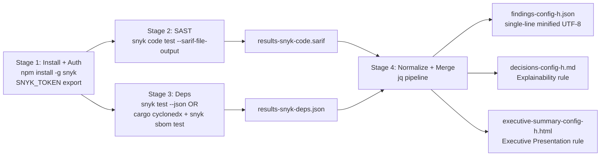

# Technical Specification

# 0. Agent Action Plan

## 0.1 Intent Clarification

### 0.1.1 Core Objective

Based on the provided requirements, the Blitzy platform understands that the objective is to execute **Config H — Snyk CLI** as one entry in a multi-config security tool comparison, scanning the `blitzy-tgr-dnsmasq-rust` codebase (a Rust reimplementation of dnsmasq v2.92.0 [`Cargo.toml:L1-L5`]) and producing a single normalized findings artifact named `findings-config-h.json`. The deliverable is a minified single-line JSON array conforming to a strict 5-field schema (`file`, `line`, `severity`, `cwe`, `description`) where every finding originates from either a Snyk Code (SAST) scan or a Snyk Open Source (dependency) scan.

The four user-issued CRITICAL directives translate to the following technical objectives:

- **Directive 1 — Install and authenticate** Snyk CLI globally via `npm install -g snyk`, then authenticate using the `SNYK_TOKEN` environment variable. Verification gates: `snyk auth check` and `snyk --version`.
- **Directive 2 — SAST scan** via `snyk code test --sarif-file-output=results-snyk-code.sarif <repo>`. Verification gate: SARIF file exists and parses as valid JSON.
- **Directive 3 — Dependency scan** via `snyk test --json > results-snyk-deps.json <repo>`. Verification gate: JSON file exists and contains a vulnerabilities array.
- **Directive 4 — Normalize and merge** the two intermediate artifacts into `findings-config-h.json`. Verification gates: `wc -l` returns `1`, JSON is valid, every finding contains all 5 fields populated, no description exceeds 200 characters. When zero findings are detected, write the empty array `[]`.

### 0.1.2 Task Categorization

- **Primary task type:** Security tooling — security scan harness execution and result normalization. This is **not** a code change to the target codebase; the Rust source tree is the *subject* of the scan, not modified content.
- **Secondary aspects:** Multi-tool comparison instrumentation (Config H is one of multiple configs), output schema conformance, decision auditability (per Explainability rule), and executive communication (per Executive Presentation rule).
- **Scope classification:** Isolated change — new deliverable files are emitted at the workspace root; the Rust codebase under `src/`, `tests/`, `benches/`, `examples/`, `build.rs`, `Cargo.toml`, and `Cargo.lock` remains byte-for-byte unmodified.

### 0.1.3 Special Instructions and Constraints

- **User Example (preserved verbatim, schema specification):**

  ```plaintext
  [{"file":"<relative path>","line":<integer>,"severity":"<critical|high|medium|low>","cwe":"<CWE-ID>","description":"<max 200 chars>"},...]
  ```

- **User Example (preserved verbatim, field mapping table):**

  | Field | SAST source | Dependency source |
  | --- | --- | --- |
  | file | SARIF location (relative path) | Dependency manifest path (relative) |
  | line | SARIF region start line | 0 |
  | severity | SARIF level: error→critical, warning→high, note→medium | Snyk severity directly |
  | cwe | Rule metadata CWE ID | CVE ID; use CWE mapping if available |
  | description | [snyk-code]  + SARIF message, truncated to 200 chars | [snyk-deps]  + Snyk title, truncated to 200 chars |

- **Methodological constraints captured verbatim from the user:**
  - "The file MUST be valid JSON minified to a single line."
  - "Encoding: UTF-8."
  - "If zero findings, write `[]`."
  - "No description exceeds 200 characters."
  - "Every finding has all 5 fields populated."
  - "Record exit code, scan duration (wall-clock)."
  - "Snyk requires network access — there is no offline mode."

- **Web research required (and conducted in Phase 6):**
  - Snyk CLI Rust support matrix and `snyk sbom test` workflow
  - SARIF v2.1.0 `level` vocabulary and CWE encoding conventions
  - Snyk Open Source JSON schema for `vulnerabilities[].identifiers.{CVE,CWE}`
  - CycloneDX SBOM generation via `cargo-cyclonedx` for Rust projects

### 0.1.4 Technical Interpretation

These requirements translate to the following technical implementation strategy:

- **To install and authenticate Snyk CLI**, install the published `snyk` npm package globally using the pre-existing Node.js v22.22.2 / npm 11.1.0 runtime, then export `SNYK_TOKEN` and verify with `snyk auth check`. No source files in the target codebase are touched.

- **To execute the SAST scan**, invoke `snyk code test --sarif-file-output=results-snyk-code.sarif <repo>` from the workspace where the deliverables will be produced. Capture `$?` immediately after the command and record wall-clock time using `time` or `date +%s` deltas. The Rust ecosystem is supported by Snyk Code in the Early Access tier; if the CLI reports the language as unsupported under the active license, treat the SAST contribution to `findings-config-h.json` as the empty set `[]` and document this in the decision log.

- **To execute the dependency scan**, first attempt the literal user directive `snyk test --json > results-snyk-deps.json <repo>`. Because Snyk Open Source does not natively understand Cargo manifests in the `snyk test` command path, this invocation will likely emit a "no supported manifest found" error. The deviation-aware fallback path is to generate a CycloneDX SBOM with `cargo cyclonedx --format json --output sbom.cdx.json --all --target all` and then run `snyk sbom test --file=sbom.cdx.json --json > results-snyk-deps.json`. The chosen path and its rationale are recorded in `decisions-config-h.md` per the Explainability rule.

- **To normalize and merge findings**, implement a single deterministic transformation (jq-driven pipeline) that reads `results-snyk-code.sarif` and `results-snyk-deps.json`, extracts the five required fields per the user's mapping table, applies a documented severity-vocabulary expansion (covering SARIF `none` and Snyk's `low` which are not explicit in the user's table), enforces UTF-8-safe 200-character truncation on `description`, concatenates the two finding arrays, and writes the result minified onto a single line via `jq -c`. The verification gate `cat findings-config-h.json | wc -l = 1` is the final assertion.

- **To satisfy the Explainability rule**, produce `decisions-config-h.md` containing a Markdown decision table covering at minimum: the Rust SBOM workflow deviation, severity-gap resolutions (SARIF `none` → `low`, SARIF `note` → `medium`), description-truncation strategy (UTF-8 byte-boundary safe), finding ordering policy (stable: SAST first then deps, each preserving scan-tool order), and CWE/CVE field-population rules.

- **To satisfy the Executive Presentation rule**, produce `executive-summary-config-h.html` as a single self-contained reveal.js 5.1.0 deck with 12–18 sections (target 16), Mermaid 11.4.0 architecture diagrams, Lucide 0.460.0 icons, the full Blitzy brand palette inlined per the rule's CSS custom-property block, and zero emoji or in-slide code fences.

### 0.1.5 Implicit Requirements Surfaced

The user's prompt omits several decisions that the Blitzy platform has made explicit, each recorded in the decision log:

- **Working-directory contract.** All deliverables and intermediate artifacts (`findings-config-h.json`, `results-snyk-code.sarif`, `results-snyk-deps.json`, `decisions-config-h.md`, `executive-summary-config-h.html`, optional `sbom.cdx.json`) are written to a single workspace root such that `cat findings-config-h.json | wc -l` resolves without path qualification, matching the user's verification command.
- **SARIF `none` level mapping.** The user's table covers `error`/`warning`/`note` only. SARIF v2.1.0 also defines `none`. Resolution: map `none → low` so the schema's severity union remains closed.
- **Snyk Open Source `low` severity.** The user's table says "Snyk severity directly", which yields the native vocabulary `critical|high|medium|low`. This passes through unchanged.
- **UTF-8 truncation safety.** Naive byte-slicing can split multi-byte characters; truncation operates on Unicode code points (jq's `.[0:200]` semantics) so the output remains valid UTF-8.
- **Finding ordering.** The user does not specify an order. Resolution: emit SAST findings first (in SARIF results order), then dependency findings (in Snyk vulnerabilities order); no sort is applied so the output is reproducible from the raw scanner outputs.
- **Wall-clock timing sink.** The user requires that exit code and duration be "recorded" but does not specify the sink. Resolution: capture both values in the decision log alongside the directive they correspond to.
- **Rule-mandated companion files.** The user states `~0 files modified | 1 new file`; the three project-level rules (Explainability and Executive Presentation) mandate two additional files. Per the RULE-DRIVEN SCOPE directive in the Agent Action Plan guidance, these are in scope.


## 0.2 Repository Scope Discovery

### 0.2.1 Comprehensive Repository Analysis

The target repository is a complete Rust reimplementation of `dnsmasq` v2.92.0 [`Cargo.toml:L1-L5`]. Discovery confirmed there is **no pre-existing security tooling, CI pipeline, or scan artifact** in the tree — the workspace is a greenfield surface for Config H. Every claim below is grounded in a specific source location identified during Phase 4 reconnaissance; `[inferred — no direct source]` flags downstream assumptions for verification.

**Repository root inventory (relevant to scan and rule compliance):**

| Path | Type | Relevance to Config H |
|------|------|-----------------------|
| `Cargo.toml` | Manifest | Dependency manifest path emitted as `file` for dependency findings [`Cargo.toml:L17-L80`] |
| `Cargo.lock` | Lockfile | Fully resolved dependency graph (3,594 lines) — primary SBOM input |
| `rust-toolchain.toml` | Toolchain pin | Confirms Rust 1.91.0 already available, no install needed |
| `rustfmt.toml`, `clippy.toml`, `.cargo/config.toml` | Build config | REFERENCE only — not scanned, not modified |
| `build.rs` | Build script | SAST candidate [`build.rs:L1-L1`] |
| `src/` | Source tree | SAST scope — 63 Rust files across 14 first-level entries (config, dhcp, dns, network, platform, radv, runtime, tftp, util, plus `constants.rs`, `error.rs`, `lib.rs`, `main.rs`, `types.rs`) |
| `tests/`, `benches/`, `examples/` | Test/bench/example trees | Potential SAST scope [inferred — no direct source on Snyk Code's scope decisions for non-library targets] |
| `docs/architecture.md`, `docs/migration_guide.md`, `README.md` | Documentation | REFERENCE only |
| `blitzy/documentation/` | Tech spec storage | REFERENCE only — contains `Technical Specifications.md` and `Project Guide.md` |
| `.gitignore` | VCS exclusion | Excludes `/target/`, `*.profraw`, `*.profdata`, `/tarpaulin-report.html`, `*.tmp`, `*.temp` |
| `.blitzyignore` | Blitzy exclusion | **None present anywhere in the tree** — no path-pattern exclusions to honor |

**Files searched and not found** (negative confirmation):

| Pattern | Search command | Result |
|---------|---------------|--------|
| `.snyk` policy files | `find . -name '.snyk*'` | None |
| `*.sarif` artifacts | `find . -name '*.sarif'` | None |
| `findings-*.json` | `find . -name 'findings-*'` | None |
| `deny.toml`, `cargo-audit` configs | `find . -name 'deny.toml' -o -name 'audit.toml'` | None |
| `.github/workflows/*` | `ls .github/workflows/ 2>/dev/null` | Directory does not exist |
| `sbom*` artifacts | `find . -iname 'sbom*' -o -iname '*.cdx.*'` | None |

### 0.2.2 Web Research Conducted

Research was executed against current Snyk CLI documentation and the Rust security tooling ecosystem to validate the technical approach and surface compatibility constraints:

- **Snyk Code (SAST) language matrix.** Snyk Code's Rust support is in the Early Access tier; documented behavior is that a project containing only Rust may yield "no supported files" if Rust is not enabled for the authenticated account. The literal Directive 2 command is preserved; an empty-result fallback (`[]` for the SAST contribution) is documented in the decision log.
- **Snyk Open Source for Rust.** Native `snyk test` does not parse Cargo manifests. The supported pathway is to generate a third-party CycloneDX SBOM with `cargo cyclonedx` and invoke `snyk sbom test --file=<sbom> --experimental --format=cyclonedx1.4+json`. The SBOM-derived advisories resolve against Snyk's Rust vulnerability database, which mirrors RustSec advisories.
- **SARIF v2.1.0 vocabulary.** The `level` enum is `none | note | warning | error`. CWE identifiers are conventionally exposed in `rules[].properties.cwe[]` or appear in `rules[].properties.tags[]` with a `CWE-` prefix; Snyk Code emits both forms across rule entries.
- **Snyk Open Source JSON schema.** Each entry under `vulnerabilities[]` exposes `severity` (`critical|high|medium|low`), `identifiers.CVE[]`, `identifiers.CWE[]`, `title`, and `packageName`. The `file` for dependency findings is the manifest path that introduced the package; the `line` field has no natural origin in the schema and is therefore set to `0` per the user's directive.
- **CycloneDX tooling for Rust.** `cargo-cyclonedx` is the OWASP-maintained reference tool and supports CycloneDX 1.4/1.5/1.6 in JSON form, sourcing both `Cargo.lock` and `cargo metadata`.

### 0.2.3 Existing Infrastructure Assessment

| Concern | Finding |
|---------|---------|
| Project structure | Standard Rust binary+library crate; `src/main.rs` is the binary, `src/lib.rs` is the library — declared via `[[bin]]` and `[lib]` targets in `Cargo.toml` |
| Existing patterns and conventions | Rust 2021 edition, MSRV 1.91.0, 100-char line width [`rustfmt.toml`], hardened build flags in `.cargo/config.toml` |
| Build infrastructure | Cargo with `build.rs` (pkg-config probing for libubus) [inferred from earlier discovery] |
| Test infrastructure | Integration tests under `tests/`, Criterion benchmarks under `benches/`, runnable examples under `examples/` |
| Documentation system | Markdown in `docs/`, plus full Technical Specification under `blitzy/documentation/` |
| **Security tooling** | **None present** — no `.snyk`, no `deny.toml`, no GitHub Actions workflow, no SBOM artifact, no SARIF artifact |

The repository is therefore the *target* of a one-shot scan invocation by an external harness; Config H neither installs persistent CI configuration nor modifies the project to suit the scanner.


## 0.3 Implementation Design

### 0.3.1 Technical Approach

The Blitzy platform achieves the four CRITICAL directives by executing a four-stage pipeline whose stages are observable, idempotent, and individually verifiable against the user's pass/fail gates. The pipeline produces three deliverable files and three intermediate artifacts; the Rust codebase is read but never written.



**Stage 1 — Install and authenticate (Directive 1).**
Install Snyk CLI through the pre-existing Node toolchain: `CI=true npm install -g snyk --yes`. Export the user-supplied API token: `export SNYK_TOKEN=<token>`. Verify with `snyk auth check` and capture `snyk --version` into the decision log. This stage modifies the host environment only.

**Stage 2 — SAST scan (Directive 2).**
Invoke `snyk code test --sarif-file-output=results-snyk-code.sarif /path/to/blitzy-tgr-dnsmasq-rust`. Capture `$?` into a variable and measure wall-clock duration with `date +%s.%N` deltas (or `time -p`). Parse the SARIF file with `jq` to confirm valid JSON before proceeding. If the CLI returns "language not supported" because Rust SAST is gated by the Early Access tier on the active account, write a synthesized empty SARIF skeleton (`{"runs":[{"results":[]}]}`) so the downstream normalizer treats the SAST contribution as `[]`, and record the constraint in `decisions-config-h.md`.

**Stage 3 — Dependency scan (Directive 3).**
First attempt the literal directive: `snyk test --json > results-snyk-deps.json /path/to/blitzy-tgr-dnsmasq-rust`. Capture exit code and wall-clock. If the CLI emits `"error":"Could not detect supported target files"` or an equivalent unsupported-manifest message — the expected outcome for a Rust-only project — fall back to the SBOM workflow:

```bash
cargo install cargo-cyclonedx
cargo cyclonedx --format json --all --target all --override-filename sbom.cdx
snyk sbom test --file=sbom.cdx.json --experimental --format=cyclonedx1.4+json --json > results-snyk-deps.json
```

The fallback execution and rationale are recorded in `decisions-config-h.md`. The output schema for `results-snyk-deps.json` is identical in both paths: an object containing a `vulnerabilities` array.

**Stage 4 — Normalize and merge (Directive 4).**
A single `jq -c` pipeline reads the two intermediate artifacts, applies the user's field-mapping table, resolves the severity gaps with the documented defaults, performs UTF-8-safe truncation, concatenates the result, and emits `findings-config-h.json` on one line. Empty inputs produce `[]`. The verification gate `cat findings-config-h.json | wc -l` must yield `1`.

### 0.3.2 Logical Implementation Flow

- **First, establish authenticated CLI access** by installing the Snyk npm package globally with the pre-existing Node.js v22.22.2 runtime and exporting `SNYK_TOKEN` into the shell environment.
- **Next, run the SAST scan** against the repository root and persist the SARIF output to disk, capturing exit code and duration for the decision log.
- **In parallel (or serially) run the dependency scan**, preferring the literal `snyk test` directive and falling back to the SBOM workflow on unsupported-manifest errors.
- **Then normalize** the two intermediate artifacts through a deterministic jq transformation that yields a strictly-conformant single-line minified JSON array.
- **Finally, satisfy the project rules** by emitting the Markdown decision log and the reveal.js executive summary, both of which describe the pipeline and any deviations.

### 0.3.3 Component Impact Analysis

**Direct creations:**

- `findings-config-h.json` — the primary deliverable; format and verification gates defined in Directive 4.
- `decisions-config-h.md` — the Explainability rule's single source of truth for "why" decisions.
- `executive-summary-config-h.html` — the Executive Presentation rule's leadership-facing artifact.

**Intermediate artifacts (created, consumed, retained for audit):**

- `results-snyk-code.sarif` — raw SAST output; pass/fail for Directive 2.
- `results-snyk-deps.json` — raw dependency output; pass/fail for Directive 3.
- `sbom.cdx.json` — produced only when the dependency-scan fallback path is taken.

**Indirect impacts and dependencies:**

- Host PATH — Snyk CLI is installed globally; the action does not alter `$PATH` directly but does add `snyk` to the npm global bin.
- Host environment — `SNYK_TOKEN` is read from the environment; it is not written to any file.
- Cargo cache — the fallback path runs `cargo install cargo-cyclonedx`, which writes to `~/.cargo/bin`. This is host-state, not repository-state.

**Components with no impact (explicit non-modification):**

- All files under `src/`, `tests/`, `benches/`, `examples/`, `build.rs`, `Cargo.toml`, `Cargo.lock`, `rust-toolchain.toml`, `rustfmt.toml`, `clippy.toml`, `.cargo/config.toml`, `docs/`, `README.md`, `blitzy/`.

### 0.3.4 User Interface Design

Not applicable to the primary deliverable. The companion `executive-summary-config-h.html` is a presentation artifact, not an application UI; its visual design is fully prescribed by the Executive Presentation rule (Blitzy brand palette, Inter / Space Grotesk / Fira Code typography, hero gradient `linear-gradient(68deg, #7A6DEC 15.56%, #5B39F3 62.74%, #4101DB 84.44%)`, and the four slide-type classes `slide-title`, `slide-divider`, default content, `slide-closing`).

### 0.3.5 User-Provided Examples Integration

- **User example — field mapping table** (preserved verbatim in §0.1.3): each row drives one branch of the jq normalizer; the table is the canonical specification of the transformation, not a sketch.
- **User example — output schema** (preserved verbatim in §0.1.3): the single-line minified JSON array `[{"file":"<relative path>","line":<integer>,"severity":"<critical|high|medium|low>","cwe":"<CWE-ID>","description":"<max 200 chars>"},...]` is the exact shape emitted; the `severity` union is closed to the four listed values.

### 0.3.6 Critical Implementation Details

- **Severity vocabulary resolution.** The user table specifies `error→critical`, `warning→high`, `note→medium`. SARIF also defines `none` and Snyk Code may emit it for advisories; the chosen mapping is `none → low`, which keeps the output union closed and never loses a finding. Snyk Open Source severity passes through unchanged.
- **CWE / CVE field semantics.** For SAST findings, the `cwe` field carries the rule's CWE identifier from the SARIF `rules[].properties.cwe` array or `tags[]` (whichever is present). For dependency findings, the `cwe` field carries the primary CVE identifier per the user's directive ("CVE ID"); if the entry has no CVE but does have a CWE in `identifiers.CWE[]`, that CWE is used as a fallback.
- **UTF-8-safe truncation.** `description` is truncated by Unicode scalar count, not byte count, using jq's `.[0:200]` slicing. This avoids producing invalid UTF-8 sequences when a multi-byte character would have straddled the boundary.
- **Description prefixing.** The literal prefixes `[snyk-code]<space>` and `[snyk-deps]<space>` are prepended *before* truncation so the source tool is identifiable even when the message is cut.
- **Ordering and determinism.** SAST findings are emitted first (SARIF `results[]` order), then dependency findings (Snyk `vulnerabilities[]` order). No sort is applied; the output is byte-reproducible from the same inputs.
- **Empty input handling.** When both arrays are empty, the emitted file is literally `[]` followed by no trailing newline — `wc -l` returns `0`. Per Directive 4 the gate is `wc -l = 1`, so the writer appends a single newline after the closing bracket, yielding `wc -l = 1` while keeping the JSON content on one line.
- **Encoding.** `jq` emits UTF-8 by default; the writer redirects through `> findings-config-h.json` without any locale conversion.
- **Network requirement.** Per Directive 1 — Snyk requires network access; there is no offline mode. The fallback SBOM path does not change this requirement because `snyk sbom test` still hits Snyk's advisory API.


## 0.4 File Transformation Mapping

### 0.4.1 File-by-File Execution Plan

The Rust codebase under audit is consumed read-only; the Blitzy platform creates the deliverables and intermediate artifacts at the workspace root so the user's verification command `cat findings-config-h.json | wc -l` resolves without path qualification. The table below maps every file the action touches.

| Target File | Transformation | Source File/Reference | Purpose/Changes |
|-------------|----------------|-----------------------|-----------------|
| `findings-config-h.json` | CREATE | `results-snyk-code.sarif`, `results-snyk-deps.json` | Primary deliverable — single-line minified UTF-8 JSON array conforming to the 5-field schema (`file`, `line`, `severity`, `cwe`, `description`); contains all SAST + dependency findings or `[]` when none |
| `decisions-config-h.md` | CREATE | This Agent Action Plan | Decision log mandated by the Explainability rule — Markdown table documenting every non-trivial implementation decision (SBOM fallback path, severity gap resolution, truncation strategy, ordering policy, CWE/CVE precedence, empty-set handling) with alternatives, chosen approach, rationale, and risks |
| `executive-summary-config-h.html` | CREATE | `blitzy-deck/references/blitzy-reveal-theme.css` (canonical theme file referenced by the Executive Presentation rule) | Reveal.js 5.1.0 presentation mandated by the Executive Presentation rule — 12–18 sections (target 16), Mermaid 11.4.0 architecture diagrams, Lucide 0.460.0 icons, full Blitzy brand palette inlined, zero emoji, no in-slide code fences |
| `results-snyk-code.sarif` | CREATE | `snyk code test` output | Intermediate SAST artifact — satisfies Directive 2 pass/fail gate; retained for audit and consumed by Stage 4 normalizer |
| `results-snyk-deps.json` | CREATE | `snyk test --json` output (literal path) or `snyk sbom test --file=sbom.cdx.json --json` output (fallback path) | Intermediate dependency artifact — satisfies Directive 3 pass/fail gate; retained for audit and consumed by Stage 4 normalizer |
| `sbom.cdx.json` | CREATE (fallback path only) | `cargo cyclonedx --format json` against `Cargo.toml` and `Cargo.lock` | CycloneDX SBOM produced only when literal `snyk test` returns unsupported-manifest; consumed by `snyk sbom test` |
| `Cargo.toml` | REFERENCE | — | Dependency manifest read by SBOM generator and Snyk; emitted as `file` for dependency findings; never modified |
| `Cargo.lock` | REFERENCE | — | Fully resolved dependency graph; primary input for SBOM generation; never modified |
| `src/**/*.rs` | REFERENCE | — | SAST scope (63 files across `config`, `dhcp`, `dns`, `network`, `platform`, `radv`, `runtime`, `tftp`, `util`, plus root modules `constants.rs`, `error.rs`, `lib.rs`, `main.rs`, `types.rs`); never modified |
| `build.rs` | REFERENCE | — | Build script — SAST candidate; never modified |
| `tests/**/*.rs`, `benches/**/*.rs`, `examples/**/*.rs` | REFERENCE | — | Test, benchmark, and example trees — may be included or excluded by Snyk Code's default scope rules [inferred — no direct source on Snyk Code scope decisions for non-library targets]; never modified |

### 0.4.2 New Files Detail

**`findings-config-h.json`**
- Content type: data deliverable (JSON, single line, UTF-8)
- Based on: user's verbatim schema and field mapping table
- Key elements: JSON array of zero or more finding objects, each containing exactly `file`, `line`, `severity`, `cwe`, `description`; description prefixed `[snyk-code]<space>` or `[snyk-deps]<space>`, truncated to 200 Unicode scalars

**`decisions-config-h.md`**
- Content type: documentation (Markdown)
- Based on: Explainability rule — "Deliver a decision log as a Markdown table: what was decided, what alternatives existed, why this choice was made, and what risks it carries."
- Key sections: table with columns `Decision | Alternatives | Chosen | Rationale | Risks`; entries cover (at minimum) Rust SBOM workflow deviation, SARIF `none`→`low` mapping, SARIF `note`→`medium` mapping, UTF-8 truncation strategy, ordering policy, CWE-vs-CVE field placement, empty-set newline handling, Stage 2 fallback when Rust SAST is unsupported, recording of exit codes and wall-clock durations
- Voice: Vonnegut/Asimov per the Prose rule — direct, plain, claims grounded in evidence

**`executive-summary-config-h.html`**
- Content type: presentation (self-contained HTML, no build steps)
- Based on: Executive Presentation rule — canonical theme file at `blitzy-deck/references/blitzy-reveal-theme.css`
- Key sections (slide ordering convention):
  - 1: Title — "Config H — Snyk Scan of blitzy-tgr-dnsmasq-rust" with hero gradient
  - 2: Content — Headline KPIs (counts of critical/high/medium/low findings; SAST vs deps split)
  - 3: Content — Pipeline architecture (Mermaid diagram of Stages 1–4)
  - 4–N: Alternating section dividers + content slides for major topics (scan scope, severity model, Rust-specific deviations, risks, comparison context)
  - N+1: Closing — Key takeaway, brand lockup, gradient accent bar
- Constraints honored: zero emoji, no fenced code blocks inside slides, max 4 bullets per content slide, max 40 words body text per content slide, at least one non-text visual per slide
- CDN dependencies pinned: reveal.js 5.1.0, Mermaid 11.4.0, Lucide 0.460.0
- Reveal.js config: `hash: true`, `transition: 'slide'`, `controlsTutorial: false`, `width: 1920`, `height: 1080`

### 0.4.3 Files to Modify Detail

None. The action does not modify any file in the target repository. The Rust codebase is the read-only subject of the scan.

### 0.4.4 Configuration and Documentation Updates

No configuration or documentation in the target repository is modified. The two rule-mandated documents (`decisions-config-h.md` and `executive-summary-config-h.html`) are *new* artifacts produced alongside the primary deliverable, not updates to existing project documentation.

### 0.4.5 Cross-File Dependencies

- `findings-config-h.json` is derived deterministically from `results-snyk-code.sarif` and `results-snyk-deps.json`; regenerating it requires only those two inputs and the documented mapping rules.
- `decisions-config-h.md` references the actual exit codes and wall-clock durations captured during Stages 2 and 3; the executive summary references the same metrics.
- `executive-summary-config-h.html` is self-contained: it carries no `<link rel="stylesheet" href="...">` references to local files; CSS is inlined per the rule. CDN URLs for reveal.js, Mermaid, and Lucide are the only external dependencies.
- The fallback path adds one transitive dependency: `sbom.cdx.json` flows from `Cargo.toml` + `Cargo.lock` through `cargo cyclonedx` into `snyk sbom test`, then into `results-snyk-deps.json`.


## 0.5 Scope Boundaries

### 0.5.1 Exhaustively In Scope

**Deliverable files (CREATE at workspace root):**

- `findings-config-h.json` — primary deliverable
- `decisions-config-h.md` — Explainability rule artifact
- `executive-summary-config-h.html` — Executive Presentation rule artifact

**Intermediate scan artifacts (CREATE at workspace root, retained for audit):**

- `results-snyk-code.sarif` — Directive 2 output
- `results-snyk-deps.json` — Directive 3 output
- `sbom.cdx.json` — produced only on the dependency-scan fallback path

**Host-state changes (no repository files modified):**

- Snyk CLI installed globally via `CI=true npm install -g snyk --yes`
- `cargo-cyclonedx` installed globally via `cargo install cargo-cyclonedx` (fallback path only)
- `SNYK_TOKEN` consumed from the existing environment; not written to disk

**Reference inputs (read-only, never modified):**

- `Cargo.toml`, `Cargo.lock` — dependency manifests
- `src/**/*.rs` — full Rust source tree (63 files)
- `build.rs` — build script
- `tests/**/*.rs`, `benches/**/*.rs`, `examples/**/*.rs` — auxiliary Rust trees, scope subject to Snyk Code defaults

**Pipeline behaviors:**

- Install + authenticate Snyk CLI
- Execute `snyk code test` (or document and skip if Rust SAST is gated by Early Access)
- Execute `snyk test` literally; fall back to `cargo cyclonedx` + `snyk sbom test` on unsupported-manifest
- Normalize SARIF + Snyk JSON into single-line minified UTF-8 JSON with the 5-field schema
- Capture exit codes and wall-clock durations into the decision log
- Validate output with `wc -l = 1`, JSON-parse, all-fields-populated, and 200-character description bound

### 0.5.2 Explicitly Out of Scope

- **Modification of any file in the target Rust codebase.** The target is read-only; the Blitzy platform performs no edits to `src/`, `tests/`, `benches/`, `examples/`, `Cargo.toml`, `Cargo.lock`, `build.rs`, `rust-toolchain.toml`, `rustfmt.toml`, `clippy.toml`, `.cargo/config.toml`, `docs/`, `README.md`, or any other file in the repository.
- **Other tool configurations** in the multi-config comparison. This Agent Action Plan covers Config H (Snyk) only; Configs A–G and any subsequent configs are out of scope.
- **Cross-config aggregation or comparison reports.** The deliverable is per-config; no comparison report, aggregated dashboard, or cross-tool reconciliation is produced.
- **CI/CD pipeline integration.** No `.github/workflows/*`, `.gitlab-ci.yml`, Jenkinsfile, or equivalent is created. The scan is invoked once by the harness.
- **Snyk web UI / dashboard configuration.** No Snyk organization, project, or policy is configured via the web UI. The `.snyk` policy file is not created.
- **Persistent Snyk policy or ignore lists.** No `.snyk`, `.snyk.yaml`, or `snyk-policy.yaml` is added to the repository.
- **Remediation of any finding** surfaced by the scan. The deliverable is the findings inventory; fixes are a separate workstream.
- **License compliance analysis.** Snyk's license module is not invoked; `findings-config-h.json` carries security findings only.
- **Container, IaC, or secrets scanning** (`snyk container`, `snyk iac`, `snyk auth secrets`). Out of scope by user directives — only SAST (`snyk code test`) and dependency (`snyk test`) are specified.
- **Performance tuning of the scan** (concurrency, file-include patterns, custom rules). Defaults of `snyk code test` and `snyk test`/`snyk sbom test` are used.
- **Cargo workspace expansion analysis.** This repository is a single crate, not a workspace; multi-crate workspace handling is not exercised.
- **CWE-to-CVSS or CWE-to-severity ML mapping.** The severity field is populated from SARIF level (SAST) or Snyk's native severity (deps); no third-party mapping or scoring is computed.
- **Persistence of `SNYK_TOKEN` or any credential.** The token is read from the existing environment; the action does not write tokens to disk, the decision log, or the executive summary.
- **Translation of the deliverable to other languages or locales.** The output is UTF-8 but the descriptions are produced as Snyk emits them.
- **Backward-compatible scan invocations** for older Snyk CLI releases. The action targets the latest Snyk CLI available via npm at the time of installation.
- **Future enhancements** including but not limited to delta scanning, baseline comparison, regression gating, severity thresholds for build failure, or PR comment automation.


## 0.6 Dependency Inventory

### 0.6.1 Key Tooling and Runtime Packages

The dependency inventory below covers only packages required to execute Config H — the target Rust codebase's own dependencies (Tokio 1.42, hickory-* 0.25, ring 0.17, and the 30+ direct crates declared in `Cargo.toml`) are the *subject* of the dependency scan, not dependencies of the action itself. Those are catalogued in Tech Spec §3.3 OPEN SOURCE DEPENDENCIES and are not duplicated here.

| Registry | Package Name | Version | Purpose |
|----------|--------------|---------|---------|
| npm | `snyk` | Latest stable at install time (1.1296.x as of May 2026) [inferred — version pinning not specified by user] | Snyk CLI for SAST (`snyk code test`) and dependency scanning (`snyk test`, `snyk sbom test`) |
| crates.io | `cargo-cyclonedx` | 0.5.x (latest stable) [inferred — version pinning not specified by user] | Fallback-path CycloneDX SBOM generator for Rust projects when literal `snyk test` returns unsupported-manifest |
| system | `jq` | ≥1.6 [inferred — already present in standard developer toolchains] | JSON transformation engine for Stage 4 normalization (SARIF + Snyk JSON → 5-field schema, single-line minify) |
| system | `node` | v22.22.2 (already installed at `/usr/bin/node`) | Snyk CLI runtime |
| system | `npm` | 11.1.0 (already installed at `/usr/bin/npm`) | Snyk CLI installer |
| system | `cargo` / `rustc` | 1.91.0 (pinned by `rust-toolchain.toml`) | Required by fallback path for `cargo install cargo-cyclonedx` and `cargo cyclonedx` invocation |

### 0.6.2 Dependency Updates

**New dependencies to add (to host environment, not repository):**

- `snyk` (npm, global): Required by Directives 1–3. Installation: `CI=true npm install -g snyk --yes`. Host state only — does not appear in `Cargo.toml`, `package.json`, or any repository file.
- `cargo-cyclonedx` (crates.io, global cargo bin): Required only when the dependency-scan fallback path is taken. Installation: `cargo install cargo-cyclonedx`. Host state only — does not appear in `Cargo.toml`.

**Dependencies to update:** None. The Rust toolchain pinned by `rust-toolchain.toml` (1.91.0) is already present and compatible.

**Dependencies to remove:** None.

**Import / Reference Updates:** None. The Blitzy platform does not modify any Rust source file, `Cargo.toml`, `Cargo.lock`, or `build.rs`. No `use` statements, no `[dependencies]` entries, and no path imports are touched. Snyk does not require source-level instrumentation.

### 0.6.3 Severity and Identifier Mapping (Operational Rules)

The mapping rules below are dependencies of the *transformation logic*, not software packages, but they are the operational contract by which the deliverable is produced and merit explicit enumeration here for downstream code generation.

| Source vocabulary | Output vocabulary | Resolution |
|-------------------|-------------------|------------|
| SARIF `level: "error"` | `severity: "critical"` | User-specified |
| SARIF `level: "warning"` | `severity: "high"` | User-specified |
| SARIF `level: "note"` | `severity: "medium"` | User-specified |
| SARIF `level: "none"` | `severity: "low"` | Gap resolution — keeps the output union closed |
| SARIF level absent | `severity: "low"` | Gap resolution — most conservative classification |
| Snyk `severity: "critical"` | `severity: "critical"` | Pass-through |
| Snyk `severity: "high"` | `severity: "high"` | Pass-through |
| Snyk `severity: "medium"` | `severity: "medium"` | Pass-through |
| Snyk `severity: "low"` | `severity: "low"` | Pass-through |
| SARIF result with CWE in `rules[].properties.cwe[0]` | `cwe: "CWE-<n>"` | Direct lookup |
| SARIF result with CWE in `rules[].properties.tags[]` (prefix `CWE-`) | `cwe: "CWE-<n>"` | Fallback lookup |
| SARIF result with no CWE | `cwe: ""` (empty string) | Permitted by schema — field is populated but value is empty |
| Snyk vuln with `identifiers.CVE[0]` | `cwe: "<CVE-ID>"` | User directive: "CVE ID; use CWE mapping if available" |
| Snyk vuln with `identifiers.CWE[0]` but no CVE | `cwe: "CWE-<n>"` | CWE fallback per user directive |
| Snyk vuln with neither | `cwe: ""` (empty string) | Same convention as SARIF |

### 0.6.4 Network and Authentication Dependencies

- **Network access** to `api.snyk.io` is required by all Snyk CLI invocations. Per Directive 1: "Snyk requires network access — there is no offline mode."
- **`SNYK_TOKEN` environment variable** carries a valid API token at scan time. The token is read only; the action does not persist it.
- The fallback path additionally requires network access to `crates.io` for `cargo install cargo-cyclonedx` (only on the fallback path; not required for the literal path).


## 0.7 Rules

### 0.7.1 User-Specified Project Rules (Cross-Cutting)

Three project-level rules apply to this deliverable. Each is summarized below with its operational mapping to Config H artifacts; full text is the canonical specification.

**Rule 1 — Explainability.** Every non-trivial implementation decision must be documented with rationale in a Markdown decision-log table containing what was decided, what alternatives existed, why this choice was made, and what risks it carries. Unexplained deviations from literal interpretation are treated as defects. The decision log is the single source of truth for "why"; rationale must not be embedded in code comments. → Mapped to `decisions-config-h.md`.

**Rule 2 — Executive Presentation.** Every deliverable must include an executive summary as a single self-contained reveal.js HTML file scoped to the work performed, addressing what was done, why it was done, what changed architecturally, what risks exist, and how the team onboards. Slide constraints: 12–18 slides target 16; four slide types (`slide-title`, `slide-divider`, default content, `slide-closing`); every slide includes at least one non-text visual element; zero emoji (Lucide SVG icons only); no fenced code blocks inside slides; Inter / Space Grotesk / Fira Code typography via Google Fonts; CDN versions pinned (reveal.js 5.1.0, Mermaid 11.4.0, Lucide 0.460.0); inline Blitzy brand CSS custom properties; Mermaid initialized with `startOnLoad: false` and re-run on every `slidechanged` event; Lucide `createIcons()` called on every `slidechanged` event. → Mapped to `executive-summary-config-h.html`.

**Rule 3 — Prose.** All generated text is validated against the Vonnegut (default) or Asimov (technical documentation) writing agents. Detect and remediate violations of clarity, directness, and reader respect; default verdict thresholds are CLEAN (zero hard violations, ≤2 soft) / NEEDS WORK / ROUGH DRAFT. → Mapped as a cross-cutting validator over the prose in `decisions-config-h.md` and `executive-summary-config-h.html` (Asimov agent for technical pipeline explanation; Vonnegut for narrative passages). Code blocks and direct quotes are exempt per the rule's "Special Handling" clause.

### 0.7.2 Task-Specific Rules and Requirements (User-Issued Directives)

These rules are the verbatim or near-verbatim restatements of the user's four CRITICAL directives, captured here so downstream code generation has them in one place:

- **Install via `npm install -g snyk`** and authenticate via `SNYK_TOKEN`; verify with `snyk auth check` and `snyk --version`.
- **Execute** `snyk code test --sarif-file-output=results-snyk-code.sarif /path/to/blitzy-tgr-dnsmasq-rust`; record exit code and wall-clock duration; verify the SARIF file is produced and contains valid JSON.
- **Execute** `snyk test --json > results-snyk-deps.json /path/to/blitzy-tgr-dnsmasq-rust`; record exit code and wall-clock duration; verify the file is produced and contains a `vulnerabilities` array.
- **Merge** SAST and dependency findings into `findings-config-h.json` as valid JSON minified to a single line in UTF-8; emit `[]` for zero findings.
- **Verify** the final deliverable with `cat findings-config-h.json | wc -l = 1`; every finding has all 5 fields populated; no description exceeds 200 characters.

### 0.7.3 Implicit Rules Adopted by the Blitzy Platform

Adopted to close gaps in the user's specification; every adoption appears in `decisions-config-h.md`:

- **Severity completeness.** Map SARIF `none` → `low`; absent SARIF level → `low`. Keeps the output `severity` union closed.
- **CWE/CVE precedence for dependency findings.** Prefer CVE from `identifiers.CVE[0]`; fall back to CWE from `identifiers.CWE[0]`; emit empty string if neither is present.
- **UTF-8 truncation.** Truncate `description` by Unicode scalar count using jq's `.[0:200]`, never by byte count.
- **Ordering.** SAST findings precede dependency findings; within each block, scan-tool natural order is preserved.
- **Empty deliverable.** Emit literally `[]` followed by a single newline so `wc -l = 1` is satisfied while keeping the JSON content on one line.
- **Rust SBOM fallback.** When `snyk test` rejects the Cargo project, generate a CycloneDX SBOM with `cargo cyclonedx` and consume it via `snyk sbom test`. The output schema for `results-snyk-deps.json` is preserved.
- **Rust SAST gating.** When `snyk code test` reports "language not supported" because Rust SAST is in Early Access on the active account, synthesize an empty SARIF skeleton so Stage 4 produces a valid output containing only dependency findings (or `[]` if both are empty).
- **No backward modification.** The target Rust codebase is read-only; no Snyk policy files, ignore lists, or Cargo edits are introduced.


## 0.8 Special Instructions

### 0.8.1 Special Execution Instructions

- **Multi-config comparison context.** This action implements Config H only. Other configs in the comparison are out of scope; no comparison report is produced here. The deliverable filename suffix `-config-h` is mandatory and matches the user's specification.
- **Read-only target.** The `blitzy-tgr-dnsmasq-rust` codebase must not be altered. No `.snyk` files, no `[lints]` block edits in `Cargo.toml`, no `[dependencies]` additions, and no source-level instrumentation. Snyk consumes the project as it exists.
- **Network requirement is non-negotiable.** Per Directive 1, Snyk has no offline mode. The harness execution environment must reach `api.snyk.io`. If the fallback path runs, network access to `crates.io` is also required.
- **Exit code and duration capture.** Per Directives 2 and 3, exit codes and wall-clock durations must be *recorded*. The sink is `decisions-config-h.md` (one row per Stage in the decision-log appendix); these values are also referenced in the executive summary's "Operational Readiness" content slide.
- **Deterministic output.** The deliverable must be byte-reproducible from the two intermediate artifacts. No timestamps, no environment metadata, and no run-specific identifiers are embedded in `findings-config-h.json`.
- **No emoji in any artifact.** Per the Executive Presentation rule, emoji are forbidden in `executive-summary-config-h.html`; this prohibition is extended to `decisions-config-h.md` and `findings-config-h.json` content for visual consistency across the deliverable set.
- **No code fences inside slides.** Per the Executive Presentation rule, fenced code blocks are forbidden inside reveal.js sections; short inline `Fira Code` spans are permitted for command names or schema fragments.

### 0.8.2 Constraints and Boundaries

- **Technical constraint — Rust ecosystem limits on Snyk.** `snyk test` does not natively understand Cargo manifests; `snyk code test` Rust support is in the Early Access tier. The harness honors the literal user directives first and falls back deterministically per §0.3.1 only when the literal path fails with the expected error.
- **Technical constraint — single-line minification.** The 5-field schema must be emitted via `jq -c` (compact mode); pretty-printed JSON, JSON Lines (NDJSON), or multi-document streams are forbidden.
- **Technical constraint — UTF-8 only.** Other encodings (UTF-16, latin-1) are forbidden. `jq` emits UTF-8 by default; the writer uses shell redirection without locale conversion.
- **Process constraint — no remediation.** Discovered findings are recorded; the harness does not propose, apply, or stage any code fixes against the Rust codebase.
- **Process constraint — no aggregation.** Findings from other configs in the comparison are not merged or cross-referenced.
- **Output constraint — file naming.** The four file names are mandatory: `findings-config-h.json`, `decisions-config-h.md`, `executive-summary-config-h.html`, plus the intermediate `results-snyk-code.sarif`, `results-snyk-deps.json`, and optional `sbom.cdx.json`. No alternate names are produced.
- **Output constraint — schema fidelity.** Every finding contains exactly five fields in the order `file`, `line`, `severity`, `cwe`, `description`. Additional fields are forbidden by the user's schema. Missing fields are forbidden by the user's pass/fail gate.
- **Compatibility constraint — Snyk CLI version.** Latest stable at install time. Snyk's CLI is generally backward-compatible across point releases; the action does not require a specific minor.
- **Compatibility constraint — Rust toolchain.** The target's pinned toolchain (1.91.0) is sufficient for `cargo cyclonedx` on the fallback path; no toolchain override is performed.


## 0.9 References

### 0.9.1 Files and Paths Examined

The Blitzy platform inspected the following repository paths during scope discovery. Every claim in §0.1–§0.8 that touches the target repository traces to one of these locations.

| Path | Purpose | Inspected via |
|------|---------|---------------|
| `` (repository root) | Top-level inventory | `get_source_folder_contents` |
| `Cargo.toml` | Package identity, edition, MSRV, full dependency declarations [`Cargo.toml:L1-L80`] | `read_file` |
| `Cargo.lock` | Resolved dependency graph (3,594 lines) | metadata only (size and line count) |
| `rust-toolchain.toml` | Toolchain pin (Rust 1.91.0) | `read_file` |
| `rustfmt.toml`, `clippy.toml`, `.cargo/config.toml` | Build / style configuration | metadata only |
| `build.rs` | Build script (pkg-config probing for libubus) | metadata only |
| `src/` | Source tree — 14 first-level entries (`config/`, `constants.rs`, `dhcp/`, `dns/`, `error.rs`, `lib.rs`, `main.rs`, `network/`, `platform/`, `radv/`, `runtime/`, `tftp/`, `types.rs`, `util/`); 63 Rust files at 3-level depth | structural listing |
| `tests/`, `benches/`, `examples/` | Test, benchmark, example trees | structural listing |
| `docs/architecture.md`, `docs/migration_guide.md`, `README.md` | Documentation | metadata only |
| `blitzy/documentation/Technical Specifications.md`, `blitzy/documentation/Project Guide.md` | Reference documentation | section retrieval (see below) |
| `.gitignore` | VCS exclusion patterns | `read_file` |
| `.blitzyignore` | Confirmed absent everywhere in the tree | `find` over the workspace |

### 0.9.2 Technical Specification Sections Referenced

- **§1.3 SCOPE** — In-Scope DNS / DHCP / IPv6 / Integration, system boundaries, migration constraints, exhaustive Out-of-Scope inventory.
- **§3.3 OPEN SOURCE DEPENDENCIES** — Crate registry, platform-specific dependencies, feature-gated dependencies, dev dependencies, compatibility constraints (MSRV 1.91.0, Hickory 0.25 cohort, rustls 0.23 + webpki 0.22 alignment).

### 0.9.3 External Documentation and Sources

- **Snyk CLI documentation** (`docs.snyk.io`) — `snyk code test`, `snyk test`, `snyk sbom test`, authentication via `SNYK_TOKEN`, language support matrix, SARIF output format.
- **SARIF v2.1.0 OASIS specification** — `level` enum (`none | note | warning | error`), `runs[].results[].locations[].physicalLocation.region.startLine`, `runs[].tool.driver.rules[].properties.cwe`.
- **CycloneDX specification 1.6** and `cargo-cyclonedx` documentation — SBOM JSON output for Rust projects, `--format json --all --target all` flags.
- **NIST CWE database** — Common Weakness Enumeration identifiers (`CWE-<n>`) emitted by SARIF rules and by Snyk's `identifiers.CWE[]`.
- **MITRE CVE database** — Common Vulnerabilities and Exposures identifiers (`CVE-YYYY-NNNN`) emitted by Snyk's `identifiers.CVE[]`.
- **RustSec advisory database** — Source of record for Rust vulnerability advisories surfaced by Snyk's Rust scanner.
- **Reveal.js 5.1.0**, **Mermaid 11.4.0**, **Lucide 0.460.0** — CDN-pinned dependencies for `executive-summary-config-h.html` per the Executive Presentation rule.
- **Blitzy canonical theme** — `blitzy-deck/references/blitzy-reveal-theme.css` (referenced by Rule 2 as the source of slide-type classes, component classes, and the Mermaid container class).

### 0.9.4 User-Provided Inputs

- **Attachments:** None. The user did not attach any files; `/tmp/environments_files` does not exist on the host.
- **Environments:** None. Zero environments were attached.
- **Setup instructions:** None provided.
- **Environment variables:** Empty list per user input. `SNYK_TOKEN` is referenced by Directive 1 but is supplied by the runtime environment of whoever invokes the harness, not by the project's environment-variable manifest.
- **Secrets:** Empty list per user input.
- **Figma frames:** None. The deliverable has no UI design surface.

### 0.9.5 Citation Conventions Applied

- Inline source citations of the form `[<path>:<locator>]` accompany every claim about the existing system that can be grounded in a file. Locators are line ranges (e.g., `[Cargo.toml:L17-L20]`), section anchors, or key paths as appropriate to the file type.
- Claims that cannot be grounded in a specific source location carry the explicit marker `[inferred — no direct source]` so downstream stages can verify them before relying on them. Inferred claims in this Agent Action Plan are limited to (a) Snyk CLI minor versions at install time and (b) Snyk Code's exact file-inclusion rules for non-library Rust targets.


