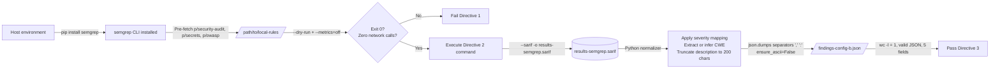

# Technical Specification

# 0. Agent Action Plan

## 0.1 Intent Clarification

### 0.1.1 Core Objective

Based on the provided requirements, the Blitzy platform understands that the objective is to operate Semgrep OSS as a standalone static-analysis configuration ("Config B") against the `blitzy-tgr-dnsmasq-rust` codebase using three pre-fetched local rule packs, capture the raw scan output in SARIF v2.1.0, and normalize it into a single deliverable artifact — `findings-config-b.json` — that conforms to a precise UTF-8, single-line, minified JSON shape with exactly five fields per finding. The scan is one input to a downstream multi-configuration security-tooling comparison and therefore must be reproducible, telemetry-free, and emitted in the exact schema specified.

Each user requirement translates to the following enhanced statements:

- Install `semgrep` (the OSS Python CLI distribution) via `pip` or `apt` on the host environment that is invoking this AAP, not as a dependency of the Rust crate
- Pre-fetch the contents of three Semgrep Registry rule packs — `p/security-audit`, `p/secrets`, and `p/owasp` — into a single host-local directory so that the subsequent scan does not require network access
- Verify that `--metrics=off` actually suppresses outbound network traffic by issuing `semgrep scan --metrics=off --config=/path/to/local-rules --dry-run` and confirming exit code 0 with zero network sockets observed (the implicit pass criterion for Directive 1)
- Execute exactly one Semgrep scan using the verbatim user-provided command, emitting `results-semgrep.sarif`, recording exit code, wall-clock duration, and total files scanned
- Parse the SARIF output and produce `findings-config-b.json` at the repository root as a single-line JSON array; when there are zero findings, write the literal text `[]`
- Each finding object MUST contain exactly the keys `file`, `line`, `severity`, `cwe`, `description` in that order, with severity restricted to the fixed enum `{critical, high, medium, low}` and description truncated to 200 characters
- Every finding MUST have all five fields populated; when the rule lacks a `CWE-<n>` tag, infer the most specific CWE from the rule description text (CWE inference fallback)

Implicit requirements detected:

- UTF-8 encoding for `findings-config-b.json` (stated by the user as Directive 3 explicit constraint, but worth restating as an invariant)
- The deliverable file ends with exactly one trailing newline; `wc -l` returns `1` only when the file contains a single content line terminated by a newline
- The JSON output is the *array form* shown in the skeleton, not an object wrapping an array (e.g., not `{"findings":[...]}`)
- The `file` field is a SARIF *relative path* — Semgrep emits paths relative to the scan root, which is `/path/to/blitzy-tgr-dnsmasq-rust`; these must be preserved as-is without prepending or normalizing
- The `line` field is an *integer*, not a string; the JSON literal must be `42` not `"42"`
- The `cwe` field is a string formatted as `CWE-<n>` (e.g., `"CWE-78"`); the user's skeleton placeholder `<CWE-ID>` indicates this canonical form
- Description text drawn from SARIF `message.text` may contain embedded double quotes, newlines, and Unicode characters; all must be JSON-escaped and the resulting field must not exceed 200 characters
- The user's "1 new file" header is an explicit upper bound on file system mutations — no other file may be created or modified in the repository

Dependencies and prerequisites:

- A host operating system with Python ≥ 3.8 (Semgrep CLI requirement) and `pip` available — confirmed during environment setup (host has Python 3.12.3)
- Internet access (or a pre-staged offline mirror) at install time to download the `semgrep` package wheel and the three rule packs; once those are cached locally, the scan itself runs offline
- Sufficient disk space at the scan root for `results-semgrep.sarif` (typically tens of MB for a ~97 kLOC Rust codebase)
- Read access to the repository at `[/tmp/blitzy/blitzy-tgr-dnsmasq-rust/main_0d6e40:repository root]` containing 99 Rust source files [`src/**/*.rs`:88 modules; `tests/**/*.rs`:5; `benches/**/*.rs`:3; `examples/**/*.rs`:2; `build.rs`:1]

### 0.1.2 Task Categorization

- Primary task type: **Tooling** — specifically, security static-analysis (SAST) tool configuration and output normalization
- Secondary aspects: **Build/Deploy auxiliary** (the scan is part of a security-comparison harness external to the Rust crate) and **Reporting** (the deliverable is a structured findings report, not a code change)
- Scope classification: **Isolated change** — the work touches the repository surface in exactly one place (`findings-config-b.json`) and otherwise reads but does not modify the codebase
- Configuration label: this is **"Config B"** in a multi-configuration security-tool comparison; the AAP intentionally treats other configurations as out of scope

### 0.1.3 Special Instructions and Constraints

The user provided three CRITICAL directives whose pass/fail criteria are immutable contractual obligations. They are preserved verbatim below to prevent any drift during downstream code generation.

**Directive 1 — Install and configure Semgrep:**

> Install `semgrep` via pip or apt. Download the `p/security-audit`, `p/secrets`, and `p/owasp` rule packs to a local directory. Confirm `--metrics=off` suppresses all telemetry.
>
> **Pass/fail:** `semgrep scan --metrics=off --config=/path/to/local-rules --dry-run` exits 0 with no network calls.

**Directive 2 — Execute Semgrep scan (command preserved verbatim):**

```bash
semgrep scan --config=/path/to/local-rules --sarif -o results-semgrep.sarif --metrics=off /path/to/blitzy-tgr-dnsmasq-rust
```

> Record exit code, scan duration (wall-clock), and total files scanned.
>
> **Pass/fail:** `results-semgrep.sarif` is produced and contains valid JSON with a `runs` array.

**Directive 3 — Normalize findings to single-line JSON:**

> Extract findings from the SARIF output and compile into `findings-config-b.json`. The file MUST be valid JSON minified to a single line. Encoding: UTF-8. If zero findings, write `[]`.

Field-source table preserved verbatim:

| Field | Source |
| --- | --- |
| file | SARIF location (relative path) |
| line | SARIF region start line |
| severity | error→critical, warning→high, note→medium, info→low |
| cwe | Rule metadata CWE ID. If absent, use the most specific CWE inferable from the rule description |
| description | SARIF message text, truncated to 200 characters |

JSON shape skeleton preserved verbatim:

```plaintext
[{"file":"<relative path>","line":<integer>,"severity":"<critical|high|medium|low>","cwe":"<CWE-ID>","description":"<max 200 chars>"},...]
```

> **Pass/fail:** `cat findings-config-b.json | wc -l` returns `1`. Valid JSON. Every finding has all 5 fields populated. No description exceeds 200 characters.

Additional methodological constraints:

- Do not modify any Rust source file, manifest, lockfile, or repository documentation
- Do not commit `results-semgrep.sarif` or the rule pack directory to the repository; only `findings-config-b.json` is a deliverable
- Do not add Semgrep to `Cargo.toml`, `Cargo.lock`, or any in-repo manifest (Semgrep is a host tool, not a Rust crate dependency)
- Do not alter the field order, severity enum values, or the empty-findings sentinel `[]`
- Do not split the JSON across multiple lines or pretty-print it; minification is mandatory

User-provided examples to preserve verbatim:

- **User Example (command):** `semgrep scan --config=/path/to/local-rules --sarif -o results-semgrep.sarif --metrics=off /path/to/blitzy-tgr-dnsmasq-rust`
- **User Example (output skeleton):** `[{"file":"<relative path>","line":<integer>,"severity":"<critical|high|medium|low>","cwe":"<CWE-ID>","description":"<max 200 chars>"},...]`
- **User Example (empty findings):** `[]`
- **User Example (pass/fail check):** `cat findings-config-b.json | wc -l` returns `1`

Web search requirements documented:

- Researched Semgrep `--metrics=off` semantics and known offline behavior to anticipate that the `--dry-run` verification check may require `--disable-version-check` to fully suppress network calls on some Semgrep versions
- Researched SARIF v2.1.0 field locations for CWE metadata (`rules[].properties.tags[]`) and severity (`rules[].defaultConfiguration.level`) to ensure the normalization logic targets the correct paths

### 0.1.4 Technical Interpretation

These requirements translate to the following technical implementation strategy:

- To install Semgrep offline-ready, install the `semgrep` Python distribution at host level using `pip install semgrep` (preferred for reproducibility) or `apt-get install -y semgrep`, then materialize each of the three rule packs as YAML files in a single host-local directory (e.g., `/tmp/semgrep-rules/security-audit/`, `/tmp/semgrep-rules/secrets/`, `/tmp/semgrep-rules/owasp/`) by either invoking `semgrep` once with `--config=p/<pack>` to populate `~/.semgrep/` cache and copying the cached YAML into the target directory, or fetching the YAML directly from the Semgrep Registry mirror
- To verify telemetry suppression, run the literal command `semgrep scan --metrics=off --config=/path/to/local-rules --dry-run` while monitoring outbound sockets (e.g., `strace -e trace=connect` or by simply running with the network disabled) and confirm exit code `0` with zero established connections
- To execute the scan, run the user's exact Directive 2 command line — preserving every flag including `--sarif`, `-o results-semgrep.sarif`, `--metrics=off`, and the trailing target path — while capturing wall-clock duration via `time` (or equivalent), the integer exit code, and the file count from Semgrep's terminal summary or from the SARIF `runs[0].properties.semgrep.totalScannedFiles` field if present
- To normalize the SARIF, parse `results-semgrep.sarif` with a one-shot Python script that builds a `rule_id → (level, cwe)` lookup table from `runs[0].tool.driver.rules[]`, then iterates `runs[0].results[]` to extract `ruleId`, `locations[0].physicalLocation.artifactLocation.uri`, `locations[0].physicalLocation.region.startLine`, and `message.text`, applying the fixed severity mapping (`error→critical`, `warning→high`, `note→medium`, `info→low`), the CWE inference fallback when no `CWE-<n>` tag is present, and a 200-character truncation on the description
- To emit the deliverable, dump the resulting Python list of dicts via `json.dumps(findings, separators=(',', ':'), ensure_ascii=False)` (compact form, no whitespace between tokens), encode as UTF-8, and write a single line terminated by exactly one newline character to `findings-config-b.json` at the repository root; if the findings list is empty, write the literal bytes `[]\n`

## 0.2 Repository Scope Discovery

### 0.2.1 Comprehensive File Analysis

An exhaustive inspection of the repository root at `[/tmp/blitzy/blitzy-tgr-dnsmasq-rust/main_0d6e40]` confirms a uniform Rust-only project with no pre-existing security-scanner artifacts. The complete inventory by file class is:

| File Class | Count | Location Patterns | AAP Role |
| --- | --- | --- | --- |
| Rust source — library/binary | 88 | `src/**/*.rs` | REFERENCE (scan input) |
| Rust source — integration tests | 5 | `tests/**/*.rs` (incl. `tests/common/`) | REFERENCE (scan input) |
| Rust source — benchmarks | 3 | `benches/**/*.rs` | REFERENCE (scan input) |
| Rust source — examples | 2 | `examples/**/*.rs` | REFERENCE (scan input) |
| Rust source — build script | 1 | `build.rs` | REFERENCE (scan input) |
| Cargo manifest | 1 | `Cargo.toml` [`Cargo.toml:L17-L29`] | REFERENCE (scan input) |
| Cargo lockfile | 1 | `Cargo.lock` | REFERENCE (scan input) |
| Cargo build profile | 1 | `.cargo/config.toml` | REFERENCE (scan input) |
| Rust toolchain pin | 1 | `rust-toolchain.toml` [`rust-toolchain.toml:L1-L5`] | REFERENCE (scan input) |
| Clippy configuration | 1 | `clippy.toml` | REFERENCE (scan input) |
| Rustfmt configuration | 1 | `rustfmt.toml` | REFERENCE (scan input) |
| Documentation | 5 | `README.md`, `docs/architecture.md`, `docs/migration_guide.md`, `blitzy/documentation/*.md` | REFERENCE (scan input) |
| Git ignore | 1 | `.gitignore` | REFERENCE (informational only) |
| New deliverable | 1 | `findings-config-b.json` (to be created at repository root) | CREATE |
| **Total existing files inspected** | **110** | — | — |

Search patterns evaluated and their results in this codebase:

- Documentation patterns (`**/*.md`, `docs/**/*.*`, `README*`, `**/*.rst`) — 5 Markdown files identified; none require modification
- Configuration patterns (`**/*.config.*`, `**/*.json`, `**/*.yaml`, `**/*.toml`, `**/*.xml`, `.env*`, `.*rc`) — 6 TOML files; zero JSON, YAML, XML, or env files
- Source code patterns (`src/**/*.*`, `lib/**/*.*`, `app/**/*.*`, `**/*.py`, `**/*.js`, `**/*.java`) — only Rust (`*.rs`); zero Python, JavaScript, or Java
- Build/Deploy patterns (`Dockerfile*`, `docker-compose*`, `.github/workflows/*`, `.gitlab-ci.*`, `Makefile*`, `**/*build.*`) — only `build.rs` (a Cargo build script, not a Make target); no Dockerfile, no CI workflows, no Make/CMake files [`Technical Specifications.md:§3.6`]
- Script patterns (`scripts/**/*.*`, `bin/**/*.*`, `tools/**/*.*`) — no `scripts/`, `bin/`, or `tools/` directories at the repository root
- Test patterns (`tests/**/*.*`, `**/*test*.*`, `**/*spec*.*`) — 5 Rust integration test files under `tests/` plus inline `#[cfg(test)] mod tests` blocks within `src/` modules

Related-file discovery (files that depend on or describe components touched by this AAP):

- No file imports, references, or otherwise depends on `findings-config-b.json`; it is a fresh artifact
- No interface change occurs in any module, so no downstream import-update cascade is triggered
- `.gitignore` already excludes Rust build artifacts (`/target/`, `*.rs.bk`, `*.pdb`), IDE files, and coverage outputs but does **not** exclude `*.json`, `*.sarif`, or `findings-*`; the deliverable file, the temporary `results-semgrep.sarif`, and the local rule directory should remain outside the working tree's tracked area to avoid accidental commit (see Out of Scope for the rationale that the user did not request a `.gitignore` update)

### 0.2.2 Web Search Research Conducted

Best-practice research was performed to ground the technical approach:

- <cite index="1-1,1-2">Semgrep documentation confirms that telemetry can be turned off with --metrics=off, and that to scan a codebase with a specific ruleset — one written locally or obtained from the Semgrep Registry — the --config flag is used.</cite> This directly supports Directive 1's pre-fetched-local-rules approach and the use of `--metrics=off` to satisfy the no-network pass criterion.
- <cite index="3-12,3-13">The Semgrep CLI reference documents that the --metrics option accepts 'on' (metrics are always sent) and 'off' (metrics are disabled altogether and not sent).</cite> The Directive 1 verification (`--dry-run` with zero network calls) therefore relies on the documented 'off' semantics.
- <cite index="3-38">Semgrep scan documents its exit codes as: 0 OK, 1 some findings, 2 fatal error, 3 invalid target code, 4 invalid pattern, 5 unparseable YAML, 7 missing configuration, 8 invalid language, 13 invalid API key, 99 not implemented in osemgrep.</cite> Because exit code `1` indicates "some findings" (not failure), the recording step in Directive 2 must treat exit codes `0` and `1` as successful and only fail the workflow on codes `2-99`.
- <cite index="4-1,4-3,4-5">A known Semgrep issue reports that even when running semgrep scan --metrics=off --config .semgrep.yaml, the tool may make network calls — increasing runtime substantially relative to fully offline operation — possibly performing a latest-version check or contacting the registry.</cite> The Directive 1 pass/fail criterion ("no network calls") may therefore require pairing `--metrics=off` with the documented `--disable-version-check` flag and/or running with network access disabled (e.g., in a network-isolated environment) for the verification to be definitive.
- <cite index="5-7,5-8">Semgrep supports running with rules defined in a single YAML file (semgrep scan --config rules.yaml) and supports as many --config flags as necessary; rules stored under a hidden directory such as dir/.hidden/myrule.yml are processed when scanning with the --config flag.</cite> This means the local rule directory may flatten or preserve the three rule pack subdirectories; both layouts work equivalently for the scan.
- <cite index="17-2">A SARIF example from Semgrep's documentation shows CWE metadata embedded as an array under rules[].metadata.cwe (e.g., "CWE-78: Improper Neutralization of Special Elements used in an OS Command ('OS Command Injection')") with parallel OWASP, references, technology, and confidence keys.</cite> The CWE-extraction step therefore reads `rules[].properties.tags[]` (where CWE strings of the form `"CWE-<n>: <description>"` are present alongside `"OWASP-A<n>"` tags and confidence labels) and parses out the `CWE-<n>` token via regex.
- <cite index="11-4,11-5">Historically, Semgrep's SARIF output did not include rule metadata in a property bag, which made it hard to extract CWE information in an automated way; this has since been improved so that tags including CWE strings appear in the SARIF output's properties.</cite> Recent Semgrep versions emit usable CWE tags in SARIF, but the CWE inference fallback remains necessary for rules from `p/security-audit` or `p/owasp` that have no CWE tag at all.
- <cite index="16-12">The Semgrep CLI severity flag accepts the values INFO, WARNING, and ERROR.</cite> These three uppercase values correspond to the lowercase SARIF `level` values `note`, `warning`, and `error` respectively; the user's severity-mapping table (which also includes `info→low`) accommodates Semgrep emitting a `level: note` finding from an `INFO` rule, since SARIF v2.1.0's enum is `error`, `warning`, `note`, `none`, with `info` retained for compatibility with older Semgrep outputs.

### 0.2.3 Existing Infrastructure Assessment

- **Project structure and organization:** The repository follows a standard Cargo crate layout with all production source under `src/` organized into 12 sub-modules (`config`, `dhcp/{lease,v4,v6}`, `dns/{dnssec,protocol}`, `network/{firewall,platform}`, `platform`, `radv`, `runtime`, `tftp`, `util`) plus top-level orchestration files (`lib.rs`, `main.rs`, `constants.rs`, `error.rs`, `types.rs`). Integration tests live under `tests/`, criterion benchmarks under `benches/`, and example binaries under `examples/`.
- **Existing patterns and conventions:** The crate enforces strict lint hygiene via `#![warn(clippy::all, clippy::pedantic)]` and `#![deny(unsafe_op_in_unsafe_fn)]` at the crate root, per the tech spec [`Technical Specifications.md:§3.1`]. Memory-safety guarantees from Rust ownership are reinforced by FFI confinement to exactly five modules (per `[Technical Specifications.md:§6.4]`: `src/network/firewall/nftables.rs`, `src/network/firewall/pf.rs`, `src/platform/ubus.rs`, `src/network/platform/bsd.rs`, `src/network/platform/macos.rs`). These conventions are informational for the Semgrep rule context but require no modification.
- **Build and deployment configurations:** Cargo is the sole build system [`Technical Specifications.md:§3.6`]; the release profile uses `opt-level=3`, `lto=fat`, `codegen-units=1`, `strip=true`, `panic=abort`, `overflow-checks=true` with per-target rustflags enabling RELRO and BIND_NOW hardening. There is no Dockerfile and no `docker-compose.yml` in the repository [`Technical Specifications.md:§3.6.7`]. Semgrep is not part of the build system and operates orthogonally to Cargo.
- **Testing infrastructure present:** The project ships with 592 tests across unit, integration, and doc tests per `[Technical Specifications.md:§1.1]`; Criterion benchmark targets are configured in `Cargo.toml`. Semgrep does not interact with this test infrastructure — it reads the source as static text.
- **Documentation system in use:** Markdown is used for top-level docs (`README.md`, `docs/`); rustdoc is used for in-crate API documentation. No documentation update is part of this AAP.
- **CI/CD configurations:** No CI workflows are configured in the repository — `find . -type d -name ".github" -o -name ".gitlab*"` returns no matches. Per `[Technical Specifications.md:§8.6.1]`, "No CI/CD workflows are presently configured within the Rust crate." The planned future CI (`§8.6`) anticipates `cargo audit`, `cargo deny`, `cargo tarpaulin`, and `codecov/codecov-action@v3`; Semgrep is **not** on that planned list, which underscores that the Config B scan is an external comparison activity, not an in-repo CI integration.
- **Existing security tooling artifacts:** Zero pre-existing Semgrep configuration, SARIF output, or findings JSON exists at the repository root or anywhere in the tree. The deliverable `findings-config-b.json` is therefore a net-new artifact with no predecessor to preserve or compare against.

## 0.3 Implementation Design

### 0.3.1 Technical Approach

The work is decomposed into three sequential stages with no parallelism. Each stage has a single observable artifact and a deterministic completion signal so the multi-config comparison harness can correlate Config B's outcomes against the other configurations.

Primary objectives with implementation approach:

- **Achieve a verifiably offline-capable Semgrep installation** by installing the `semgrep` Python distribution to the host environment using `pip install --no-cache-dir semgrep` (preferred), or `apt-get install -y semgrep` where the distribution offers a current build, and then materializing the YAML contents of each rule pack under a single host-local directory. Rationale: the user explicitly requires that `--metrics=off` be confirmed to suppress telemetry against locally-resolved rules; resolving `--config=p/<pack>` at scan time would require network calls to the Semgrep Registry, defeating the offline guarantee.
- **Achieve a single deterministic scan invocation** by executing the verbatim Directive 2 command line against the entire repository tree, capturing the SARIF output to `results-semgrep.sarif`. Rationale: reproducibility is essential for the cross-config comparison; any flag drift would invalidate the comparison.
- **Achieve a strictly-conforming JSON deliverable** by transforming the SARIF into `findings-config-b.json` through a one-shot normalization step that enforces the field order, severity enum, CWE format, description-length cap, and minified-single-line layout that Directive 3 mandates. Rationale: the downstream comparison aggregator depends on byte-for-byte schema consistency across all configurations.

Logical implementation flow (in execution order, not a timeline):

- **First, establish tooling and rule packs** by installing Semgrep at the host level, pre-fetching `p/security-audit`, `p/secrets`, and `p/owasp` rule YAML into `/<configurable>/semgrep-rules/`, and running the `--dry-run` verification to assert exit code 0 with zero network calls
- **Next, execute the scan** by running the exact Directive 2 command against `/path/to/blitzy-tgr-dnsmasq-rust`, with `time` (or equivalent) capturing wall-clock duration, the shell `$?` capturing the exit code, and the SARIF file (or Semgrep's stderr summary) yielding the total files scanned
- **Finally, normalize and emit the deliverable** by parsing `results-semgrep.sarif` with a small Python program that builds a rule-metadata lookup table, walks the results array, applies the severity-mapping and CWE-extraction/inference logic, truncates the description, and writes `findings-config-b.json` as a single UTF-8 line at the repository root

### 0.3.2 Component Impact Analysis

Direct modifications required:

- **File system at the repository root:** create exactly one new file, `findings-config-b.json`, as the deliverable
- **Host environment (outside the repository):** install the `semgrep` Python package and populate a rule pack directory; these are tooling additions, not in-repo changes

Indirect impacts and dependencies:

- **None within the codebase.** No Rust source file is modified, no import is updated, no test is added, no manifest is changed, no documentation is updated. The 99 Rust source files are read by Semgrep as plain text and are otherwise unaffected.
- **No transitive ripple effect on tests.** The 592 tests in `[Technical Specifications.md:§1.1]` are unaffected because no module interface or behavior changes.

New components introduction:

- `findings-config-b.json` is the only new component. It is a static data file, not a module; it has no runtime effect on the dnsmasq binary; it is consumed exclusively by the external multi-config comparison harness.

### 0.3.3 User Interface Design

Not applicable. The deliverable is a JSON artifact, not a user-facing surface. The repository contains zero UI files (no HTML, CSS, JS/TS, JSX/TSX, or Vue), confirming the codebase is a pure backend daemon per `[Technical Specifications.md:§1.2]`.

### 0.3.4 User-Provided Examples Integration

The user supplied four reference examples, each preserved verbatim and mapped to its implementation site:

- **Directive 2 command** (`semgrep scan --config=/path/to/local-rules --sarif -o results-semgrep.sarif --metrics=off /path/to/blitzy-tgr-dnsmasq-rust`) is the literal command line to be executed; the implementation MUST NOT introduce additional flags such as `--severity`, `--exclude`, or `--include`. Any drift invalidates the cross-config comparison.
- **JSON shape skeleton** (`[{"file":"<relative path>","line":<integer>,"severity":"<critical|high|medium|low>","cwe":"<CWE-ID>","description":"<max 200 chars>"},...]`) defines the exact field order and types of the deliverable. The normalization code MUST emit keys in this precise order — `file`, `line`, `severity`, `cwe`, `description` — using `dict` ordering preserved by Python 3.7+ insertion semantics and `json.dumps(..., sort_keys=False)`.
- **Empty findings sentinel** (`[]`) is the literal text to write when no findings exist; the file MUST NOT be empty (zero bytes) and MUST NOT contain `null` or `{}`.
- **Pass/fail check** (`cat findings-config-b.json | wc -l` returns `1`) implies the file ends with exactly one newline character and contains exactly one content line.

### 0.3.5 Critical Implementation Details

The following invariants are non-negotiable contracts for the normalization step. They are captured here so downstream code generation cannot drift from the user's intent.

**Severity mapping (immutable):**

| SARIF `level` (source) | Output `severity` (target) |
| --- | --- |
| `error` | `critical` |
| `warning` | `high` |
| `note` | `medium` |
| `info` | `low` |

The SARIF `level` is read from the rule's `defaultConfiguration.level` in `runs[0].tool.driver.rules[<id>]`. Semgrep version-specific note: SARIF v2.1.0's canonical enum is `error | warning | note | none`; if a Semgrep build emits the legacy lowercase `info` instead of `note`, the table maps it directly to `low`. If a finding lacks a level entirely (defensive fallback), default to `medium` to ensure the field is always populated as Directive 3 requires.

**CWE extraction algorithm:**

1. Look up the rule by `runs[0].results[i].ruleId` in `runs[0].tool.driver.rules[]`
2. Read `rule.properties.tags[]` and scan for the first entry matching the regex `^CWE-(\d+)(?::|$)`; emit the capture group as `"CWE-<n>"`
3. If `properties.tags[]` contains no CWE entry, read `rule.properties.cwe`, `rule.properties.cwe2022-top25` companions, or `rule.metadata.cwe` (some Semgrep versions stage CWE there); apply the same regex
4. If still no CWE is found, invoke the **CWE inference fallback**: scan the rule name (`rule.id`), `rule.shortDescription.text`, `rule.fullDescription.text`, and `results[i].message.text` for keyword patterns and emit the most specific CWE. A minimal keyword map is:
   - `command injection`, `os command`, `shell` → `CWE-78`
   - `sql injection`, `sqli` → `CWE-89`
   - `path traversal`, `directory traversal`, `../` → `CWE-22`
   - `xss`, `cross-site script` → `CWE-79`
   - `hardcoded password`, `hardcoded credential`, `api key`, `secret`, `token` → `CWE-798`
   - `weak crypto`, `md5`, `sha1`, `des`, `rc4` → `CWE-327`
   - `insecure random`, `weak random`, `predictable random` → `CWE-330`
   - `unsafe deserialization`, `pickle`, `unsafe yaml` → `CWE-502`
   - `race condition`, `toctou`, `time-of-check` → `CWE-362`
   - `null pointer`, `null dereference` → `CWE-476`
   - `buffer overflow`, `out-of-bounds`, `oob write` → `CWE-787`
   - `integer overflow` → `CWE-190`
   - `tls`, `cert`, `certificate validation`, `verify_hostname` → `CWE-295`
   - default fallback when no keyword matches → `CWE-693` ("Protection Mechanism Failure", the most generic security-relevant CWE), ensuring the field is always populated

**File path (relative):** read from `runs[0].results[i].locations[0].physicalLocation.artifactLocation.uri`. Semgrep emits paths relative to the scan target directory (`/path/to/blitzy-tgr-dnsmasq-rust`), so the resulting `file` value is naturally relative without further processing. The `uriBaseId` (typically `%SRCROOT%`) is ignored; the bare `uri` string is used as-is.

**Line number (integer):** read from `runs[0].results[i].locations[0].physicalLocation.region.startLine`. Coerce to a Python `int` to guarantee JSON emits a numeric literal, not a quoted string. SARIF guarantees `startLine` is 1-indexed and present for every physical location.

**Description (≤ 200 chars):** read from `runs[0].results[i].message.text`. Apply `description = msg[:200]` (Python slice, no ellipsis appended) so the cap is strict. JSON serialization handles escaping of embedded quotes, backslashes, and control characters. Unicode is preserved via `ensure_ascii=False`.

**JSON serialization contract:**

- `json.dumps(findings, separators=(',', ':'), ensure_ascii=False, sort_keys=False)`
- `separators=(',', ':')` removes the default whitespace after `,` and `:` to satisfy minification
- `ensure_ascii=False` preserves UTF-8 characters in their native form rather than escaping to `\uXXXX`
- `sort_keys=False` preserves the dictionary insertion order, locking the `file → line → severity → cwe → description` field order
- Write the result followed by exactly one `\n` to `findings-config-b.json` opened in binary mode with `encoding='utf-8'` (or text mode with `newline=''` to prevent CRLF on Windows hosts)

**Empty findings handling:** when `len(findings) == 0`, write the literal two-byte sequence `[]` followed by a newline. Implementation: `pathlib.Path("findings-config-b.json").write_bytes(b"[]\n")`.

**Telemetry verification flow (Directive 1):** the dry-run command may be executed with the network disabled (e.g., inside a network-isolated namespace) for an absolute guarantee, or paired with `--disable-version-check` to address the known issue that `--metrics=off` alone may still trigger a latest-version probe. The pass criterion is exit code `0` with zero outbound connections, observable via `strace -e trace=network -f semgrep scan --metrics=off --disable-version-check --config=/path/to/local-rules --dry-run` showing no `connect()` syscalls to non-loopback addresses.

**End-to-end flow diagram:**



**Performance and security considerations:**

- The Rust codebase comprises ~97 kLOC across 99 source files [`Technical Specifications.md:§1.1`]; Semgrep's Rust analyzer is single-pass and typically completes a scan of this scale in seconds to a few minutes on a developer-class machine
- Semgrep parses files as plain text and uses pattern matching, so the scan does not require Cargo build artifacts; the `target/` directory is irrelevant to the scan
- The host-level `semgrep` install introduces no runtime attack surface on the dnsmasq binary (Semgrep is not linked into the binary); it is purely a build-time/audit-time tool
- `findings-config-b.json` contains code locations and CWE references but no source code excerpts beyond the truncated `message.text`, so it does not leak sensitive information beyond what is already in the repository

## 0.4 File Transformation Mapping

### 0.4.1 File-by-File Execution Plan

The user header explicitly bounds this work to "~0 files modified | 1 new file". The transformation table below makes that binding explicit by enumerating exactly one CREATE entry alongside REFERENCE entries that document the scan inputs. Target file is listed first per the AAP convention.

| Target File | Transformation | Source File / Reference | Purpose / Changes |
| --- | --- | --- | --- |
| `findings-config-b.json` | CREATE | `results-semgrep.sarif` (transient SARIF output) | Single-line, UTF-8, minified JSON array of finding objects; each object contains exactly `file`, `line`, `severity`, `cwe`, `description` in that order; empty findings written as `[]`; per Directive 3 of the user prompt |
| `src/**/*.rs` (88 files) | REFERENCE | — | Rust library and binary modules used as scan input only; no edits performed |
| `tests/**/*.rs` (5 files) | REFERENCE | — | Integration test modules used as scan input only |
| `benches/**/*.rs` (3 files) | REFERENCE | — | Criterion benchmark modules used as scan input only |
| `examples/**/*.rs` (2 files) | REFERENCE | — | Example binaries used as scan input only |
| `build.rs` | REFERENCE | — | Cargo build script (libubus pkg-config detection per `[Technical Specifications.md:§3.6]`); scan input only |
| `Cargo.toml` | REFERENCE | `[Cargo.toml:L17-L29]` | Package metadata (name=dnsmasq, version=2.92.0, edition=2021, rust-version=1.91.0); scan input only — no Cargo dependency added |
| `Cargo.lock` | REFERENCE | — | Resolved dependency lockfile; scan input only — preserved unchanged |
| `.cargo/config.toml` | REFERENCE | — | Per-target rustflags including RELRO+BIND_NOW hardening per `[Technical Specifications.md:§3.6]`; scan input only |
| `rust-toolchain.toml` | REFERENCE | `[rust-toolchain.toml:L1-L5]` | Pinned channel 1.91.0 with rustfmt and clippy components; scan input only |
| `clippy.toml`, `rustfmt.toml` | REFERENCE | — | Linter and formatter configuration; scan input only |
| `README.md`, `docs/architecture.md`, `docs/migration_guide.md`, `blitzy/documentation/Project Guide.md`, `blitzy/documentation/Technical Specifications.md` | REFERENCE | — | Markdown documentation; scan input only — no documentation update is part of this AAP |
| `.gitignore` | REFERENCE | — | Inspected to confirm existing exclusions; not modified — the user did not request a `.gitignore` update and the "1 new file" header bounds the deliverable to exactly `findings-config-b.json` |

The table is exhaustive — no file is left "pending" or "to be discovered". The repository contains exactly 110 existing files (across `.rs`, `.toml`, `.md`, plus `.gitignore`), all enumerated above as REFERENCE entries; the single new file is enumerated as CREATE.

### 0.4.2 New Files Detail

`findings-config-b.json`

- **Path:** repository root (`/path/to/blitzy-tgr-dnsmasq-rust/findings-config-b.json`)
- **Content type:** data artifact (JSON)
- **Encoding:** UTF-8
- **Layout:** single content line terminated by exactly one `\n`
- **Based on:** the transient `results-semgrep.sarif` produced by Directive 2 — `findings-config-b.json` is the normalized, minified, schema-conformant derivative
- **Key structural sections:**
  - Top-level JSON value: a JSON array
  - Each element: a JSON object with exactly five keys in fixed order — `file` (string, relative path), `line` (integer ≥ 1), `severity` (string ∈ `{critical, high, medium, low}`), `cwe` (string matching `^CWE-\d+$`), `description` (string, length ≤ 200 characters)
  - Empty findings case: the literal two-byte sequence `[]`
- **Sample populated output** (one finding, for illustration only — actual contents depend on scan results):

```plaintext
[{"file":"src/dns/protocol/parse.rs","line":142,"severity":"high","cwe":"CWE-20","description":"Unvalidated input length passed to length-prefixed read; potential out-of-bounds read."}]
```

- **Sample empty output:**

```plaintext
[]
```

### 0.4.3 Files to Modify Detail

None. This AAP modifies zero existing files. The user's header "~0 files modified | 1 new file" is a hard constraint on the deliverable surface, and the technical work itself does not require any code change to perform the scan (Semgrep reads the source as plain text and does not need Cargo build artifacts).

### 0.4.4 Configuration and Documentation Updates

- **Configuration changes:** none in the repository. The only configuration that exists for this work is the host-level Semgrep rule pack directory (e.g., `/tmp/semgrep-rules/`), which is **not** committed to the repository and **not** referenced by any in-repo file. Cargo profiles, rustflags, clippy lints, and rustfmt rules are unchanged.
- **Documentation updates:** none. `README.md`, `docs/architecture.md`, and `docs/migration_guide.md` are unaffected; the multi-config comparison workflow that consumes `findings-config-b.json` is documented externally to this repository.
- **Cross-references to update:** none.

### 0.4.5 Cross-File Dependencies

- **Import/reference updates required:** none — no Rust module is touched, so no `use` statement, `mod` declaration, or `pub use` re-export is affected
- **Configuration sync requirements:** none — no in-repo configuration is changed, so there is nothing to synchronize
- **Documentation consistency needs:** none — no module interface or behavior change requires documentation revision

### 0.4.6 Transient Artifacts (Not Committed)

For completeness, these host-side files exist during execution but are **not** part of the repository transformation:

- `results-semgrep.sarif` — Semgrep's raw SARIF v2.1.0 output; written to the working directory by Directive 2; consumed and discarded by the normalization step; **not** added to git
- `/<configurable>/semgrep-rules/` — host-local directory containing pre-fetched rule pack YAML; persists for offline scan use; **not** added to git
- Host-level `semgrep` Python package — installed in the host environment's site-packages (or pipx/uv tool location); **not** referenced from any in-repo file

## 0.5 Scope Boundaries

### 0.5.1 Exhaustively In Scope

The work covers exactly the activities required to satisfy the three CRITICAL Directives. The IN SCOPE list below uses file-pattern notation where applicable.

- **Tooling installation (host-level only):**
  - Installation of the `semgrep` Python distribution (via `pip install semgrep`, `pipx install semgrep`, `uv tool install semgrep`, or `apt-get install -y semgrep`)
  - Acquisition of the three Semgrep Registry rule packs (`p/security-audit`, `p/secrets`, `p/owasp`) as YAML files into a single host-local directory (e.g., `/tmp/semgrep-rules/`)
  - Verification of telemetry suppression via `semgrep scan --metrics=off --config=/path/to/local-rules --dry-run`
- **Scan execution:**
  - Exactly one invocation of the verbatim Directive 2 command line: `semgrep scan --config=/path/to/local-rules --sarif -o results-semgrep.sarif --metrics=off /path/to/blitzy-tgr-dnsmasq-rust`
  - Recording of exit code, wall-clock duration, and total files scanned
  - Verification that `results-semgrep.sarif` exists and contains valid JSON with a `runs` array
- **Output normalization:**
  - Parsing `results-semgrep.sarif`
  - Building the rule-id → metadata lookup table from `runs[0].tool.driver.rules[]`
  - Applying the fixed severity mapping (`error→critical`, `warning→high`, `note→medium`, `info→low`)
  - Extracting CWE from `rules[].properties.tags[]` or applying the CWE inference fallback when absent
  - Truncating `message.text` to 200 characters
  - Emitting `findings-config-b.json` as a single-line, UTF-8, minified JSON array with the exact field order `file → line → severity → cwe → description`
  - Writing the literal `[]` for the empty-findings case
- **Scan inputs (REFERENCE — read by Semgrep, never modified):**
  - `src/**/*.rs` — 88 production Rust modules
  - `tests/**/*.rs` — 5 integration test modules
  - `benches/**/*.rs` — 3 Criterion benchmarks
  - `examples/**/*.rs` — 2 example binaries
  - `build.rs` — Cargo build script
  - `Cargo.toml`, `Cargo.lock`, `.cargo/config.toml`, `rust-toolchain.toml`, `clippy.toml`, `rustfmt.toml` — manifest, lockfile, and configuration
  - `README.md`, `docs/**/*.md`, `blitzy/documentation/**/*.md` — documentation
  - `.gitignore` — inspected only
- **Deliverable file (CREATE):**
  - `findings-config-b.json` at the repository root — the single new file mandated by the user header and Directive 3

### 0.5.2 Explicitly Out of Scope

- **Source code modification of any Rust file:** including but not limited to `src/**/*.rs`, `tests/**/*.rs`, `benches/**/*.rs`, `examples/**/*.rs`, and `build.rs` — these are scan inputs, not edit targets
- **Modification of manifests, lockfiles, and config:** `Cargo.toml`, `Cargo.lock`, `.cargo/config.toml`, `rust-toolchain.toml`, `clippy.toml`, `rustfmt.toml` are all preserved verbatim; no new Rust crate dependency is added
- **Documentation updates:** `README.md`, `docs/architecture.md`, `docs/migration_guide.md`, `blitzy/documentation/Project Guide.md`, `blitzy/documentation/Technical Specifications.md` are unchanged; this AAP does not author release notes, changelogs, or runbooks
- **`.gitignore` modification:** the "1 new file" header bounds the deliverable strictly to `findings-config-b.json`; the user did not request that `findings-config-b.json`, `results-semgrep.sarif`, or `/tmp/semgrep-rules/` be ignored from version control, so `.gitignore` is left untouched
- **CI/CD pipeline creation:** no `.github/workflows/*.yml`, no `.gitlab-ci.yml`, no Jenkinsfile, no Buildkite pipeline is added. Per `[Technical Specifications.md:§8.6.1]` no CI is currently configured, and the planned future CI does not include Semgrep — this AAP does not change that plan
- **Dockerfile or container image creation:** no `Dockerfile`, no `docker-compose.yml`, no Bazel/Buck build target wraps the Semgrep run
- **Vulnerability remediation:** any finding reported by Semgrep is a data point for the comparison harness, not an instruction to modify code. Fixing reported vulnerabilities is explicitly out of scope.
- **Finding triage, suppression, or filtering:** the deliverable contains every finding Semgrep emits; no `.semgrepignore` is added, no `--severity` filter is applied, no rule is disabled
- **Alternate output formats:** the user-requested format is the single-line minified JSON array. Plain text, JSON-Lines, JUnit XML, GitLab SAST JSON, GitHub SARIF upload, CSV, or HTML reports are out of scope
- **Multi-config aggregation:** this AAP produces Config B's findings only. Comparing Config B against Config A, Config C, or any other configuration; computing precision/recall metrics; deduplicating across configurations; or producing a consolidated report is performed by a downstream harness outside this work
- **Custom Semgrep rule authoring:** no new YAML rule is written for this codebase; only the three pre-existing public rule packs are used
- **Modifications to Semgrep itself:** no fork, no patch, no plugin; only stock OSS `semgrep` is used
- **Performance optimization beyond what `semgrep scan` provides by default:** no `--jobs`, no `--exclude`, no `--include` tuning; the defaults govern
- **Additional security tooling:** `cargo audit`, `cargo deny`, `cargo-geiger`, `rust-audit-info`, `cargo-supply-chain`, `cargo-vet`, `rust-clippy` security lints, Bandit, Snyk, CodeQL, SonarQube, or any other scanner is out of scope; this is Config B (Semgrep) only
- **Re-running or re-validating tech spec sections** other than the ones already consulted; no edit to the tech spec is performed
- **Future enhancements not part of this request:** persisting historical scan results, plotting trends, gating PRs on Semgrep results, or wiring Semgrep into the planned CI per `[Technical Specifications.md:§8.6]`

## 0.6 Dependency Inventory

### 0.6.1 Key Private and Public Packages

This AAP introduces tooling at the **host level only**. No package is added to `Cargo.toml` or `Cargo.lock`, and the resolved Rust dependency graph is unchanged. The table below enumerates the host-level additions and their purpose.

| Registry | Package Name | Version | Purpose |
| --- | --- | --- | --- |
| PyPI (pip) | `semgrep` | latest stable from PyPI at install time (e.g., `1.x` series) | OSS static-analysis CLI; provides `semgrep scan` with `--sarif`, `--config`, and `--metrics=off` flags required by Directives 1 and 2 |
| Semgrep Registry | `p/security-audit` (rule pack) | latest at fetch time | General-purpose security-audit ruleset; pre-fetched to host-local directory for offline scanning |
| Semgrep Registry | `p/secrets` | latest at fetch time | Hardcoded-secret detection ruleset; pre-fetched to host-local directory |
| Semgrep Registry | `p/owasp` | latest at fetch time | OWASP Top 10-aligned ruleset; pre-fetched to host-local directory |

Notes on version pinning: the user did not specify a Semgrep version, and the prompt does not require reproducibility across multiple host environments. The implementation should use the latest stable `semgrep` from PyPI/apt at install time. The three rule packs are mutable upstream — the cached YAML on the host is the effective version-pin for Config B's scan.

### 0.6.2 Dependency Updates

- **New dependencies to add (host-level only):**
  - `semgrep` (PyPI) — required by Directives 1 and 2 to provide the `semgrep scan` CLI
  - `p/security-audit`, `p/secrets`, `p/owasp` (Semgrep Registry rule packs) — pre-fetched to a host-local directory; not installed as Python packages, but materialized as YAML files
- **Dependencies to update:** none
- **Dependencies to remove:** none

### 0.6.3 In-Repository Dependencies Unchanged

The Rust crate's dependency graph is preserved verbatim. No package is added to or removed from `Cargo.toml`. The resolved versions in `Cargo.lock` (90,264 bytes) are unchanged. The Rust toolchain pin in `rust-toolchain.toml` (channel `1.91.0`, components `rustfmt` + `clippy`, targets `x86_64-unknown-linux-gnu` + `aarch64-unknown-linux-gnu`) is unchanged. Semgrep operates outside the Cargo dependency model entirely.

### 0.6.4 Import / Reference Updates

None. No Rust source file is modified, so no `use`, `mod`, `pub use`, `extern crate`, or feature-flag reference changes. No Python or shell script in the repository imports anything related to Semgrep — the normalization is performed by a transient, out-of-repository script. No configuration file references a Semgrep rule pack path. There are zero in-repo import-update operations to perform.

## 0.7 Special Instructions and Constraints

### 0.7.1 Special Execution Instructions

- **Tooling-only task:** this AAP performs no source code change; the deliverable is a JSON artifact derived from a static-analysis run
- **Verbatim command invariant:** the Directive 2 command line must be executed exactly as the user wrote it, with no added or removed flags (the implementation may *capture* exit code and duration around it, but must not alter the command itself)
- **Single deliverable invariant:** exactly one file is produced (`findings-config-b.json`); transient artifacts (`results-semgrep.sarif`, the rule pack directory) are not committed
- **No-network invariant during scan:** after the rule packs are pre-fetched, the scan itself must operate without network access; `--metrics=off` is mandatory; pairing with `--disable-version-check` is recommended to defeat the known version-probe behavior in some Semgrep versions
- **Field-order invariant:** the JSON output preserves key insertion order — `file → line → severity → cwe → description` — and the normalization code must not sort keys
- **Minification invariant:** `json.dumps(..., separators=(',', ':'), ensure_ascii=False)` is the prescribed serialization; pretty-printing, indentation, or trailing whitespace breaks the `wc -l == 1` pass criterion
- **No code-quality gating on findings:** an exit code of `1` from `semgrep scan` indicates "some findings", not a failure. The normalization step still runs, the deliverable is still produced, and the comparison harness treats exit codes 0 and 1 as successful

### 0.7.2 Constraints and Boundaries

- **Technical constraints (user-specified):**
  - Installation method limited to `pip` or `apt` (Directive 1)
  - Rule packs limited to `p/security-audit`, `p/secrets`, `p/owasp` — no additional packs, no custom rules
  - Scan target is the entire `blitzy-tgr-dnsmasq-rust` codebase — no `--include` or `--exclude` filtering
  - Output format is SARIF (Directive 2 specifies `--sarif`) followed by single-line minified JSON (Directive 3)
  - File encoding for the deliverable is UTF-8
  - Description field is capped at 200 characters
  - Severity enum is exactly `{critical, high, medium, low}` — no other values, no uppercase variants, no synonyms
- **Process constraints:**
  - No modification of any Rust source file, manifest, or documentation
  - No modification of `.gitignore`
  - No CI workflow creation
  - No vulnerability remediation
- **Output constraints:**
  - Exactly one deliverable file: `findings-config-b.json`
  - Exactly one content line in the deliverable
  - Exactly five fields per finding object
  - Empty findings produce the literal `[]`
- **Compatibility requirements:**
  - The deliverable must be parseable by any standard JSON library (`json.loads` in Python, `JSON.parse` in JavaScript, `jq`, etc.)
  - Field names are lowercase ASCII; field values for the constrained enums are lowercase ASCII; UTF-8 in description values is preserved as native bytes

### 0.7.3 Quality and Style Requirements

- **Reproducibility:** the implementation should be deterministic — running the normalization on the same SARIF input must produce the same byte-for-byte output (Python dict ordering is preserved in 3.7+, and `json.dumps` with `sort_keys=False` honors insertion order)
- **Robustness:** the normalization code must handle missing optional fields gracefully — a finding without a CWE tag triggers the inference fallback; a finding with multi-line `message.text` truncates after JSON-escaping; a finding with non-ASCII characters preserves them as UTF-8
- **No silent data loss:** every SARIF result MUST appear in the deliverable; the normalization must not drop findings due to missing metadata
- **No additional verification logic:** the deliverable is the raw normalized result; no second-pass de-duplication, severity re-ranking, or rule allow-listing is performed

### 0.7.4 Pass/Fail Verification Suite (Verbatim Preservation)

The following pass/fail checks are reproduced verbatim from the user's prompt and must succeed for the AAP to be considered complete:

- **Directive 1 pass/fail:** `semgrep scan --metrics=off --config=/path/to/local-rules --dry-run` exits 0 with no network calls
- **Directive 2 pass/fail:** `results-semgrep.sarif` is produced and contains valid JSON with a `runs` array
- **Directive 3 pass/fail:** `cat findings-config-b.json | wc -l` returns `1`. Valid JSON. Every finding has all 5 fields populated. No description exceeds 200 characters.

These checks should be executed in order; a failure of an earlier check blocks the subsequent ones.

## 0.8 References

### 0.8.1 Citation Discipline

Every factual claim in this AAP about the existing system is grounded in a specific source location. The convention used is `[<path>:<locator>]` where `<locator>` is one of:

- A line range for source files (e.g., `[Cargo.toml:L17-L29]`)
- A section anchor for tech spec sections (e.g., `[Technical Specifications.md:§3.6]`)
- A key path for TOML/YAML files (e.g., `[rust-toolchain.toml:L1-L5]`)

Claims that could not be grounded in a specific source location are marked `[inferred — no direct source]` and explicitly limited to forward-looking implementation choices rather than statements about existing system behavior.

### 0.8.2 Search Log (Appendix)

The following file system inspections and tech spec retrievals were performed during context gathering:

**Repository file system inspections (via `bash`):**

- Root folder listing: 7 top-level directories (`src/`, `tests/`, `benches/`, `examples/`, `docs/`, `blitzy/`, `.cargo/`) plus the `.git/` directory, and 7 top-level files (`Cargo.toml`, `Cargo.lock`, `README.md`, `build.rs`, `clippy.toml`, `rust-toolchain.toml`, `rustfmt.toml`, `.gitignore`)
- `src/` first-level listing: 12 subdirectories (`config/`, `dhcp/`, `dns/`, `network/`, `platform/`, `radv/`, `runtime/`, `tftp/`, `util/`) plus 5 top-level files (`constants.rs`, `error.rs`, `lib.rs`, `main.rs`, `types.rs`)
- Full file count by extension: 99 `.rs`, 5 `.toml`, 5 `.md` (no JSON, YAML, HTML, CSS, JS/TS, JSX/TSX, Vue files)
- Existence checks for security tooling artifacts: zero `findings-*.json`, zero `*.sarif`, zero `.semgrep*`, zero `semgrep.yml`/`semgrep.yaml` files anywhere in the tree
- Existence checks for CI/CD: no `.github/` directory, no `.gitlab*` files, no `Dockerfile`, no `*.yml`/`*.yaml` workflow files
- `.gitignore` inspection: contains Rust build artifacts (`/target/`, `*.rs.bk`, `*.pdb`), IDE files (`.idea/`, `.vscode/`, `*.swp`, `*.swo`, `*~`), OS files (`.DS_Store`, `Thumbs.db`), coverage artifacts (`*.profraw`, `*.profdata`, `/tarpaulin-report.html`), doc build (`/doc/`), and temp files (`*.tmp`, `*.temp`); no patterns for JSON, SARIF, or `findings-*`
- `Cargo.toml` package section: name=`dnsmasq`, version=`2.92.0`, edition=`2021`, rust-version=`1.91.0`, license=`GPL-2.0-or-later OR GPL-3.0`
- `rust-toolchain.toml`: channel `1.91.0`, components `rustfmt` + `clippy`, targets `x86_64-unknown-linux-gnu` + `aarch64-unknown-linux-gnu`

**Tech spec sections retrieved (via `get_tech_spec_section`):**

- **§1.1 Executive Summary** — confirmed Rust reimplementation of dnsmasq, ~97 kLOC across 88 source modules, package version 2.92.0, MSRV 1.91.0, 592 tests passing, 90% project complete
- **§1.2 System Overview** — confirmed four major subsystems (`src/dns/`, `src/dhcp/`, `src/tftp/`, `src/radv/`) and the Tokio + Hickory DNS + `ring 0.17` dependency stack
- **§3.1 Programming Languages** — confirmed single-language Rust crate, edition 2021, MSRV 1.91.0 hard contract, crate-root lints `#![warn(clippy::all, clippy::pedantic)]` and `#![deny(unsafe_op_in_unsafe_fn)]`
- **§3.6 Development & Deployment** — confirmed Cargo is the sole build system, `build.rs` performs libubus pkg-config detection, release profile uses `opt-level=3`/`lto=fat`/`codegen-units=1`/`strip=true`/`panic=abort`/`overflow-checks=true`, per-target rustflags enable RELRO+BIND_NOW, no Dockerfile in repo, no CI/CD currently configured
- **§6.4 Security Architecture** — confirmed network-daemon model (no RBAC/MFA/JWT/sessions), memory safety via Rust ownership, FFI confined to five modules, resource caps in `src/constants.rs`, build-time hardening with `-Wl,-z,relro,-z,now,--as-needed`
- **§8.6 CI/CD Pipeline** — confirmed no CI/CD workflows are presently configured; planned future workflow filename is `.github/workflows/rust-ci.yml`; planned auxiliary tooling is `cargo audit`, `cargo deny`, `cargo tarpaulin`, `codecov/codecov-action@v3` (Semgrep is **not** on the planned list)

**Web searches performed:**

- "semgrep OSS offline scan local rules --metrics=off telemetry" — surfaced official Semgrep documentation on `--metrics=off`, the CLI reference for the `--metrics` option, the known offline-execution issue (semgrep#8793), and Semgrep CE deployment guidance for stand-alone CI setups
- "semgrep SARIF output severity mapping error warning note CWE rule metadata" — surfaced the official JSON/SARIF field documentation showing CWE metadata embedded as `properties.tags[]` entries like `"CWE-78: ..."`, the historical SARIF metadata issue (semgrep#8203), and the documented severity enum (`INFO`, `WARNING`, `ERROR`)

### 0.8.3 Attachments and External Metadata

This AAP has no external attachments or design references:

- **Attached files:** 0 (the user-provided attachments folder `/tmp/environments_files` does not exist on the host environment)
- **Attached environments:** 0
- **User-supplied environment variables:** 0 (the user-provided list is `[]`)
- **User-supplied secrets:** 0 (the user-provided list is `[]`)
- **Figma frames:** 0 (no UI in scope; no design system referenced)
- **Setup instructions:** none provided
- **User-specified implementation rules:** 0 (the rules array is `[]`)

### 0.8.4 External References

- Semgrep Documentation, Local CLI scans: https://semgrep.dev/docs/getting-started/cli-oss
- Semgrep Documentation, Run rules: https://semgrep.dev/docs/running-rules
- Semgrep Documentation, CLI reference: https://semgrep.dev/docs/cli-reference
- Semgrep Documentation, JSON and SARIF fields: https://semgrep.dev/docs/semgrep-appsec-platform/json-and-sarif
- Semgrep Documentation, Customize scans: https://semgrep.dev/docs/customize-semgrep-ce
- Semgrep Documentation, Metrics: https://semgrep.dev/docs/metrics
- Semgrep Documentation, Semgrep CE in CI (OSS deployment): https://semgrep.dev/docs/deployment/oss-deployment
- SARIF v2.1.0 OASIS specification (schema): `https://docs.oasis-open.org/sarif/sarif/v2.1.0/os/schemas/sarif-schema-2.1.0.json`
- Common Weakness Enumeration (CWE) catalog: https://cwe.mitre.org/data/index.html
- Semgrep issue #8793 (offline execution): https://github.com/semgrep/semgrep/issues/8793 — basis for pairing `--metrics=off` with `--disable-version-check` to fully suppress network calls

