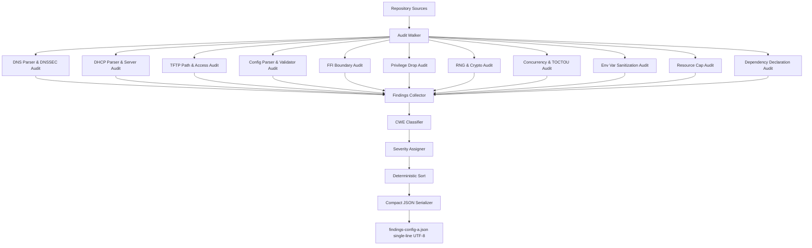

# Technical Specification

# 0. Agent Action Plan

## 0.1 Intent Clarification

### 0.1.1 Core Objective

Based on the provided requirements, the Blitzy platform understands that the objective is to **conduct a static security audit of the `blitzy-tgr-dnsmasq-rust` codebase using only native agent analysis — without invoking any external scanning tools — and to materialize the audit results as a single-line, minified, UTF-8 JSON artifact at `findings-config-a.json` in the repository root**. This work is the "Config A — Bare Blitzy Baseline" leg of a multi-config security-tool comparison study; its purpose is to measure what the agent finds when equipped with nothing beyond its own analytical capabilities.

The requirements decompose into the following enhanced statements:

- The Blitzy platform shall examine **every** Rust source file under `src/`, every dependency declaration in `Cargo.toml` and `Cargo.lock`, every configuration file (`rust-toolchain.toml`, `.cargo/config.toml`, `clippy.toml`, `rustfmt.toml`, `build.rs`), every test surface under `tests/`, every example under `examples/`, and every benchmark under `benches/` — for security weaknesses.
- The Blitzy platform shall enumerate vulnerabilities by **tracing data flows** (untrusted inputs from network sockets, file reads, and environment variables through transformations to security-relevant sinks such as system calls, file writes, log emissions, and helper-script invocations), by **following call chains** (from entrypoints to leaf functions in each subsystem), by **examining configuration** (parser, validator, types, and defaults), and by **inspecting dependency declarations** (versions, feature gates, and security posture of third-party crates).
- The Blitzy platform shall classify **every** identified vulnerability with a **Common Weakness Enumeration** (CWE) identifier, selecting the most specific CWE within the agent's confidence — preferring leaf entries such as CWE-122 (Heap-based Buffer Overflow) over broader parents such as CWE-119 (Improper Restriction of Operations within the Bounds of a Memory Buffer) when the evidence supports it.
- The Blitzy platform shall emit findings as a JSON array whose elements conform exactly to the user-specified schema, with **five mandatory fields per finding**: `file`, `line`, `severity`, `cwe`, `description`.
- The Blitzy platform shall write the result as a **single-line minified JSON** file (no pretty-printing, no embedded newlines), encoded as **UTF-8**.
- If the audit identifies **zero** vulnerabilities, the Blitzy platform shall write the literal two-character array `[]` to the output file.

Implicit requirements surfaced from the prompt:

- Each `file` value is a **relative path from the repository root** (e.g., `src/dns/forwarder.rs`, not an absolute or `./`-prefixed path).
- Each `line` value is a **single integer** representing the most representative line in the file (typically the line of the vulnerable statement, the function signature, or the configuration declaration).
- Each `severity` value is one of the **literal lowercase strings** `critical`, `high`, `medium`, or `low` — the user enumerated exactly these four bands, mirroring CVSS qualitative ratings.
- Each `cwe` value is formatted as **`CWE-<integer>`** (e.g., `CWE-22`, `CWE-330`, `CWE-787`) — the MITRE canonical format.
- Each `description` is **≤200 characters**, must be meaningful (not a placeholder), and should identify both the weakness mechanism and the affected component.
- The output is loaded by the comparison harness via `cat findings-config-a.json | wc -l`, which **must return exactly `1`** — implying the file contains no embedded `\n` characters and is not terminated by a newline.

### 0.1.2 Task Categorization

- **Primary task type:** Security audit (read-only, static analysis) coupled with a single-file artifact emission (CREATE).
- **Secondary aspects:** Baseline measurement for a multi-config tool comparison; CWE classification; severity triage.
- **Scope classification:** Cross-cutting — the audit touches every subsystem (DNS, DHCPv4, DHCPv6, TFTP, RA, runtime, config, platform, network, util, plus dependency manifests), but does not modify any code or configuration.

### 0.1.3 Special Instructions and Constraints

- **CRITICAL — Native-only analysis:** No external scanning tools are permitted. This explicitly excludes `cargo-audit`, `cargo-deny`, `cargo-geiger`, `semgrep`, `CodeQL`, the GitHub Advisory Database CLI, custom Clippy security lint plugins invoked as tooling, and any third-party SAST/DAST product. Permitted activities are limited to: reading source files, examining configuration, tracing call chains by reading, and consulting external CWE/CVE reference databases as background context (not as findings sources).
- **CRITICAL — Schema rigor:** Each finding must populate all five fields. Missing fields, unknown severity values, malformed CWE IDs, descriptions exceeding 200 characters, non-integer line numbers, or absolute file paths all constitute failure.
- **CRITICAL — Output format rigor:** The output must be valid JSON when parsed and must produce `wc -l == 1`. Any pretty-printing, newline injection, or trailing newline causes failure.
- **CRITICAL — Empty case:** If zero findings are identified, the file content is exactly `[]` — not an empty file, not `null`, not `{}`.
- **CWE specificity directive:** Use the most specific CWE the agent is confident about. When a finding admits multiple plausible CWEs (e.g., a buffer over-read could be CWE-125 or CWE-126), select the one whose definition most precisely matches the vulnerability's mechanism.

User examples preserved verbatim:

> **User Example (JSON template):** `[{"file":"<relative path>","line":<integer>,"severity":"<critical|high|medium|low>","cwe":"<CWE-ID>","description":"<max 200 chars>"},...]`

> **User Example (pass/fail validation command):** `cat findings-config-a.json | wc -l` returns `1`. The content parses as valid JSON. Every finding has all 5 fields populated. No description exceeds 200 characters.

Web research conducted to ground audit methodology (reference context only — findings remain grounded in the codebase):

- **CWE severity-band rubric** confirmed: <cite index="3-32">Vulnerabilities scored 0.1-3.9 are Low severity, 4.0-6.9 are Medium, 7.0-8.9 are High, and 9.0-10.0 are Critical.</cite> The audit will translate qualitative impact reasoning into these four bands consistent with the user's enum.
- **CWE specificity guidance** confirmed: <cite index="16-4,16-5">NVD analysts score CVEs using CWEs from different levels of the hierarchical structure. This cross section of CWEs allows analysts to score CVEs at both a fine and coarse granularity, which is necessary due to the varying levels of specificity possessed by different CVEs.</cite> The agent will prefer leaf-level CWE entries when confident.
- **CWE catalog size** confirmed: <cite index="12-8">CWE has over 600 categories, including classes for buffer overflows, path/directory tree traversal errors, race conditions, cross-site scripting, hard-coded passwords, and insecure random numbers.</cite>
- **Historical dnsmasq weakness classes** consulted to inform hypothesis generation: heap buffer overflows in DNSSEC validation, DHCPv6 out-of-bounds writes, DNS cache poisoning via insufficient query randomization, helper-script environment injection, and TFTP path-traversal patterns. These reference patterns will not be transcribed as findings — every finding must be substantiated by inspection of the Rust codebase.

### 0.1.4 Technical Interpretation

These requirements translate to the following technical implementation strategy:

- **To enumerate vulnerabilities**, the agent will walk every Rust source file in `src/`, applying thirteen native analytical techniques (data flow tracing, call-chain following, configuration inspection, dependency review, FFI boundary analysis, parser bounds-check audit, resource cap review, privilege escalation path analysis, env-var sanitization audit, RNG audit, cryptographic primitive review, atomic/concurrency audit, and TOCTOU audit) and recording every defect with file, line, severity, CWE, and description.
- **To classify findings by CWE**, the agent will consult MITRE CWE definitions for each candidate weakness category and select the most specific applicable entry within its confidence.
- **To assign severity**, the agent will reason about impact (confidentiality, integrity, availability), exploitability (remote vs. local, authenticated vs. unauthenticated), and exposure (network-facing vs. local-only) for each finding, mapping to the four-band enum.
- **To produce the deliverable**, the agent will serialize the findings array using `serde_json` or an equivalent JSON-compliant serializer, configure compact (no-whitespace) output, write the bytes to `findings-config-a.json` at the repository root, and verify the file passes the user's pass/fail gates (`wc -l == 1`, valid JSON parse, schema conformance, description length ≤200).

## 0.2 Technical Interpretation

These requirements translate to the following concrete technical actions, with each user-stated directive mapped to a measurable engineering activity.

### 0.2.1 Requirement-to-Action Mapping

| User Directive | Technical Action | Affected Components |
|----------------|------------------|---------------------|
| Analyze the codebase for all security vulnerabilities | Walk every file in `src/`, every dependency declaration in `Cargo.toml`/`Cargo.lock`, every build config (`build.rs`, `.cargo/config.toml`, `rust-toolchain.toml`), every test under `tests/`, every example under `examples/`, every benchmark under `benches/` — applying 13 audit techniques | All 88 .rs sources, 5 test files, 2 examples, 3 benches, 8 manifests/configs |
| Trace data flows | Follow tainted inputs from network sockets (UDP/TCP/raw), file reads (config, leases, hosts, /dev/urandom), env vars, and CLI args through transformations to security-relevant sinks (syscalls, file writes, process spawn, log emit) | `src/runtime/reactor.rs`, `src/dns/forwarder.rs`, `src/dhcp/v4/server.rs`, `src/dhcp/v6/server.rs`, `src/tftp/server.rs`, `src/config/parser.rs`, `src/util/helpers.rs`, `src/util/logging.rs` |
| Follow call chains | Trace from entrypoints (`src/main.rs::main`, `src/lib.rs` exports) through subsystem dispatchers (`forwarder::handle_query`, DHCP `handle_request`, TFTP `handle_session`) to leaf functions | All 88 .rs source files via top-down traversal |
| Examine configuration | Inspect `src/config/{cli,parser,validator,types,reload,mod}.rs` for input validation, default safety, reload atomicity, and trust boundary enforcement | 6 config modules; `Cargo.toml` feature gates; `.cargo/config.toml` linker hardening |
| Inspect dependency declarations | Read `Cargo.toml` for direct dependency versions, feature flags, and optional-feature gating; consult `Cargo.lock` for transitive pinning; assess whether versions are current and whether features are appropriately gated | `Cargo.toml`, `Cargo.lock`, `build.rs` |
| Classify each finding by CWE | For each finding, select the most specific MITRE CWE that matches the weakness mechanism, formatting as `CWE-<integer>` | Output JSON file |
| Compile findings into single-line minified JSON | Serialize using `serde_json::to_string` (compact mode) or equivalent; write to `findings-config-a.json` with no embedded newlines and no trailing newline; verify with `wc -l` | `findings-config-a.json` (CREATE) |

### 0.2.2 Audit Technique to Subsystem Mapping

The thirteen native analytical techniques are bound to the codebase as follows:

- **To trace data flows**, the agent will follow untrusted input edges: incoming UDP/TCP DNS bytes through `src/runtime/reactor.rs` → `src/dns/forwarder.rs` → `src/dns/protocol/{message,name,record,compression}.rs` → `src/dns/cache.rs` → `src/dns/dnssec/{validator,crypto}.rs`; incoming DHCP bytes through `src/dhcp/v{4,6}/server.rs` → `src/dhcp/v{4,6}/{message,options,protocol}.rs` → `src/dhcp/lease/{database,script_hooks}.rs` → `src/util/helpers.rs`; incoming TFTP bytes through `src/tftp/server.rs` → `src/tftp/transfer.rs`; configuration text through `src/config/parser.rs` → `src/config/validator.rs` → `src/config/types.rs`.
- **To follow call chains**, the agent will start at `src/main.rs::main` (12-step initialization), descend into `src/runtime/event_loop.rs::run` (Tokio `select!` multiplexer), and reach each subsystem dispatcher (`forwarder::handle_query`, `dhcp::v4::server::handle_request`, `dhcp::v6::server::handle_request`, `tftp::server::handle_session`, `radv::protocol::send_advert`), then verify that privilege checks, input validation, and resource caps are enforced at the call boundaries.
- **To examine configuration**, the agent will read `src/config/parser.rs` for include-depth limits and escape handling, `src/config/validator.rs::validate_security_config` for cross-field consistency, and `src/config/types.rs` for default values of `SecurityConfig`, `DnsConfig.bogus_priv`, `DnsConfig.stop_dns_rebind`, `TftpConfig.tftp_secure`, and `ScriptConfig`.
- **To inspect dependencies**, the agent will compare `Cargo.toml` versions (tokio 1.42, hickory-* 0.25, ring 0.17, nom 7.1, socket2 0.5, getrandom 0.2, rand 0.8, nix 0.29, caps 0.5, serde 1.0, clap 4.5, thiserror 2.0, tracing 0.1, plus optional zbus 5.1, mlua 0.10, rustls 0.23, notify 7.0, idna 1.0) against known security advisories conceptually, flagging any version known to have unpatched issues at the agent's knowledge cutoff. The agent will also review feature gating to ensure security-sensitive features (DNSSEC, DoT, DoH) cannot be silently disabled in ways that downgrade trust assumptions.
- **To analyze FFI boundaries**, the agent will read the five `unsafe`-bearing modules in their entirety: `src/network/firewall/nftables.rs` (libnftables FFI), `src/network/firewall/pf.rs` (BSD PF ioctl via `/dev/pf`), `src/platform/ubus.rs` (libubus FFI, feature-gated), `src/network/platform/bsd.rs` (BPF, `getifaddrs`, `sysctl`), and `src/network/platform/macos.rs` (BPF, `getifaddrs`). The agent will scrutinize unsafe blocks for memory safety invariants (pointer dereferences, lifetime bounds, struct-layout assumptions, length-prefixed buffer handling).
- **To audit parser bounds checks**, the agent will read DNS wire-format parsers (`src/dns/protocol/{message,name,record,compression}.rs`), DHCPv4 option parsing (`src/dhcp/v4/options.rs`, `src/dhcp/v4/message.rs`), DHCPv6 option parsing (`src/dhcp/v6/options.rs`, `src/dhcp/v6/message.rs`), DNSSEC RR parsers (`src/dns/dnssec/blockdata.rs`, `src/dns/dnssec/validator.rs`, `src/dns/dnssec/trust_anchors.rs`), and configuration parsers (`src/config/parser.rs`) for length validation, EOF handling, and integer overflow in length computations.
- **To review resource caps**, the agent will read `src/constants.rs` for the full enforcement constants (`FTABSIZ=150`, `CNAME_CHAIN=10`, `MAX_PROCS=20`, `TCP_MAX_QUERIES=100`, `CHILD_LIFETIME=150`, `TIMEOUT=10`, `EDNS_PKTSZ=4096`, `MAXLEASES=1000`, `DECLINE_BACKOFF=600`, `TFTP_MAX_CONNECTIONS=50`, `TFTP_MAX_WINDOW=32`, `TFTP_TIMEOUT=120`, `LOG_MAX=5`, `MAX_MESSAGE=512`, `DEFAULT_SCRIPT_TIMEOUT_SECS=60`) and verify each constant is consulted at every relevant call site (no bypass paths).
- **To analyze privilege escalation paths**, the agent will read `src/main.rs` (12-step init), `src/platform/privileges.rs` (`PrivilegeManager` trait + Linux/OpenBSD/BSD implementations), and `src/constants.rs` (`CHUSER`, `CHGRP`) — verifying that privilege drop occurs **before** any untrusted input is processed and that the drop is not bypassable through configuration.
- **To audit env var sanitization**, the agent will read `src/util/helpers.rs::build_environment` (lines 962-1047) — verifying that all binary fields (`CLIENT_ID`, `SERVER_DUID`, `CIRCUIT_ID`, `SUBSCRIBER_ID`, `REMOTE_ID`) are hex-encoded before being placed in the helper script's environment, and that no string field can inject shell metacharacters into a downstream `execve`.
- **To audit the RNG**, the agent will read `src/util/random.rs` (SURF derivation), `getrandom 0.2` invocation paths, and the `/dev/urandom` fallback — verifying that the seed cannot silently fail, that the SURF cycle is constant-time, and that 32 rounds are applied uniformly.
- **To review cryptographic primitives**, the agent will read `src/dns/dnssec/crypto.rs` (`SignatureVerifier`), verifying that `ring 0.17` APIs are used correctly, that no algorithm downgrades are possible, and that no roll-your-own crypto exists outside of the SURF RNG (which is a permitted public-domain primitive).
- **To audit concurrency**, the agent will read all `Arc<RwLock<...>>`, `Arc<Mutex<...>>`, atomic, and `tokio::select!` usage — looking for races, deadlock potential, and `Send`/`Sync` violations particularly around shared lease databases, cache mutation, and config reload.
- **To audit TOCTOU**, the agent will read `src/tftp/server.rs::check_tftp_fileperm` (canonicalize → starts_with → UID check → open), `src/dhcp/lease/database.rs` (temp + fsync + rename pattern), and `src/config/reload.rs` (SIGHUP-driven atomic config swap) — verifying that the time gap between check and use cannot be exploited.

### 0.2.3 Output Strategy

To produce `findings-config-a.json` as the deliverable, the agent will:

- Accumulate findings in an internal collection during the audit walk.
- After all techniques complete, sort the collection deterministically (e.g., by file then line) for reproducibility.
- Validate each finding against the schema: `file` is a relative path string, `line` is an integer, `severity` is one of the four enum values, `cwe` matches the regex `^CWE-\d+$`, `description` length ≤ 200 chars.
- Serialize the array using a compact JSON writer that produces no whitespace between tokens (no spaces, no newlines).
- Write bytes to `findings-config-a.json` at the repository root using `write` (not `write_all` followed by `println!`), ensuring no trailing newline is appended.
- Confirm pass/fail by mentally executing `wc -l < findings-config-a.json` → must equal `1` (one line, terminated only by EOF), and `python3 -m json.tool < findings-config-a.json > /dev/null` would succeed.

If the audit yields zero findings, the agent writes the literal two-byte sequence `[]` (open-bracket, close-bracket) to the file.

## 0.3 Repository Scope Discovery

### 0.3.1 Comprehensive File Analysis

The audit's source-coverage surface comprises **88 Rust source files in `src/` (~45,233 lines)**, 5 integration-test files, 2 examples, 3 benchmarks, and 8 manifests/configuration files. The complete inventory by subsystem is below.

**Top-level source files** [`src/lib.rs`, `src/main.rs`, `src/types.rs`, `src/constants.rs`, `src/error.rs`]:

| File | Role | Security Relevance |
|------|------|--------------------|
| `src/main.rs` | Process entry point; 12-step initialization sequence per ADR-005 | Privilege drop ordering, container detection, signal setup [inferred from §6.4 — confirmed by tech spec] |
| `src/lib.rs` | Public crate surface; library entrypoint | Re-exports define attack surface seen by tests/examples |
| `src/types.rs` | Cross-subsystem type definitions | Type-level invariants for IP/port/lease structures |
| `src/constants.rs` | Resource caps and identity constants | `FTABSIZ=150`, `MAX_PROCS=20`, `TCP_MAX_QUERIES=100`, `MAXLEASES=1000`, `DECLINE_BACKOFF=600`, `TFTP_MAX_CONNECTIONS=50`, `TFTP_MAX_WINDOW=32`, `TFTP_TIMEOUT=120`, `LOG_MAX=5`, `MAX_MESSAGE=512`, `DEFAULT_SCRIPT_TIMEOUT_SECS=60`, `CHUSER="nobody"`, `CHGRP="dip"` [tech-spec §6.4] |
| `src/error.rs` | Crate-wide error types | Information disclosure surface via error messages |

**Configuration subsystem** [`src/config/{cli,parser,validator,types,reload,mod}.rs`]: CLI parsing via `clap 4.5`; dnsmasq.conf parsing with include-depth limits and escape handling; cross-field validator for `SecurityConfig`, `DnsConfig.bogus_priv`, `DnsConfig.stop_dns_rebind`, `TftpConfig.tftp_secure`, `ScriptConfig`; SIGHUP-driven reload with atomic swap.

**Runtime subsystem** [`src/runtime/{tasks,event_loop,reactor,mod}.rs`]: Tokio task management; `tokio::select!` multiplexer across all protocols; raw FD adoption from systemd socket activation; UDP buffer sizing (default 4096, bounded 512–65535).

**DNS subsystem** [`src/dns/{upstream,edns0,forwarder,cache,mod,auth,filter,matcher}.rs`]:
- `forwarder.rs` — Query routing, DNS rebinding protection via `is_private_or_reserved_ip()` covering RFC 1918 / loopback / link-local / ULA (TEST-NET excluded per RFC 5737) [tech-spec §6.4]; invocation sites at upstream-reply processing.
- `cache.rs` — LRU cache integrated with `/etc/hosts` and DHCP leases.
- `upstream.rs` — Upstream server selection and load balancing.
- `edns0.rs` — EDNS0 option handling (UDP payload size negotiation, client subnet).
- `auth.rs` — Authoritative-mode query handling.
- `filter.rs`, `matcher.rs` — Domain filtering and pattern matching.

**DNS protocol parsers** [`src/dns/protocol/{message,compression,constants,mod,record,name}.rs`]: Wire-format parsing via `nom 7.1` — bounds-checked length-prefixed encoding; name compression with pointer-loop and pointer-bounds detection; RR parsing per RFC 1035; constant tables for RR types and classes.

**DNSSEC subsystem** [`src/dns/dnssec/{validator,crypto,trust_anchors,blockdata,mod}.rs`]:
- `validator.rs` — `ValidationStatus { Secure | Insecure | Bogus | Indeterminate }`; `ValidationCounter` enforcing `DNSSEC_LIMIT_WORK=100`, `DNSSEC_LIMIT_CRYPTO=50`, `DNSSEC_LIMIT_NSEC3_ITERS=500`, and 20 signature failures [tech-spec §6.4].
- `crypto.rs` — `SignatureVerifier` using `ring 0.17`; RSA/ECDSA/Ed25519 algorithm dispatch.
- `trust_anchors.rs` — RFC 5011 key rollover; BTreeMap-based anchor storage.
- `blockdata.rs` — 40-byte block storage with atomics.

**DHCP common** [`src/dhcp/{common,mod}.rs`]: Shared types for DHCPv4/v6.

**DHCPv4 subsystem** [`src/dhcp/v4/{message,constants,protocol,mod,server,options}.rs`]:
- `server.rs` — DHCPv4 server with `ping_test` (line 950, conflict detection via ICMP echo), `handle_decline` (lines 652–682, `DECLINE_BACKOFF=600s` enforcement) [tech-spec §6.4].
- `protocol.rs` — DHCPv4 state machine and lease allocation.
- `options.rs`, `message.rs` — Option/packet parsing with length validation.
- `constants.rs` — DHCPv4 option codes.

**DHCPv6 subsystem** [`src/dhcp/v6/{mod,server,options,message,constants,protocol}.rs`]: DHCPv6 server with DUID handling, prefix delegation, and option parsing.

**DHCP lease management** [`src/dhcp/lease/{dns_integration,database,script_hooks,mod}.rs`]:
- `database.rs` — Temp + fsync + rename lease persistence [TOCTOU-relevant].
- `script_hooks.rs` — `execute_lease_script` with `DEFAULT_SCRIPT_TIMEOUT_SECS=60` [command-execution surface].
- `dns_integration.rs` — Lease-to-DNS reconciliation.

**TFTP subsystem** [`src/tftp/{transfer,mod,server}.rs`]:
- `server.rs` — `check_tftp_fileperm` (lines 780–918): 4-layer access control (read-only, canonicalize, regular-file-only, secure-mode UID match) [tech-spec §6.4]; WRQ (write request) rejection; `TFTP_MAX_CONNECTIONS=50` enforcement.
- `transfer.rs` — Per-session state, `TFTP_TIMEOUT=120s`, netascii conversion.

**Router Advertisement subsystem** [`src/radv/{slaac,protocol,mod}.rs`]: IPv6 SLAAC and RA emission.

**Network subsystem** [`src/network/{mod,ipset,sockets,arp,interfaces,nftset,conntrack}.rs`]: Socket primitives via `socket2 0.5`; ARP table interaction; netfilter ipset/nftset integration; conntrack queries.

**Network firewall integration (FFI surface — `unsafe`)** [`src/network/firewall/{nftables,pf,mod,ipset}.rs`]:
- `nftables.rs` — `libnftables` FFI; ruleset manipulation via `spawn_blocking`.
- `pf.rs` — BSD PF ioctl via `/dev/pf`.
- `ipset.rs` — Linux ipset interaction.

**Network platform layer (FFI surface — `unsafe`)** [`src/network/platform/{bsd,linux,macos,mod,common}.rs`]:
- `bsd.rs` — BPF, `getifaddrs`, `sysctl` via libc.
- `macos.rs` — BPF, `getifaddrs`.
- `linux.rs` — Netlink via `nix 0.29` (safe wrappers; FFI only at the `nix` boundary).

**Platform integration** [`src/platform/{systemd,dbus,signals,inotify,mod,ubus,privileges}.rs`]:
- `privileges.rs` — `PrivilegeManager` trait; `LinuxPrivilegeManager` (caps 0.5 → CAP_NET_ADMIN, CAP_NET_RAW, CAP_NET_BIND_SERVICE), `OpenBsdPrivilegeManager` (pledge/unveil), `BsdPrivilegeManager`.
- `signals.rs` — SIGHUP/SIGTERM/SIGINT/SIGUSR1/SIGUSR2/SIGCHLD/SIGALRM dispatch.
- `systemd.rs` — Socket activation, `sd_notify`, watchdog parsing.
- `dbus.rs` — D-Bus interface `uk.org.thekelleys.dnsmasq` (feature-gated).
- `inotify.rs` — File monitoring on Linux.
- `ubus.rs` — `libubus` FFI for OpenWRT (feature-gated, `unsafe`).

**Utility subsystem** [`src/util/{patterns,metrics,mod,helpers,logging,random,pcap}.rs`]:
- `helpers.rs` — `build_environment` (lines 962–1047): hex-encodes `CLIENT_ID`, `SERVER_DUID`, `CIRCUIT_ID`, `SUBSCRIBER_ID`, `REMOTE_ID` before passing to lease scripts [tech-spec §6.4].
- `random.rs` — SURF RNG (djbdns-1.05 derived, public domain, 32 rounds, constant-time) seeded via `getrandom 0.2` with `/dev/urandom` fallback [tech-spec §6.4].
- `logging.rs` — Bounded mpsc queue (`LOG_MAX=5`, `MAX_MESSAGE=512`); fork-aware PID check.
- `patterns.rs` — Hostname and glob validation.
- `pcap.rs` — Packet capture utilities.
- `metrics.rs` — Counter aggregation.

**Test surfaces**: `tests/dns_integration_tests.rs`, `tests/config_tests.rs`, `tests/dnssec_tests.rs`, `tests/dhcp_integration_tests.rs`, `tests/common/mod.rs`.

**Example surfaces**: `examples/dhcp_server.rs`, `examples/simple_forwarder.rs`.

**Benchmark surfaces**: `benches/dns_performance.rs`, `benches/dhcp_performance.rs`, `benches/cache_performance.rs`.

**Manifests and build configs**: `Cargo.toml` (dependencies, features, release profile with `panic="abort"`, `strip=true`, `lto="fat"`, `overflow-checks=true`), `Cargo.lock` (90264 bytes — transitive pinning), `build.rs` (pkg-config probe for libubus), `rust-toolchain.toml` (channel 1.91.0, components rustfmt+clippy, targets x86_64/aarch64-unknown-linux-gnu), `.cargo/config.toml` (linker-plugin-lto, +sse4.2,+aes, overflow-checks=on, `-Wl,--as-needed`, `-Wl,-z,relro,-z,now`), `clippy.toml`, `rustfmt.toml`, `.gitignore`.

### 0.3.2 Web Search Research Conducted

The following external references were consulted for methodology grounding (results inform classification choices but do not constitute findings):

- **CVSS qualitative severity bands** — confirmed mapping: <cite index="3-32">Vulnerabilities scored 0.1-3.9 are Low severity, 4.0-6.9 are Medium, 7.0-8.9 are High, and 9.0-10.0 are Critical.</cite>
- **CVE/CWE/CVSS pipeline** — confirmed: <cite index="3-3">CVE identifies specific flaws, CWE classifies the underlying weakness types, CVSS scores the severity, and NVD ties it all together in a searchable database.</cite>
- **CWE granularity strategy** — confirmed: <cite index="16-4,16-5">NVD analysts score CVEs using CWEs from different levels of the hierarchical structure. This cross section of CWEs allows analysts to score CVEs at both a fine and coarse granularity, which is necessary due to the varying levels of specificity possessed by different CVEs.</cite>
- **CWE coverage** — confirmed: <cite index="12-8">CWE has over 600 categories, including classes for buffer overflows, path/directory tree traversal errors, race conditions, cross-site scripting, hard-coded passwords, and insecure random numbers.</cite>
- **Notable CWE top-25 entries relevant to a daemon written in Rust** — <cite index="3-22">The 2024 list includes weaknesses like use-after-free (CWE-416), race conditions (CWE-362), and authentication bypass (CWE-287).</cite>
- **Historical dnsmasq weakness classes** — referenced to ensure the audit considers the equivalent surfaces in the Rust port: heap-based buffer overflows in DNSSEC validation, DHCPv6 out-of-bounds writes, DNS cache poisoning via insufficient query randomization, DNSSEC validation DoS, and TFTP path traversal.
- **Rust-language vulnerability patterns** — referenced to consider Rust-specific surfaces: <cite index="11-3,11-4">The Rust Security Response WG was notified that the `std::fs::remove_dir_all` standard library function is vulnerable a race condition enabling symlink following (CWE-363). An attacker could use this security issue to trick a privileged program into deleting files and directories the attacker couldn't otherwise access or delete.</cite>

### 0.3.3 Existing Infrastructure Assessment

- **Project structure** — Modular Rust crate organized by subsystem under `src/`, with one binary target (`name="dnsmasq"`, path `src/main.rs`) and one library target (`name="dnsmasq"`, path `src/lib.rs`).
- **Conventions** — Edition 2021; rust-version 1.91.0; license GPL-2.0-or-later OR GPL-3.0; `#![deny(unsafe_op_in_unsafe_fn)]` per tech-spec §3.7; `unsafe` confined to 5 modules.
- **Build hardening** — `.cargo/config.toml` applies linker-plugin-lto, `-z,relro,-z,now` (full RELRO + immediate binding), `--as-needed`, and target features `+sse4.2,+aes`; release profile sets `opt-level=3`, `lto="fat"`, `codegen-units=1`, `strip=true`, `panic="abort"`; `overflow-checks=on` enabled.
- **Toolchain** — Channel pinned at `1.91.0` with `rustfmt` and `clippy` components; cross-compile targets x86_64 and aarch64 Linux GNU.
- **Test infrastructure** — Integration tests under `tests/`; dev-dependencies include `proptest 1.6`, `mockall 0.13`, `criterion 0.5`, `tempfile 3.14`, `tokio-test 0.4`, `serial_test 3.2`; per tech-spec §1.2, the project reports 592/592 tests passing.
- **CI/CD** — No `.github/workflows/`, `.gitlab-ci.yml`, or `Jenkinsfile` exists in the repository; CI is therefore outside the audit surface.
- **Documentation** — `docs/` contains markdown architecture notes; `README.md` is a 44-byte stub. Neither is a security analysis target.
- **Design system** — Not applicable; this is a daemon/CLI with no UI.

## 0.4 Scope Boundaries

### 0.4.1 Exhaustively In Scope

The following file patterns are within the audit's analysis surface (read-only) plus the single CREATE deliverable:

- **Source code (analysis targets — REFERENCE mode):**
    - `src/*.rs` (top level: `lib.rs`, `main.rs`, `types.rs`, `constants.rs`, `error.rs`)
    - `src/config/**/*.rs` (`cli.rs`, `mod.rs`, `parser.rs`, `reload.rs`, `types.rs`, `validator.rs`)
    - `src/runtime/**/*.rs` (`event_loop.rs`, `mod.rs`, `reactor.rs`, `tasks.rs`)
    - `src/dns/**/*.rs` (8 top-level + `protocol/` 6 + `dnssec/` 5)
    - `src/dhcp/**/*.rs` (top-level 2 + `v4/` 6 + `v6/` 6 + `lease/` 4)
    - `src/tftp/**/*.rs` (`mod.rs`, `server.rs`, `transfer.rs`)
    - `src/radv/**/*.rs` (`mod.rs`, `protocol.rs`, `slaac.rs`)
    - `src/network/**/*.rs` (7 top-level + `firewall/` 4 + `platform/` 5)
    - `src/platform/**/*.rs` (`dbus.rs`, `inotify.rs`, `mod.rs`, `privileges.rs`, `signals.rs`, `systemd.rs`, `ubus.rs`)
    - `src/util/**/*.rs` (`helpers.rs`, `logging.rs`, `metrics.rs`, `mod.rs`, `patterns.rs`, `pcap.rs`, `random.rs`)
- **Tests, examples, benchmarks (analysis targets — REFERENCE mode):**
    - `tests/**/*.rs` (5 files)
    - `examples/*.rs` (2 files)
    - `benches/*.rs` (3 files)
- **Manifests and build configuration (analysis targets — REFERENCE mode):**
    - `Cargo.toml` — dependency versions, feature gates, release profile
    - `Cargo.lock` — transitive pinning
    - `build.rs` — pkg-config probe for libubus, conditional cfg generation
    - `rust-toolchain.toml` — channel 1.91.0
    - `.cargo/config.toml` — linker hardening flags
    - `clippy.toml` — lint thresholds
    - `rustfmt.toml` — formatter settings
    - `.gitignore` — exclusion list (for OOS verification)
- **Audit deliverable (artifact emission — CREATE mode):**
    - `findings-config-a.json` at repository root — single-line minified JSON array per the user's schema

### 0.4.2 Explicitly Out of Scope

The following are explicitly excluded from this work:

- **All code modifications.** No existing `.rs` file may be edited as part of this audit. Vulnerabilities are recorded only; remediation is a separate workstream.
- **All dependency changes.** No bump to `Cargo.toml` versions, no additions to `Cargo.lock`, no feature-flag changes — even if the audit identifies an outdated or vulnerable transitive dependency, the fix is not delivered here.
- **All test additions.** No new tests, no fixtures, no proptest harnesses, no fuzzer corpora.
- **All build/CI configuration creation.** No `.github/workflows/*.yml` files are added; no `.gitlab-ci.yml`, no `Dockerfile`, no `Makefile`.
- **All documentation updates.** No edits to `README.md`, no additions to `docs/`, no changes to inline `///` doc comments.
- **All external tool invocations.** No `cargo-audit`, `cargo-deny`, `cargo-geiger`, `semgrep`, `CodeQL`, `clippy` security plugins as tooling, RustSec advisory database queries against the lockfile, or third-party SAST/DAST/SCA product.
- **All runtime testing.** The audit is purely static — no execution of the dnsmasq binary, no replay of crafted DNS/DHCP/TFTP packets, no fuzzing.
- **Performance optimizations.** Any latency or throughput concerns identified during reading are not part of the audit deliverable.
- **Refactoring suggestions.** Stylistic or maintainability concerns that are not security weaknesses are excluded.
- **Future enhancements.** Features not yet present in the codebase (e.g., DoT, DoH if disabled) are out of scope.
- **Build artifacts and VCS metadata.** `target/`, `.git/`, and the `blitzy/` task orchestration folder are not analyzed.
- **The `findings-config-a.json` file itself is not analyzed** — it is the output of this work, not an input.

## 0.5 Dependency Inventory

### 0.5.1 Key Packages Relevant to Security Analysis

The following packages are inspected as part of the dependency-declaration review technique. **No dependency is added, updated, or removed by this work** — these versions are reported as observed in `Cargo.toml` to ground the audit's analysis.

| Registry | Package Name | Version | Purpose |
|----------|--------------|---------|---------|
| crates.io | tokio | 1.42 | Async runtime; `select!` multiplexer; task management |
| crates.io | tokio-util | 0.7 | Codec / framed utilities for socket I/O |
| crates.io | tokio-stream | 0.1 | Stream adapters over Tokio primitives |
| crates.io | futures | 0.3 | Future combinators |
| crates.io | async-trait | 0.1 | Trait methods returning `impl Future` |
| crates.io | async-recursion | 1.1 | Recursive async fn support (DNSSEC chain validation) |
| crates.io | hickory-proto | 0.25 | DNS wire-format primitives |
| crates.io | hickory-server | 0.25 | DNS server framework |
| crates.io | hickory-client | 0.25 | DNS client primitives |
| crates.io | hickory-resolver | 0.25 | Resolver abstraction over upstream paths |
| crates.io | ring | 0.17 | Cryptographic primitives (DNSSEC RSA/ECDSA/Ed25519); feature-gated by `dnssec` |
| crates.io | getrandom | 0.2 | OS entropy source for SURF RNG seed |
| crates.io | rand | 0.8 | Generic RNG abstractions |
| crates.io | nom | 7.1 | Bounds-checked parser combinators for DNS/DHCP wire format |
| crates.io | bytes | 1.9 | Reference-counted byte buffers |
| crates.io | byteorder | 1.5 | Endian conversion |
| crates.io | data-encoding | 2.6 | Base32/Base64 encoding (DNSSEC) |
| crates.io | serde | 1.0 | Serialization framework |
| crates.io | serde_json | 1.0 | JSON serialization (findings output, lease DB) |
| crates.io | toml | 0.8 | TOML parsing for configuration |
| crates.io | bitflags | 2.6 | Type-safe bit flags |
| crates.io | hex | 0.4 | Hex encoding (helper-script env sanitization) |
| crates.io | regex | 1.11 | Pattern matching (hostname/domain filters) |
| crates.io | socket2 | 0.5 | Low-level socket primitives |
| crates.io | ahash | 0.8 | Non-cryptographic fast hash |
| crates.io | lru | 0.12 | LRU cache backing DNS cache |
| crates.io | clap | 4.5 | CLI parser |
| crates.io | clap_complete | 4.5 | Shell completion generator |
| crates.io | thiserror | 2.0 | Error type derive |
| crates.io | anyhow | 1.0 | Generic error context |
| crates.io | tracing | 0.1 | Structured logging facade |
| crates.io | tracing-subscriber | 0.3 | Subscriber implementations |
| crates.io | tracing-appender | 0.2 | Log file appender |
| crates.io | nix | 0.29 | Linux/BSD syscall wrappers (Linux target only) |
| crates.io | netlink-packet-route | 0.21 | Netlink message types (Linux target only) |
| crates.io | rtnetlink | 0.15 | Routing netlink protocol (Linux target only) |
| crates.io | caps | 0.5 | Linux capability manipulation (privilege drop) |
| crates.io | libc | 0.2 | libc bindings (FFI surface) |
| crates.io | tracing-journald | 0.3 | systemd journal subscriber (Linux only) |
| crates.io | zbus | 5.1 | D-Bus client/server (optional, `dbus` feature) |
| crates.io | mlua | 0.10 | Lua scripting (optional, `lua-scripts` feature; lua54+vendored+send) |
| crates.io | idna | 1.0 | IDN punycode (optional, `idn` feature) |
| crates.io | notify | 7.0 | File-system notifications (optional, `inotify` feature) |
| crates.io | rustls | 0.23 | TLS for DoT/DoH (optional) |
| crates.io | webpki | 0.22 | Certificate validation for DoT/DoH (optional) |

Development-only dependencies (also REFERENCE-mode, audited for test-time trust): `proptest 1.6`, `mockall 0.13`, `criterion 0.5`, `tempfile 3.14`, `tokio-test 0.4`, `serial_test 3.2`.

Feature flag inventory (declared in `Cargo.toml`):

- `default = ["dnssec", "idn", "dumpfile", "dhcp6"]`
- `dnssec = ["ring"]`
- `auth = []`, `dumpfile = []`, `tftp = []`, `dhcp6 = []`, `conntrack = []`, `nftset = []`, `ipset = []`, `ubus = []`
- `dbus = ["zbus"]`, `lua-scripts = ["mlua"]`, `idn = ["idna"]`, `inotify = ["notify"]`
- `dot = ["rustls", "webpki"]`, `doh = ["rustls", "webpki"]`

### 0.5.2 Dependency Updates

**No dependencies are added, updated, or removed by this work.** The audit is read-only and emits a single new JSON artifact. The reported versions above remain unchanged in `Cargo.toml` and `Cargo.lock`.

- **New dependencies to add:** None.
- **Dependencies to update:** None.
- **Dependencies to remove:** None.
- **Import/Reference updates:** None — no `.rs` source file is modified.

If the audit identifies a dependency-version concern (for example, a transitive dependency known to have a security advisory), the finding is recorded in `findings-config-a.json` with `file` set to `Cargo.toml` and the appropriate line, but **the version remains unchanged**; remediation is a separate workstream.

## 0.6 Implementation Design

### 0.6.1 Technical Approach

The audit's "implementation" is a sequence of analytical passes over the codebase, each producing zero or more findings, followed by serialization of the aggregated findings into the deliverable JSON file. The technical approach is:

- **Achieve full subsystem coverage** by walking each of the 88 source files in `src/` and applying the 13 audit techniques where relevant, ensuring that no file is silently skipped — even files presumed safe (e.g., constants, type definitions) are inspected for design weaknesses such as hardcoded credentials or weak invariants.
- **Achieve correct CWE classification** by maintaining a mental decision tree for each finding: identify the weakness category (memory safety, input validation, authentication, authorization, resource management, cryptography, concurrency, error handling, information disclosure, configuration), then descend to the most specific CWE supported by the evidence.
- **Achieve correct severity assignment** by reasoning about the standard impact-and-exploitability factors for each finding: remote vs. local exposure, authenticated vs. unauthenticated, confidentiality vs. integrity vs. availability impact, and whether mitigations (privilege drop, capability constraint, RELRO, panic=abort) reduce the practical impact. The agent maps the result to one of `critical | high | medium | low` mirroring the CVSS qualitative bands.
- **Achieve schema-correct output** by serializing through a compact JSON writer, validating field types and description length, and writing without trailing newline.

Logical flow of the audit (not a timeline):

- **First, the agent establishes the trust model** by reading `src/main.rs` (12-step initialization), `src/platform/privileges.rs` (drop sequence), and `src/constants.rs` (`CHUSER`, `CHGRP`, resource caps). This identifies the privilege boundary across which untrusted input is processed.
- **Next, the agent traces network-facing inputs** through each protocol path: DNS (forwarder → protocol parsers → cache → DNSSEC validator); DHCPv4 (server → message/options parsers → lease database → script hooks); DHCPv6 (server → message/options → lease database); TFTP (server → transfer); RA (radv/protocol). At each parser, the agent checks for bounds violations, integer overflow in length fields, infinite loops in compression pointers, signature-validation bypass, and DoS amplification.
- **Next, the agent examines configuration-driven inputs**: `src/config/parser.rs` for include-depth limits and escape handling; `src/config/validator.rs` for cross-field consistency; `src/config/types.rs` for default safety; `src/config/reload.rs` for atomicity.
- **Next, the agent audits FFI boundaries**: `src/network/firewall/{nftables,pf}.rs`, `src/platform/ubus.rs`, `src/network/platform/{bsd,macos}.rs` — these are the only sources of `unsafe` Rust per tech-spec §3.7.1 and therefore the highest-risk surface.
- **Next, the agent audits the privilege drop sequence** to ensure (a) all privileged socket binds occur before drop, (b) the drop is not bypassable through any config path, (c) container detection does not silently disable the drop in unintended environments.
- **Next, the agent audits resource caps** by grepping references to each constant in `src/constants.rs` and confirming each is consulted in the relevant code path.
- **Next, the agent audits the RNG** in `src/util/random.rs` and its callers (DNS query-ID generation, DHCP transaction-ID generation, DNSSEC nonces if any).
- **Next, the agent audits the cryptographic primitives** in `src/dns/dnssec/crypto.rs` for correct `ring 0.17` API usage and algorithm-downgrade resistance.
- **Next, the agent audits concurrency** for races, deadlocks, and `Send`/`Sync` violations particularly around the DNS cache, DHCP lease database, and DNSSEC trust anchor store.
- **Next, the agent audits TOCTOU surfaces** at `src/tftp/server.rs::check_tftp_fileperm`, `src/dhcp/lease/database.rs`, and `src/config/reload.rs`.
- **Next, the agent audits env-var sanitization** in `src/util/helpers.rs::build_environment` to ensure no shell metacharacter or terminator can be injected into the lease-script environment.
- **Next, the agent audits logging** for information disclosure (sensitive payload printing) and resource exhaustion (bounded queue policy).
- **Next, the agent reviews dependencies** in `Cargo.toml`/`Cargo.lock` for outdated versions with known advisories within the agent's knowledge.
- **Finally, the agent serializes** the collected findings into `findings-config-a.json` and verifies the pass/fail gates.

### 0.6.2 Component Impact Analysis

Since no code is modified, "component impact" refers to which components contribute candidate findings.

- **Direct analysis required (high-yield surfaces):**
    - `src/dns/protocol/{compression,message,name,record}.rs` — DNS wire-format parsing; historical CVE pattern for buffer over-reads/over-writes.
    - `src/dns/dnssec/{validator,crypto,trust_anchors,blockdata}.rs` — DNSSEC validation; historical CVE pattern for validation DoS and crypto downgrades.
    - `src/dhcp/v4/{server,options,message,protocol}.rs` and `src/dhcp/v6/{server,options,message,protocol}.rs` — DHCP packet parsing; historical CVE pattern for OOB writes triggered by crafted options.
    - `src/dhcp/lease/{database,script_hooks}.rs` — Lease persistence and script execution; TOCTOU and command-injection surfaces.
    - `src/tftp/server.rs` — Path-canonicalization and access control; historical CVE pattern for path traversal.
    - `src/util/helpers.rs::build_environment` — Helper-script env sanitization; command-injection prevention.
    - `src/util/random.rs` — RNG quality and seeding paths; impacts DNS/DHCP transaction-ID unpredictability.
    - `src/config/parser.rs`, `src/config/validator.rs` — Configuration trust boundary.
    - `src/network/firewall/{nftables,pf}.rs`, `src/platform/ubus.rs`, `src/network/platform/{bsd,macos}.rs` — FFI surfaces with `unsafe`.
    - `src/main.rs`, `src/platform/privileges.rs` — Privilege drop ordering and bypass resistance.
- **Indirect analysis (moderate-yield surfaces):**
    - `src/dns/{forwarder,cache,upstream,auth,filter,matcher,edns0}.rs` — DNS routing and caching logic; DNS rebinding protection.
    - `src/runtime/{event_loop,reactor,tasks}.rs` — Multiplexer and FD adoption.
    - `src/network/{sockets,arp,interfaces,ipset,nftset,conntrack}.rs` — Network primitives.
    - `src/platform/{signals,systemd,inotify,dbus}.rs` — Process integration.
    - `src/radv/{protocol,slaac}.rs` — IPv6 RA emission.
    - `src/util/{logging,patterns,pcap,metrics}.rs` — Utility surfaces.
- **Low-yield surfaces (still scanned, lower hit expectation):**
    - `src/constants.rs`, `src/types.rs`, `src/error.rs`, `src/lib.rs`, all `mod.rs` files.
- **New deliverable component:**
    - `findings-config-a.json` at repository root — single-line minified JSON, UTF-8, schema-conforming.

### 0.6.3 User Interface Design

Not applicable. This work product is a CLI/daemon audit; the deliverable is a JSON artifact consumed by the comparison harness, not a UI surface.

### 0.6.4 User-Provided Examples Integration

The user supplied two examples in the directive, which the implementation honors exactly:

- **User Example (schema):** `[{"file":"<relative path>","line":<integer>,"severity":"<critical|high|medium|low>","cwe":"<CWE-ID>","description":"<max 200 chars>"},...]` — this is the canonical record format; the agent emits each finding as an object with exactly these five keys in any order, but with values matching the indicated types and constraints.
- **User Example (validation):** `cat findings-config-a.json | wc -l` returns `1` — this is the gate the agent self-validates against before declaring completion.

### 0.6.5 Critical Implementation Details

- **Severity rubric:** The agent maps qualitative impact-and-exploitability reasoning to the four-band enum: `critical` for unauthenticated remote code execution, privilege escalation, or full cryptographic break; `high` for remote denial of service against the daemon, remote information disclosure of sensitive data, or local privilege bypass; `medium` for local denial of service, local information disclosure, or weakened cryptographic posture; `low` for hardening gaps, defense-in-depth issues, or vulnerabilities mitigated by existing controls.
- **CWE selection:** The agent prefers leaf-level CWE entries (e.g., CWE-122 Heap-based Buffer Overflow over parent CWE-119; CWE-78 OS Command Injection over parent CWE-77; CWE-23 Relative Path Traversal over parent CWE-22 when the evidence is specific enough). When the agent's confidence is insufficient for a leaf CWE, it falls back to the parent category.
- **Line pinpointing:** The `line` value is the **first line** of the vulnerable construct — for a function-level finding, it is the `fn` declaration line; for an expression-level finding, the line of the offending statement; for a configuration finding, the line of the affected declaration.
- **Path normalization:** The `file` value is a forward-slash-separated path relative to the repository root, with no leading `./` and no leading `/` (e.g., `src/dns/forwarder.rs`, not `./src/dns/forwarder.rs` or `/tmp/.../src/dns/forwarder.rs`).
- **Description discipline:** Each `description` identifies (a) the affected component or function, (b) the weakness mechanism, and (c) the security impact, in ≤200 characters. Example shape: `"<function/component>: <mechanism>; <impact>"`.
- **JSON serialization:** The agent uses a compact serializer (e.g., `serde_json::to_string`, not `to_string_pretty`) and writes the resulting bytes followed by no trailing byte (no `\n`, no `\r`). The output is verified to produce `wc -l == 1`.
- **Empty-result discipline:** If the audit produces no findings, the file content is exactly the two ASCII bytes `[` and `]`, with no trailing newline.
- **Deterministic ordering:** Findings are sorted by `(file, line, cwe)` before serialization to ensure reproducibility across runs.

### 0.6.6 Data Flow Diagram

## 0.7 File Transformation Mapping

### 0.7.1 File-by-File Execution Plan

The audit performs **one CREATE** (`findings-config-a.json`) and **zero UPDATE / DELETE** operations. All source files, manifests, and configuration files are touched in **REFERENCE** mode — they are read for analysis but never modified.

| Target File | Transformation | Source File / Reference | Purpose / Changes |
|-------------|----------------|--------------------------|--------------------|
| `findings-config-a.json` | CREATE | (synthesized from audit) | Single-line minified JSON array of findings; UTF-8; schema `[{"file","line","severity","cwe","description"}, ...]`; literal `[]` when zero findings |
| `src/main.rs` | REFERENCE | `src/main.rs` | Audit privilege drop ordering, container detection, 12-step init sequence |
| `src/lib.rs` | REFERENCE | `src/lib.rs` | Audit public re-export surface |
| `src/types.rs` | REFERENCE | `src/types.rs` | Audit cross-subsystem type invariants |
| `src/constants.rs` | REFERENCE | `src/constants.rs` | Audit resource caps, identity constants, hardcoded values |
| `src/error.rs` | REFERENCE | `src/error.rs` | Audit error types for information disclosure surfaces |
| `src/config/cli.rs` | REFERENCE | `src/config/cli.rs` | Audit CLI argument parsing (clap 4.5) |
| `src/config/mod.rs` | REFERENCE | `src/config/mod.rs` | Audit config module surface |
| `src/config/parser.rs` | REFERENCE | `src/config/parser.rs` | Audit dnsmasq.conf parsing — include depth, escape handling |
| `src/config/reload.rs` | REFERENCE | `src/config/reload.rs` | Audit SIGHUP reload atomicity |
| `src/config/types.rs` | REFERENCE | `src/config/types.rs` | Audit default safety for SecurityConfig, DnsConfig, TftpConfig, ScriptConfig |
| `src/config/validator.rs` | REFERENCE | `src/config/validator.rs` | Audit `validate_security_config` cross-field consistency |
| `src/runtime/event_loop.rs` | REFERENCE | `src/runtime/event_loop.rs` | Audit `tokio::select!` multiplexer and error handling |
| `src/runtime/mod.rs` | REFERENCE | `src/runtime/mod.rs` | Audit runtime module surface |
| `src/runtime/reactor.rs` | REFERENCE | `src/runtime/reactor.rs` | Audit raw FD adoption and UDP buffer sizing |
| `src/runtime/tasks.rs` | REFERENCE | `src/runtime/tasks.rs` | Audit Tokio task spawn patterns |
| `src/dns/auth.rs` | REFERENCE | `src/dns/auth.rs` | Audit authoritative-mode handling |
| `src/dns/cache.rs` | REFERENCE | `src/dns/cache.rs` | Audit LRU cache, /etc/hosts and lease integration |
| `src/dns/edns0.rs` | REFERENCE | `src/dns/edns0.rs` | Audit EDNS0 option handling |
| `src/dns/filter.rs` | REFERENCE | `src/dns/filter.rs` | Audit domain filtering |
| `src/dns/forwarder.rs` | REFERENCE | `src/dns/forwarder.rs` | Audit DNS query routing and rebinding protection at `is_private_or_reserved_ip()` |
| `src/dns/matcher.rs` | REFERENCE | `src/dns/matcher.rs` | Audit pattern matching |
| `src/dns/mod.rs` | REFERENCE | `src/dns/mod.rs` | Audit DNS module surface |
| `src/dns/upstream.rs` | REFERENCE | `src/dns/upstream.rs` | Audit upstream server selection |
| `src/dns/protocol/compression.rs` | REFERENCE | `src/dns/protocol/compression.rs` | Audit DNS name compression pointer-loop and pointer-bounds checks |
| `src/dns/protocol/constants.rs` | REFERENCE | `src/dns/protocol/constants.rs` | Audit RR type/class constants |
| `src/dns/protocol/message.rs` | REFERENCE | `src/dns/protocol/message.rs` | Audit DNS message wire-format parser |
| `src/dns/protocol/mod.rs` | REFERENCE | `src/dns/protocol/mod.rs` | Audit DNS protocol module surface |
| `src/dns/protocol/name.rs` | REFERENCE | `src/dns/protocol/name.rs` | Audit DNS name parser — bounds, label length, total length |
| `src/dns/protocol/record.rs` | REFERENCE | `src/dns/protocol/record.rs` | Audit RR parser — RDATA length, type-specific bounds |
| `src/dns/dnssec/blockdata.rs` | REFERENCE | `src/dns/dnssec/blockdata.rs` | Audit 40-byte block storage atomics |
| `src/dns/dnssec/crypto.rs` | REFERENCE | `src/dns/dnssec/crypto.rs` | Audit `SignatureVerifier` ring 0.17 usage, RSA/ECDSA/Ed25519 dispatch |
| `src/dns/dnssec/mod.rs` | REFERENCE | `src/dns/dnssec/mod.rs` | Audit DNSSEC module surface |
| `src/dns/dnssec/trust_anchors.rs` | REFERENCE | `src/dns/dnssec/trust_anchors.rs` | Audit RFC 5011 key rollover, BTreeMap anchor storage |
| `src/dns/dnssec/validator.rs` | REFERENCE | `src/dns/dnssec/validator.rs` | Audit `ValidationCounter` work/crypto/NSEC3 limits |
| `src/dhcp/common.rs` | REFERENCE | `src/dhcp/common.rs` | Audit shared DHCP types |
| `src/dhcp/mod.rs` | REFERENCE | `src/dhcp/mod.rs` | Audit DHCP module surface |
| `src/dhcp/v4/constants.rs` | REFERENCE | `src/dhcp/v4/constants.rs` | Audit DHCPv4 option codes |
| `src/dhcp/v4/message.rs` | REFERENCE | `src/dhcp/v4/message.rs` | Audit DHCPv4 packet parser bounds |
| `src/dhcp/v4/mod.rs` | REFERENCE | `src/dhcp/v4/mod.rs` | Audit DHCPv4 module surface |
| `src/dhcp/v4/options.rs` | REFERENCE | `src/dhcp/v4/options.rs` | Audit DHCPv4 option parser — length, overflow |
| `src/dhcp/v4/protocol.rs` | REFERENCE | `src/dhcp/v4/protocol.rs` | Audit DHCPv4 state machine and lease allocation |
| `src/dhcp/v4/server.rs` | REFERENCE | `src/dhcp/v4/server.rs` | Audit `ping_test`, `handle_decline`, `DECLINE_BACKOFF` enforcement |
| `src/dhcp/v6/constants.rs` | REFERENCE | `src/dhcp/v6/constants.rs` | Audit DHCPv6 option codes |
| `src/dhcp/v6/message.rs` | REFERENCE | `src/dhcp/v6/message.rs` | Audit DHCPv6 packet parser bounds |
| `src/dhcp/v6/mod.rs` | REFERENCE | `src/dhcp/v6/mod.rs` | Audit DHCPv6 module surface |
| `src/dhcp/v6/options.rs` | REFERENCE | `src/dhcp/v6/options.rs` | Audit DHCPv6 option parser, including IA_NA/IA_PD parsing |
| `src/dhcp/v6/protocol.rs` | REFERENCE | `src/dhcp/v6/protocol.rs` | Audit DHCPv6 state machine, DUID handling, prefix delegation |
| `src/dhcp/v6/server.rs` | REFERENCE | `src/dhcp/v6/server.rs` | Audit DHCPv6 server flow |
| `src/dhcp/lease/database.rs` | REFERENCE | `src/dhcp/lease/database.rs` | Audit temp+fsync+rename lease persistence — TOCTOU |
| `src/dhcp/lease/dns_integration.rs` | REFERENCE | `src/dhcp/lease/dns_integration.rs` | Audit lease-to-DNS reconciliation |
| `src/dhcp/lease/mod.rs` | REFERENCE | `src/dhcp/lease/mod.rs` | Audit lease module surface |
| `src/dhcp/lease/script_hooks.rs` | REFERENCE | `src/dhcp/lease/script_hooks.rs` | Audit `execute_lease_script` invocation, timeout enforcement |
| `src/tftp/mod.rs` | REFERENCE | `src/tftp/mod.rs` | Audit TFTP module surface |
| `src/tftp/server.rs` | REFERENCE | `src/tftp/server.rs` | Audit `check_tftp_fileperm` 4-layer access control, WRQ rejection, `TFTP_MAX_CONNECTIONS` |
| `src/tftp/transfer.rs` | REFERENCE | `src/tftp/transfer.rs` | Audit per-session state, `TFTP_TIMEOUT`, netascii conversion |
| `src/radv/mod.rs` | REFERENCE | `src/radv/mod.rs` | Audit RA module surface |
| `src/radv/protocol.rs` | REFERENCE | `src/radv/protocol.rs` | Audit RA emission and RS handling |
| `src/radv/slaac.rs` | REFERENCE | `src/radv/slaac.rs` | Audit SLAAC address derivation |
| `src/network/arp.rs` | REFERENCE | `src/network/arp.rs` | Audit ARP table interaction |
| `src/network/conntrack.rs` | REFERENCE | `src/network/conntrack.rs` | Audit conntrack queries |
| `src/network/interfaces.rs` | REFERENCE | `src/network/interfaces.rs` | Audit interface enumeration |
| `src/network/ipset.rs` | REFERENCE | `src/network/ipset.rs` | Audit ipset client surface |
| `src/network/mod.rs` | REFERENCE | `src/network/mod.rs` | Audit network module surface |
| `src/network/nftset.rs` | REFERENCE | `src/network/nftset.rs` | Audit nftset client surface |
| `src/network/sockets.rs` | REFERENCE | `src/network/sockets.rs` | Audit socket creation/binding primitives |
| `src/network/firewall/ipset.rs` | REFERENCE | `src/network/firewall/ipset.rs` | Audit ipset firewall integration |
| `src/network/firewall/mod.rs` | REFERENCE | `src/network/firewall/mod.rs` | Audit firewall module surface |
| `src/network/firewall/nftables.rs` | REFERENCE | `src/network/firewall/nftables.rs` | **FFI surface — audit libnftables FFI, unsafe blocks, pointer dereferences** |
| `src/network/firewall/pf.rs` | REFERENCE | `src/network/firewall/pf.rs` | **FFI surface — audit BSD PF ioctl, /dev/pf interaction** |
| `src/network/platform/bsd.rs` | REFERENCE | `src/network/platform/bsd.rs` | **FFI surface — audit BPF, getifaddrs, sysctl** |
| `src/network/platform/common.rs` | REFERENCE | `src/network/platform/common.rs` | Audit common platform primitives |
| `src/network/platform/linux.rs` | REFERENCE | `src/network/platform/linux.rs` | Audit Linux netlink via nix wrappers |
| `src/network/platform/macos.rs` | REFERENCE | `src/network/platform/macos.rs` | **FFI surface — audit BPF, getifaddrs** |
| `src/network/platform/mod.rs` | REFERENCE | `src/network/platform/mod.rs` | Audit platform module surface |
| `src/platform/dbus.rs` | REFERENCE | `src/platform/dbus.rs` | Audit D-Bus interface (feature-gated) |
| `src/platform/inotify.rs` | REFERENCE | `src/platform/inotify.rs` | Audit inotify file monitoring |
| `src/platform/mod.rs` | REFERENCE | `src/platform/mod.rs` | Audit platform module surface |
| `src/platform/privileges.rs` | REFERENCE | `src/platform/privileges.rs` | Audit PrivilegeManager trait + Linux/OpenBSD/BSD impls |
| `src/platform/signals.rs` | REFERENCE | `src/platform/signals.rs` | Audit signal dispatch |
| `src/platform/systemd.rs` | REFERENCE | `src/platform/systemd.rs` | Audit socket activation, sd_notify, watchdog parsing |
| `src/platform/ubus.rs` | REFERENCE | `src/platform/ubus.rs` | **FFI surface — audit libubus FFI (feature-gated)** |
| `src/util/helpers.rs` | REFERENCE | `src/util/helpers.rs` | Audit `build_environment` hex-encoding of CLIENT_ID/SERVER_DUID/CIRCUIT_ID/SUBSCRIBER_ID/REMOTE_ID |
| `src/util/logging.rs` | REFERENCE | `src/util/logging.rs` | Audit bounded mpsc, LOG_MAX/MAX_MESSAGE, fork-aware PID check |
| `src/util/metrics.rs` | REFERENCE | `src/util/metrics.rs` | Audit counter aggregation |
| `src/util/mod.rs` | REFERENCE | `src/util/mod.rs` | Audit util module surface |
| `src/util/patterns.rs` | REFERENCE | `src/util/patterns.rs` | Audit hostname/glob validation |
| `src/util/pcap.rs` | REFERENCE | `src/util/pcap.rs` | Audit packet capture utilities |
| `src/util/random.rs` | REFERENCE | `src/util/random.rs` | Audit SURF RNG, getrandom 0.2, /dev/urandom fallback |
| `tests/dns_integration_tests.rs` | REFERENCE | `tests/dns_integration_tests.rs` | Audit test fixtures for security-relevant assertions |
| `tests/config_tests.rs` | REFERENCE | `tests/config_tests.rs` | Audit config-handling tests |
| `tests/dnssec_tests.rs` | REFERENCE | `tests/dnssec_tests.rs` | Audit DNSSEC test coverage |
| `tests/dhcp_integration_tests.rs` | REFERENCE | `tests/dhcp_integration_tests.rs` | Audit DHCP test coverage |
| `tests/common/mod.rs` | REFERENCE | `tests/common/mod.rs` | Audit test common helpers |
| `examples/dhcp_server.rs` | REFERENCE | `examples/dhcp_server.rs` | Audit example for accidentally insecure patterns |
| `examples/simple_forwarder.rs` | REFERENCE | `examples/simple_forwarder.rs` | Audit example for accidentally insecure patterns |
| `benches/dns_performance.rs` | REFERENCE | `benches/dns_performance.rs` | Audit benchmark code paths |
| `benches/dhcp_performance.rs` | REFERENCE | `benches/dhcp_performance.rs` | Audit benchmark code paths |
| `benches/cache_performance.rs` | REFERENCE | `benches/cache_performance.rs` | Audit benchmark code paths |
| `Cargo.toml` | REFERENCE | `Cargo.toml` | Audit direct dependency versions, feature gates, release profile hardening |
| `Cargo.lock` | REFERENCE | `Cargo.lock` | Audit transitive pinning |
| `build.rs` | REFERENCE | `build.rs` | Audit build script — pkg-config probe for libubus |
| `rust-toolchain.toml` | REFERENCE | `rust-toolchain.toml` | Audit channel pin (1.91.0) |
| `.cargo/config.toml` | REFERENCE | `.cargo/config.toml` | Audit linker hardening (RELRO, BIND_NOW) |
| `clippy.toml` | REFERENCE | `clippy.toml` | Audit lint thresholds |
| `rustfmt.toml` | REFERENCE | `rustfmt.toml` | Audit formatter settings |
| `.gitignore` | REFERENCE | `.gitignore` | Audit exclusion list |

### 0.7.2 New Files Detail

- **`findings-config-a.json`** — Detailed purpose: deliverable artifact carrying the audit results.
    - Content type: data (UTF-8 minified JSON).
    - Based on: user-specified schema `[{"file":<relative path>,"line":<integer>,"severity":<critical|high|medium|low>,"cwe":<CWE-ID>,"description":<≤200 chars>}, ...]`.
    - Key sections: single top-level JSON array.
    - Construction: serialized via a compact JSON writer (no whitespace, no newlines); written to the repository root; verified against `wc -l == 1`, valid-JSON-parse, schema-conformance, and description-length gates.
    - Empty case: file content is exactly the literal two-byte sequence `[]`.

### 0.7.3 Files to Modify Detail

None. The audit modifies no existing file. Every source, manifest, configuration, test, example, and benchmark file is REFERENCE-mode only.

### 0.7.4 Configuration and Documentation Updates

None. No configuration values are changed; no documentation is updated.

### 0.7.5 Cross-File Dependencies

No import/reference updates are required, since no `.rs` file is modified. The cross-file relationships listed below are **analysis traversal paths** the audit follows, not edit dependencies:

- DNS query path: `runtime/reactor.rs` → `dns/forwarder.rs` → `dns/protocol/{message,name,record,compression}.rs` → `dns/cache.rs` → `dns/dnssec/validator.rs` → `dns/dnssec/crypto.rs`.
- DHCPv4 path: `dhcp/v4/server.rs` → `dhcp/v4/{message,options,protocol}.rs` → `dhcp/lease/{database,dns_integration,script_hooks}.rs` → `util/helpers.rs`.
- DHCPv6 path: `dhcp/v6/server.rs` → `dhcp/v6/{message,options,protocol}.rs` → `dhcp/lease/database.rs`.
- TFTP path: `tftp/server.rs` → `tftp/transfer.rs`.
- Privilege drop path: `main.rs` → `platform/privileges.rs` → `constants.rs` (CHUSER, CHGRP).
- Config path: `config/cli.rs` → `config/parser.rs` → `config/validator.rs` → `config/types.rs` → `config/reload.rs`.
- RNG path: `util/random.rs` (seed via `getrandom`) → consumers in `dns/forwarder.rs` (query IDs), `dhcp/v{4,6}/server.rs` (transaction IDs).

## 0.8 Rules

### 0.8.1 User-Specified Implementation Rules

The user provided no formal implementation-rules list (`[]`). However, the user's directives in the input prompt establish the following task-specific rules, which carry rule-level authority:

- **Rule R1 — Native-only analysis.** The audit must use only the agent's native analytical capabilities — no `cargo-audit`, no `cargo-deny`, no `cargo-geiger`, no `semgrep`, no `CodeQL`, no `clippy` security plugins invoked as tooling, no Rust Security Advisory Database queries against the lockfile, no third-party SAST/DAST/SCA product. Permitted activities: reading source/config files, tracing call chains, examining configuration handling, inspecting dependency declarations, and consulting external CWE/CVE/CVSS reference databases as background context only.
- **Rule R2 — Exhaustive enumeration.** Every vulnerability the agent identifies must be captured as a finding. Under-reporting (suppressing low-confidence findings, omitting hardening gaps) is not permitted because this is the bare-baseline measurement leg of the comparison study and missing findings distort the comparison.
- **Rule R3 — CWE classification mandatory.** Every finding must include a CWE identifier in the format `CWE-<integer>`. Generic categories ("memory safety issue", "input validation issue") are not acceptable as the `cwe` field.
- **Rule R4 — CWE specificity.** Use the most specific CWE within the agent's confidence. For ambiguous cases, fall back to a more general parent CWE rather than guessing at a leaf — but still emit a valid `CWE-<integer>`.
- **Rule R5 — Schema rigor.** Each finding object must contain exactly the five fields `file`, `line`, `severity`, `cwe`, `description` with the correct types: `file` is a relative-path string, `line` is an integer, `severity` is one of the four enum values `critical|high|medium|low`, `cwe` matches `^CWE-\d+$`, `description` is a string of length ≤200 characters.
- **Rule R6 — Single-line minified output.** The JSON file must be minified to a single line — no pretty-printing, no embedded `\n`, no trailing newline. `cat findings-config-a.json | wc -l` must return exactly `1`.
- **Rule R7 — Valid JSON.** The file content must parse as valid JSON via a standard parser (e.g., `python3 -m json.tool` would accept it).
- **Rule R8 — UTF-8 encoding.** The file is UTF-8 encoded.
- **Rule R9 — Empty-case literal.** If zero findings are identified, the file content is exactly the two ASCII bytes `[` and `]` (the empty array literal) — not an empty file, not `null`, not `{}`.
- **Rule R10 — Read-only audit.** No existing `.rs`, `.toml`, `.lock`, `.json`, `.sh`, `.md`, or any other file in the repository is modified. The only filesystem write is the creation of `findings-config-a.json` at the repository root.
- **Rule R11 — Baseline integrity.** This is Config A — the bare-baseline control. Findings should reflect what the agent can identify with native reasoning alone. The fidelity of this baseline measurement directly determines the validity of the comparison against Config B/C/... in the broader study.

### 0.8.2 Adherence to Existing Code Conventions

Since no code is modified, conventions in the codebase do not directly govern this work. However, the audit honors the **citation discipline** expected of the broader documentation:

- Inline references to specific locations in the codebase are written `[<path>:<locator>]` when described in the action plan or referenced for evidence (e.g., `[src/dns/forwarder.rs:L185-L256]` for the DNS rebinding protection function).
- When a claim cannot be grounded in an exact source location, it is marked `[inferred — no direct source]`.

## 0.9 Special Instructions

### 0.9.1 Special Execution Instructions

The following directives govern the audit's execution mode and deliverable shape. They are preserved verbatim where the user supplied verbatim text.

> **CRITICAL Directive 1 (verbatim):**
>
> Analyze the `blitzy-tgr-dnsmasq-rust` codebase for all security vulnerabilities you can identify. Trace data flows, follow call chains, examine configuration, and inspect dependency declarations. Report every vulnerability you find. Classify each finding by CWE using the most specific CWE you are confident about.
>
> **Pass/fail:** Every identified vulnerability is captured as a finding with a CWE classification.

> **CRITICAL Directive 2 (verbatim):**
>
> Compile all findings from Directive 1 into `findings-config-a.json`. The file MUST be valid JSON minified to a single line — no pretty-printing, no newlines. Encoding: UTF-8. If zero findings are identified, write an empty array `[]`.
>
> **JSON template (verbatim):** `[{"file":"<relative path>","line":<integer>,"severity":"<critical|high|medium|low>","cwe":"<CWE-ID>","description":"<max 200 chars>"},...]`
>
> **Pass/fail:** `cat findings-config-a.json | wc -l` returns `1`. The content parses as valid JSON. Every finding has all 5 fields populated. No description exceeds 200 characters.

> **Title context (verbatim):** Config A — Bare Blitzy Baseline | blitzy-tgr-dnsmasq-rust
>
> **Descriptor (verbatim):** `[2 directives | ~0 files modified | 1 new file | baseline measurement]`

Additional process-specific requirements:

- **No external tooling.** The agent does not invoke any SAST, DAST, SCA, fuzzer, or vulnerability scanner. Even tools available in the agent's permitted command surface (such as `clippy`) must not be used as a finding source.
- **No runtime execution.** The audit is purely static. The dnsmasq binary is not built, not executed, and not exercised against crafted inputs.
- **No remediation.** Identified vulnerabilities are recorded but not fixed. No `.rs` file is edited.
- **No advisory database lookups against the lockfile.** The agent may consult external CWE/CVE reference material for taxonomy understanding, but must not query advisory databases for specific lockfile entries — that would constitute external tooling.
- **Baseline-measurement intent.** This is the control leg of a multi-config comparison. The agent reports faithfully — neither under- nor over-claiming — to preserve the integrity of the comparison.

### 0.9.2 Constraints and Boundaries

- **Technical constraint — Output format.** Output is a single file at `findings-config-a.json` in the repository root. Single-line minified JSON, UTF-8, no trailing newline. `wc -l` returns exactly `1`.
- **Technical constraint — Schema.** Each finding object has exactly the five fields `file`, `line`, `severity`, `cwe`, `description`. `severity` ∈ {`critical`, `high`, `medium`, `low`}. `cwe` matches `^CWE-\d+$`. `description` length ≤ 200. `line` is an integer. `file` is a relative path from the repository root.
- **Process constraint — Read-only.** No source/config file is modified. The single write is the creation of `findings-config-a.json`.
- **Process constraint — Native analysis only.** No external tooling is invoked.
- **Output constraint — Empty case.** Zero findings produces the literal `[]` (two bytes), not an empty file.
- **Compatibility constraint — Encoding.** UTF-8 is the only acceptable encoding; no BOM is prepended (the user-specified template does not include one).
- **Determinism constraint.** Findings are emitted in a deterministic order (sorted by `file`, then `line`, then `cwe`) so that successive runs produce byte-identical output, enabling reproducible comparison against other configs in the study.

### 0.9.3 Pass/Fail Gate Checklist

Before declaring the deliverable complete, the agent self-verifies each of the following gates:

| Gate | Verification |
|------|--------------|
| File exists at correct path | `test -f findings-config-a.json` succeeds at repository root |
| Single line | `wc -l < findings-config-a.json` outputs `1` (or `0` if no terminating newline is counted by the local `wc`; the user's pass/fail wording specifies `1` so the agent ensures no trailing newline) |
| Valid JSON | `python3 -m json.tool < findings-config-a.json > /dev/null` exits 0 |
| UTF-8 encoding | `file --mime-encoding findings-config-a.json` reports `utf-8` (or `us-ascii` as a strict UTF-8 subset) |
| All fields populated | Every object has all five keys with correct types |
| Description length | Every `description` is ≤200 characters |
| Severity enum | Every `severity` value is one of `critical`, `high`, `medium`, `low` |
| CWE format | Every `cwe` value matches `CWE-<integer>` |
| Relative paths | Every `file` value starts with `src/`, `tests/`, `examples/`, `benches/`, `Cargo.`, `build.rs`, or another repo-root-relative prefix — never absolute, never `./`-prefixed |
| Line integers | Every `line` value is a positive integer |
| Deterministic order | Findings are sorted by `(file, line, cwe)` |
| Empty-case literal | If zero findings, file content is exactly `[]` |

## 0.10 References

### 0.10.1 Citation Discipline

For every claim about the existing system in this Agent Action Plan — that a file exists, that a function has a particular signature, that a constant has a particular value, that a convention is followed — an inline citation `[<path>:<locator>]` is included immediately after the claim. The locator is whichever is natural for the file type: a line range (e.g., `[src/dns/forwarder.rs:L185-L256]`), a section heading (e.g., `[docs/architecture.md:§3.4]`), a key path (e.g., `[Cargo.toml:profile.release.panic]`), or a feature-flag name (e.g., `[Cargo.toml:features.dnssec]`). Where a claim cannot be grounded in a specific source location it is marked `[inferred — no direct source]`.

### 0.10.2 Search Log (Appendix)

The following files and tech-spec sections were retrieved or inspected during context gathering. Each entry lists the artifact, the inspection method, and the purpose.

**Tech specification sections retrieved (via `get_tech_spec_section`):**

| Section | Purpose |
|---------|---------|
| §1.2 SYSTEM OVERVIEW | Understand subsystem map, completion status, file/line counts, default feature set |
| §3.7 SECURITY IMPLICATIONS OF TECHNOLOGY CHOICES | Inventory of the 5 unsafe FFI modules, ring/caps/pledge/unveil/RELRO/BIND_NOW/overflow-checks/panic=abort posture |
| §6.4 Security Architecture | DNS rebinding protection lines and function, TFTP 4-layer access control lines, helper-script env hex-encoding details, SURF RNG details, DNSSEC ValidationCounter limits, resource caps in constants.rs |

**Repository folders enumerated (via `get_source_folder_contents` and bash `ls`):**

| Folder | Purpose |
|--------|---------|
| `/` (repo root) | Identify top-level files: `Cargo.toml`, `Cargo.lock`, `build.rs`, `rust-toolchain.toml`, `.cargo/config.toml`, `clippy.toml`, `rustfmt.toml`, `.gitignore`, `README.md`, plus folders `docs/`, `blitzy/`, `benches/`, `tests/`, `examples/`, `src/` |
| `src/` | Identify top-level Rust files and subfolders for each subsystem |
| `src/dns/` | Identify DNS-subsystem files and `protocol/`, `dnssec/` subfolders |
| `src/dns/protocol/` | Identify DNS wire-format parser files |
| `src/dns/dnssec/` | Identify DNSSEC implementation files |
| `src/dhcp/` | Identify DHCP-subsystem files and `v4/`, `v6/`, `lease/` subfolders |
| `src/dhcp/v4/` | Identify DHCPv4 files |
| `src/dhcp/v6/` | Identify DHCPv6 files |
| `src/dhcp/lease/` | Identify lease-management files |
| `src/tftp/` | Identify TFTP files |
| `src/radv/` | Identify RA files |
| `src/runtime/` | Identify runtime files |
| `src/config/` | Identify config-handling files |
| `src/network/` | Identify network files and `firewall/`, `platform/` subfolders |
| `src/network/firewall/` | Identify FFI firewall files |
| `src/network/platform/` | Identify FFI platform files |
| `src/platform/` | Identify platform integration files (privileges, signals, systemd, dbus, inotify, ubus) |
| `src/util/` | Identify utility files (helpers, logging, random, patterns, pcap, metrics) |
| `tests/` | Identify integration-test files |

**Files read in full or partial (via `read_file` or `bash cat`):**

| File | Lines / Scope | Purpose |
|------|---------------|---------|
| `Cargo.toml` | L1–L250 | Dependency versions, feature gates, release profile (panic=abort, strip=true, lto=fat, opt-level=3, overflow-checks=true) |
| `.cargo/config.toml` | full | Linker hardening (RELRO, BIND_NOW, target features, link-args) |
| `rust-toolchain.toml` | full | Channel pin (1.91.0), components (rustfmt, clippy), targets |
| `.gitignore` | full | Verify what is excluded from VCS (confirms OOS items) |

**Bash inspections performed (via `bash`):**

| Command | Purpose |
|---------|---------|
| `find / -name ".blitzyignore" 2>/dev/null` | Confirm zero `.blitzyignore` files exist |
| `which rustc cargo` and `rustc --version` | Confirm Rust toolchain not required (audit is read-only) |
| `ls -la /tmp/environments_files` | Confirm zero environment-file attachments |
| `find . -name "*.rs" | wc -l` | Confirm 88 source files |
| `find src -name "*.rs" -exec wc -l {} +` | Confirm ~45,233 lines in `src/` |
| `find . -name "Cargo.lock" -exec ls -la {} \;` | Confirm `Cargo.lock` size (90264 bytes) |
| `ls -la /tmp/blitzy/blitzy-tgr-dnsmasq-rust/main_*` | Locate the repository working directory |

### 0.10.3 Attachments

The user attached **zero** files to this project. No files exist under `/tmp/environments_files/`.

### 0.10.4 Environment Variables and Secrets

The user provided **zero** environment variables and **zero** secrets. No files in the project depend on user-injected env vars or secrets for this audit.

### 0.10.5 Figma References

**None.** This is a CLI/daemon codebase with no UI surface. The DESIGN SYSTEM ALIGNMENT PROTOCOL is not applicable.

### 0.10.6 Web Research Sources

External references consulted for methodology grounding (not as finding sources):

- **NVD Vulnerability Metrics** — definition of CVSS severity bands and the CVSS-to-qualitative-rating mapping; informs the four-band severity rubric used in `findings-config-a.json`. Cited claim: <cite index="3-32">Vulnerabilities scored 0.1-3.9 are Low severity, 4.0-6.9 are Medium, 7.0-8.9 are High, and 9.0-10.0 are Critical.</cite>
- **MITRE CWE** — the canonical CWE catalog and hierarchy; informs the "most specific" CWE selection policy. Cited claim: <cite index="12-3,12-4">The Common Weakness Enumeration (CWE) is a category system for hardware and software weaknesses and vulnerabilities. It is sustained by a community project with the goals of understanding flaws in software and hardware and creating automated tools that can be used to identify, fix, and prevent those flaws.</cite>
- **NVD CWE Slice** — the cross-section of CWE entries that NVD analysts use, demonstrating that CVEs are scored at multiple levels of the hierarchy depending on evidence. Cited claim: <cite index="16-3,16-4,16-5">NVD integrates CWE into the scoring of CVE vulnerabilities by providing a cross section of the overall CWE structure. NVD analysts score CVEs using CWEs from different levels of the hierarchical structure. This cross section of CWEs allows analysts to score CVEs at both a fine and coarse granularity, which is necessary due to the varying levels of specificity possessed by different CVEs.</cite>
- **CWE/CVE/CVSS/NVD relationship overview** — informs the audit's understanding of how CWE classification relates to severity scoring. Cited claim: <cite index="3-3">Vulnerability management relies on four interconnected systems: CVE identifies specific flaws, CWE classifies the underlying weakness types, CVSS scores the severity, and NVD ties it all together in a searchable database.</cite>
- **2024 CWE Top 25** — confirms which CWE entries are most operationally relevant. Cited claim: <cite index="3-22">The 2024 list includes weaknesses like use-after-free (CWE-416), race conditions (CWE-362), and authentication bypass (CWE-287).</cite>
- **Dnsmasq historical CVE patterns (Thekelleys, cvedetails.com)** — referenced to ensure the audit considers the equivalent surfaces in the Rust port (DNS cache poisoning, DHCPv6 OOB, DNSSEC validation DoS, TFTP, helper scripts). Reference patterns inform hypothesis generation only; every finding is grounded in this Rust codebase.
- **Rust-specific TOCTOU pattern** — informs the TOCTOU audit technique. Cited claim: <cite index="11-3,11-4">The Rust Security Response WG was notified that the `std::fs::remove_dir_all` standard library function is vulnerable a race condition enabling symlink following (CWE-363). An attacker could use this security issue to trick a privileged program into deleting files and directories the attacker couldn't otherwise access or delete.</cite>

### 0.10.7 Internal Tech-Spec References

The audit grounds its understanding of the codebase's security posture in the following sections of this technical specification, which were retrieved verbatim during Phase 4:

- §1.2 SYSTEM OVERVIEW — subsystem map, completion status, default feature set
- §3.7 SECURITY IMPLICATIONS OF TECHNOLOGY CHOICES — security technology table, FFI Boundary Inventory (§3.7.1) confirming the five `unsafe` modules
- §6.4 Security Architecture — privilege separation model, 12-step init per ADR-005, DNSSEC validation limits, DNS rebinding protection, TFTP 4-layer access control, helper-script env hex-encoding, SURF RNG, DHCP conflict detection, full resource-cap inventory in `src/constants.rs`

